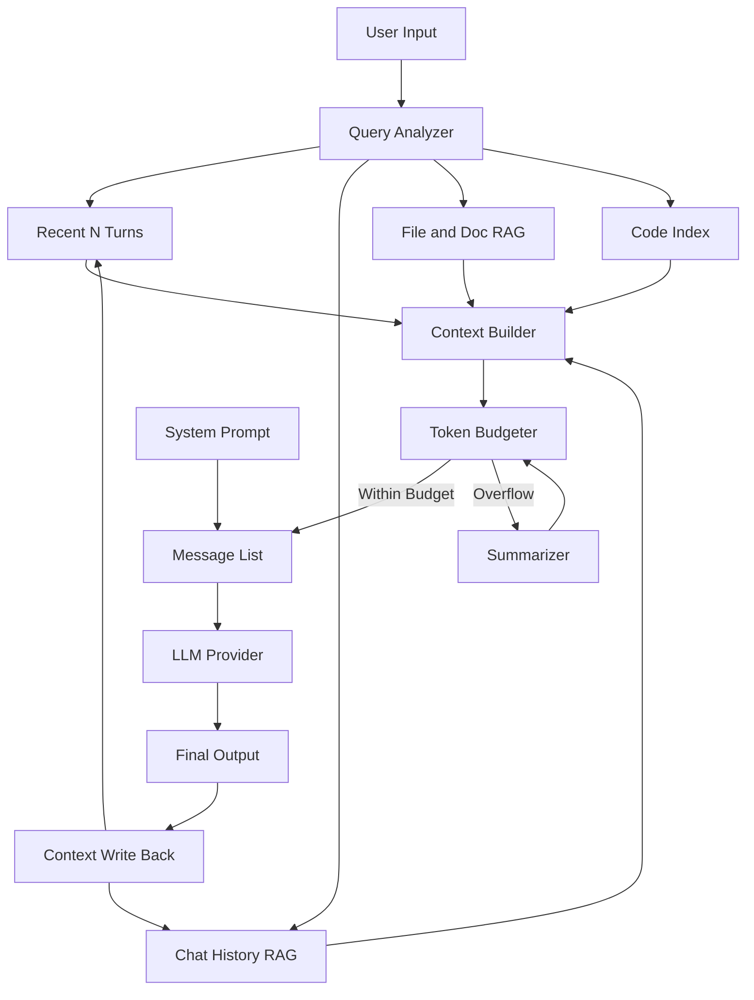
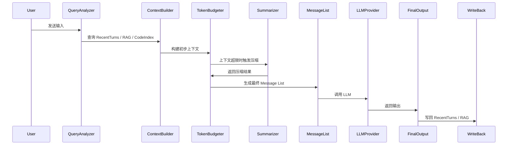

# LLM Context Memory / Summary / RAG 架构设计说明

## 一、设计目标

在多轮对话（20-30轮）下保持优秀的记忆力表现，同时保证从请求发起到首个 token 输出的低延迟响应。

## 二、设计原则

* **保持事实源完整性**：所有用户输入与 Assistant 输出都会被完整保留下来，支持审计、回放、调试与离线再处理。
* **短期与长期上下文管理**：Recent N Turns 维持即时对话连贯性，RAG Memory 承载长期、结构化知识。
* **上下文压缩与预算控制**：通过 Summary 与 Token Budgeter 在长对话下保持上下文可控性，避免超过 LLM token 限制。
* **Agent Handoff 支持**：Summary 提供语义交接，Recent N Turns 保证即时状态。

---

## 三、核心组件与职责划分

### 1. Assistant Raw Output

* LLM 推理生成的原文输出
* 不做任何裁剪或加工
* 是所有后续处理的输入源

### 2. Recent N Turns Store

* 存储最近 N 轮 user / assistant 的原文对话
* 直接用于下一轮 Prompt 构造
* 可在上下文超限时被 Summary 替代

### 3. Write Back Store

* 全量保存 Assistant Raw Output
* 用于审计、离线分析及再摘要

### 4. Summary（摘要）

* 异步生成，不阻塞当前轮 LLM 推理
* 主要用于 Token Budgeter 上下文裁剪
* 影响未来轮次的 Context Builder 输入
* 不直接写入 Recent N Turns

### 5. RAG Memory

* 存储长期有价值的结构化信息
* 经过 Eligibility Judge 决定是否写入
* Summary 可作为辅助判断输入，但不是直接存储内容

### 6. Code Index

* 提供快速检索所需代码片段或模块
* 供 Context Builder 组装完整上下文

### 7. File and Doc RAG

* 存储外部文档、知识库信息
* Query Analyzer 可以检索供 Context Builder 使用

### 8. Token Budgeter

* 评估 Context Builder 输出是否超过 LLM token 限制
* 超限时触发 Summarizer 压缩历史上下文

### 9. Context Builder & Message List

* 将 Recent Turns、RAG Memory、Code Index 汇总为 Message List
* System Prompt 与 Token Budgeter 的裁剪结果共同构成最终 LLM 输入

---

## 四、完整架构总览

---

## 五、关键时序说明

### 1. 输入与输出的持久化原则

* 所有用户输入与 Assistant 输出都会被完整保留下来
* Recent N Turns 保存短期对话
* Write Back 保存完整事实源
* Summary 与 RAG 基于这些事实源派生

### 2. 时序图

