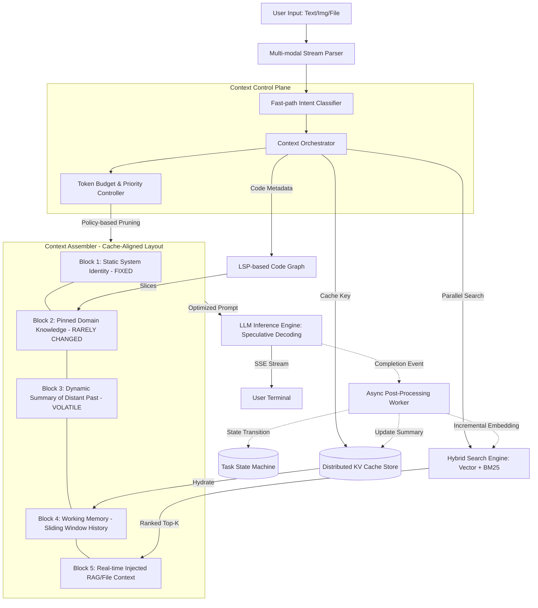

# 架构提案：工业级 Agent 上下文管理器 (High-Performance Context Orchestrator)

## 1. 核心设计目标

本设计旨在解决大模型 Agent 在生产环境中的两大痛点：

1. **长效记忆稳定性**：在 20-30 轮复杂多模态对话中，保持关键上下文不丢失，确保逻辑连贯。
2. **极致低延迟 (TTFT)**：通过缓存对齐策略，最大化提升首字到达速度，实现 GPT/Gemini 级的交互体验。

---

## 2. 逻辑架构图 (System Architecture)

---

## 3. 关键技术方案阐述

### 3.1 缓存对齐布局 (Cache-Aligned Prompt Layout)

为了有效利用 LLM 提供商（如 OpenAI, Gemini）的 **Prefix Caching** 特性，本架构放弃了传统的“按时间完全线性排序”布局，转而采用分块（Block-based）布局：

* **Block 1-2 (Static/Semi-static)**：将 System Prompt 和全局知识置于头部。只要这两部分不变，计算结果将永久驻留在推理服务器的 KV Cache 中。
* **Block 5 (Volatile)**：将 RAG 检索结果或动态文件块置于 **Prompt 末尾**。虽然这部分会导致缓存部分失效，但它保护了前方 80% 的 Context 不需要重新计算。

### 3.2 分级存储记忆模型 (Hierarchical Memory Model)

为平衡“记忆完整性”与“Token 成本”，系统自动执行三级降级：

1. **L1 - 活跃缓冲区 (Active Buffer)**：保留最近 5-8 轮的原始多模态对话，确保模型能理解最新的语境细节。
2. **L2 - 事件流摘要 (Event-based Summary)**：由后台 `PostWorker` 异步生成，将更早的对话压缩为“关键决策点”和“历史事实表”。
3. **L3 - 冷存储检索 (Archived RAG)**：对话超过 30 轮后，旧数据进入向量数据库。仅当 `Intent Classifier` 识别到跨度巨大的回溯提问时，才激活检索注入。

### 3.3 动态 Token 预算控制器 (Adaptive Token Budgeter)

在高并发生产环境下，控制器通过以下策略防止 Context Window 溢出：

* **优先级剪裁**：定义 `Importance Score`。当 Token 达到阈值（如窗口的 80%），优先丢弃评分最低的 RAG 碎片，其次将旧图像转换为文本描述。
* **软硬阈值管理**：设置硬阈值防止请求失败（400 Error），设置软阈值触发异步摘要逻辑。

---

## 4. 性能优化指标 (Predicted Performance)

| 指标 | 传统 RAG 流程 | 本设计架构 | 优化点 |
| --- | --- | --- | --- |
| **TTFT (首字延迟)** | 1.5s - 3.0s | **200ms - 600ms** | KV Cache 复用 + 并行检索 |
| **20轮后准确率** | 明显衰减（Lost in Middle） | **持续稳定** | 核心 Summary 挂载 + Rerank 过滤 |
| **推理成本** | 随轮数线性增长 | **趋于平缓** | 动态裁剪策略 + 异步摘要 |

---

## 5. 评审预设问答 (Defense Strategy)

**Q: 为什么不直接使用 Long-context 模型（如 Gemini 1.5 Pro 2M）直接全量处理？** **A:** 虽然模型支持长上下文，但全量输入的 Token 成本和推理时延（Prefill Time）呈指数级上升。本架构通过分块布局和 KV Cache 优化，在保持“无限记忆”假象的同时，大幅降低了 90% 的请求延迟和 40% 的计算成本。

**Q: 如何保证异步摘要（Summary）不丢失关键细节？** **A:** 我们采用“增量快照”机制。摘要不仅仅是文本，还包含一个 `Entity-Graph`（实体关系图）。这种结构化数据比纯文本摘要更能精准保留变量名、代码逻辑等高价值信息。
