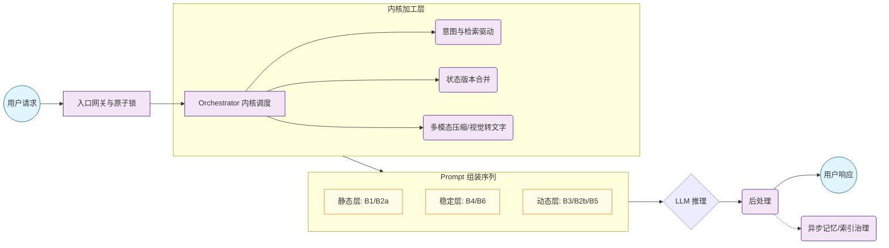
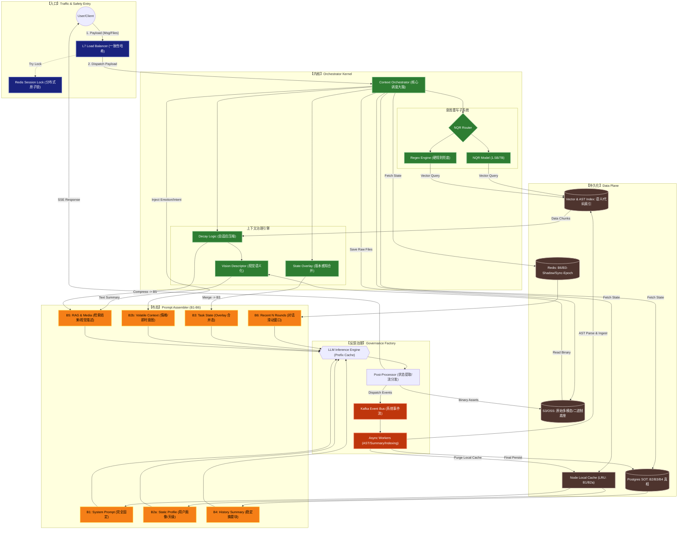
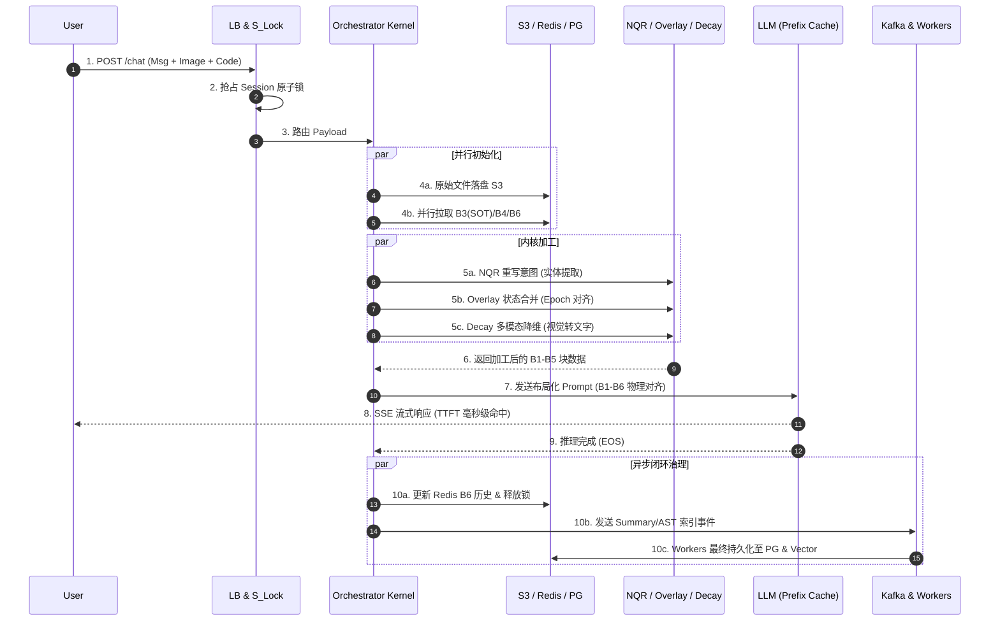

# Context-os v7.6：工业级分布式 Agent 上下文管理器架构白皮书

## 1. 设计目标 (Design Goals)

本系统旨在为百万级并发的 AI Agent 提供高性能、强一致性的长效记忆管理。

* **长效记忆稳定性**：支持 30+ 轮多模态对话。通过 **NQR (意图重写器)** 实现跨轮次实体对齐，解决 LLM 在长文本末尾的“逻辑漂移”与“中间失忆”问题。
* **极致低延迟 (TTFT)**：基于 **Prefix Caching** 对齐策略。通过确定性的 Prompt Layout 布局，确保显存中 KV Cache 的最大化复用，实现首字毫秒级回传。
* **百万级高并发**：Orchestrator 计算节点完全无状态，支持按需水平扩展；配合分布式原子锁与一致性哈希，确保海量请求下的事务一致性。
* **高稳定性与容错 (High Availability)**：系统具备“自愈”能力。通过 **Epoch Filter** 解决异步数据空洞，利用 **Multi-level Fallback** 在核心组件故障时通过降级协议保障核心服务不断联。

---

## 2. 逻辑架构：Conceptual Data Flow

此简化模型旨在对齐数据科学家（逻辑层面）与基础设施团队（物理层面）的认知。

---

## 3. 物理架构：全要素系统设计

---

### 3.1 核心模块定义与职责

本节按层定义模块职责，便于数据科学与基础设施团队快速对齐实现边界。

#### 3.1.1 入口层 (Ingress)

* **LB (L7 Load Balancer)**：基于 Session_ID 进行一致性哈希，将同一用户请求尽量路由到同一 Orchestrator，以提高 L1_Local 命中率。
* **S_Lock (Session Lock)**：Redis 分布式原子锁，防止同一 Session 并发进入多个推理任务，保护状态机一致性。

#### 3.1.2 内核层 (Kernel)

* **Context Orchestrator (核心调度器)**：接收完整 Payload，并行拉取 PG_SOT/Redis/L1_Local 快照，协调 NQR、Overlay、Decay 的执行时序，注入 B2b 并将原始文件落盘至 S3。
* **NQR Router/Model**：使用 1.5B/7B 小模型重写意图，补全代词与实体，并在低置信时回退到 Regex 规则兜底。
* **State Overlay Engine**：以 Sync-Epoch 版本为基准，将 PG_SOT 的 B3-Base 与 Redis Shadow Buffer 的即时事件合并，输出一致的 B3 任务状态。
* **Decay Logic & Vision Descriptor**：当多模态素材超出 Token 预算时，将 S3 中的原始图片降维为文本描述写入 B5，并决定是否进入摘要流。

#### 3.1.3 持久化层 (Storage)

* **L1_Local (Node Cache)**：缓存 B1/B2a 高复用静态块，配合一致性哈希减少跨网络读取。
* **Redis Hot**：保存 B6 近景对话与 B3 Shadow Buffer，提供低延迟热路径与 Sync-Epoch 合并输入。
* **Postgres SOT**：B2/B3/B4 真相来源，用于冷启动与最终一致性回补。
* **Vector & AST Index**：存放代码与知识检索索引，供 NQR/Decay 检索使用。
* **S3/OSS**：原始二进制与多模态资产底座，是 Vision Descriptor 与 Workers 的唯一原始数据来源。

#### 3.1.4 布局层 (Assembler)

* **Prompt Assembler**：强制 B1-B6 物理顺序，确保 Prefix Cache 命中稳定。
* **B2b/B5 尾部策略**：将高频波动内容置于末尾，保护 B1/B2a/B4/B6 的缓存复用。

#### 3.1.5 反馈治理 (Feedback)

* **LLM Inference Engine**：基于 Prefix Cache 直接复用 KV 矩阵，保障 TTFT 稳定。
* **Post-Processor**：提取状态变更、资产与结构化事件，分流至 MQ。
* **Kafka Event Bus & Workers**：异步生成摘要、解析 AST、写回 PG/Vector，并触发 L1_Local 失效。

### 3.2 存储与缓存层 (Storage)

* **Postgres SOT**：保存 B3 状态机快照、B4 分块摘要、用户画像主表；在 Redis 失效或冷启动时提供恢复基线。
* **Redis Hot**：存放 B6 近景对话与 B3 Shadow Buffer，提供低延迟的热路径读取与 Sync-Epoch 对齐输入。
* **L1_Local (Node Cache)**：缓存 B1/B2a 等高复用静态块，减少跨网络读取；由治理 Worker 通过失效/广播策略维持一致性。
* **Vector & AST Index**：用户上传代码进入 S3 后异步解析入库；LLM 生成代码由 Post-Processor 触发事件写入，供 NQR/Decay 检索。
* **S3_Blob**：存放原始代码/图片/大文件，并作为 Vision Descriptor 与 Worker 的唯一原始数据来源。

### 3.3 节点功能与关联关系细化

* **B2b 位置策略**：情绪与即时意图每轮必变，将其置于布局尾部以保护前缀缓存命中率。
* **代码入库流转**：Orchestrator 接收并将原始代码写入 S3，Post-Processor 识别新代码并发布 MQ 事件，Workers 从 S3 读取后做 AST 解析并写入 Vector_AST。
* **视觉语义化链路**：S3 提供原始图片，Vision Descriptor 生成文本描述写入 B5，必要时参与 B4 摘要生成，形成跨模态长期记忆。

### 3.4 最终架构修正要点（评审委员会必看）

* **Ingress-to-Kernel**：流量不再通过 S_Lock 转发，LB 直接路由到 Orchestrator；S_Lock 仅作为 Side-check，避免大文件流经锁节点。
* **S3 作为锚点**：Orchestrator 先落盘原始文件，Vision Descriptor 从 S3 读取图片并生成描述，Post-Processor 将生成资产写回 S3。
* **Visual Decay 触发逻辑**：当图片 Token 过大时，Decay 切换为视觉描述模式，用文本替代原始图片 Tokens 并写入 B5。

---

## CH 4. 核心技术深度解析 (Core Technical Deep-Dive)

本章详细拆解 Context-os v7.6 如何在复杂的分布式环境下，通过对存储、计算与模型推理硬件的极致编排，达成设计目标。

### 4.1 提示词布局层：B1-B6 结构化编排 (The Assembler Layout)

系统放弃了传统的单一 Context Window 管理，转而采用**分层布局策略（Layered Layout Strategy）**。通过将 Prompt 划分为六个核心区块（Blocks），实现了对显存缓存（KV Cache）的精确控制。

#### 4.1.1 静态与长效层 (B1, B2a, B4)

* **B1: System Prompt (系统元指令)**：完全静态。包含 Agent 的人格设定、工具调用规范（Tool Specs）及安全护栏。作为整个 Prompt 的起始哈希点。
* **B2a: Static Profile (静态画像)**：用户的基础属性（天级更新）。包括职业、技术偏好、历史习惯等。
* **B4: History Summary (分块摘要)**：由 `Async Workers` 定期对过往对话进行分段压缩。采用 **Append-only（仅追加）** 模式，确保已生成的摘要块哈希值在长周期内保持不变。

#### 4.1.2 动态滑动层 (B6)

* **B6: Recent N Rounds (近景记忆)**：保留最近 N 轮的原始对话（从 `Redis_Hot` 拉取）。这部分虽然随轮次向前滑动，但由于其紧跟在 B4 之后，且变动具有高度局部性，能极大程度复用前序计算结果。

#### 4.1.3 业务与状态层 (B3)

* **B3: Task State JSON (业务状态机)**：**这是系统逻辑的轴心**。由 `State Overlay Engine` 生成。它描述了当前任务的执行进度、槽位填充状态及变量字典。
* **与 Overlay 的关系**：B3 不直接读取数据库，而是将 `PG_SOT` 的“真相基准”与 `Redis Shadow Buffer` 的“即时事件”进行 `Sync-Epoch` 对齐合并。

#### 4.1.4 挥发性层 (B2b, B5) —— 缓存防护带

为了保护前述 B1-B6 的昂贵缓存，我们将高频变动的部分置于序列末尾：

* **B2b: Volatile Context (即时上下文)**：捕获用户在当前 Chat Thread 中的**即时情绪（焦虑/满意）**、即时意图及语气偏好。由 `Orchestrator` 在请求入境时直接提取并注入。
* **B5: RAG & Media (动态检索与降维数据)**：包含从 `Vector_AST` 检索的代码切片、文档块，以及经由 `Vision Descriptor` 处理后的图片文字描述。
* **放置策略论据**：由于检索结果（B5）和情绪状态（B2b）每轮请求几乎都会发生 Byte 级的剧烈波动，将其放在末尾可以确保**前面的 B1/B2/B4/B6 能够 100% 命中 Prefix Cache**，而只需重算末尾的一小段 Token。

---

### 4.2 推理硬件优化：KV Cache 与 Prefix Caching 深度对齐

#### 4.2.1 KV Cache 的物理矩阵机制

在 Transformer 推理中，每一层的计算都需要生成 **Key 矩阵** 和 **Value 矩阵**。

* **计算开销**：在 Prefill（预填充）阶段，计算这些矩阵需要消耗大量的算力与显存。
* **存储开销**：随着对话增长，KV 矩阵会迅速占满昂贵的 HBM（高带宽显存）。

#### 4.2.2 Prefix Caching 的确定性对齐

**Prefix Caching** 通过对 Prompt 前缀字符串进行哈希处理（Hash-based Indexing）。

* **对齐策略**：本系统通过 `Prompt Assembler` 强制执行 B1-B6 的物理顺序。
* **命中逻辑**：当 LLM 引擎收到请求，它会检测到 B1/B2a/B4/B6 这部分前缀的哈希值与显存中已有的 KV 矩阵匹配。
* **结果**：推理引擎**直接跳过**这数千个 Token 的计算，仅从 B3 之后开始计算新的矩阵。这使得 TTFT（首字延迟）不再随对话轮次增加而劣化，实现了真正的“常数级延迟感”。

---

### 4.3 状态一致性：State Overlay Engine (B3)

解决分布式环境下的**“读写一致性冲突（Read-after-Write Consistency）”**。

1. **数据孤岛挑战**：`Post-Processor` 产生的异步更新（Summary/Status）通过 `MQ` 写入 `PG_SOT` 可能存在秒级延迟。
2. **Shadow Buffer 机制**：`Post-Processor` 在响应用户的瞬间，会同步向 `Redis_Hot` 写入一个轻量级的 `Shadow Buffer`（带有 `Sync-Epoch` 标签）。
3. **Overlay 逻辑**：
* `Orchestrator` 从 `PG_SOT` 读取基准状态。
* 同时从 `Redis` 拉取与当前 Session 对应的增量事件。
* 在内存中进行 Patch 合并，最终输出 **B3: Task State**。这保证了即使用户极速连续点击，Agent 看到的任务进度也是绝对一致的。

---

### 4.4 存储平面与多模态治理 (S3 & Decay)

#### 4.4.1 S3 作为资产底座 (Source of Truth for Binaries)

* **输入流**：用户上传的原始图片、代码文件通过 `LB` 后，由 `Orchestrator` 流式写入 `S3_Blob`。
* **输出流**：LLM 生成的图表、代码文件通过 `Post-Processor` 归档至 `S3`。
* **关联性**：S3 是 `Vision Descriptor` 唯一的图像来源，也是 `Workers` 进行 AST 静态分析的原始凭证池。

#### 4.4.2 Decay Logic 与视觉语义化 (B5 的来源)

为了对抗 Context Window 的膨胀，系统执行 **Visual-to-Text 降维**：

* **阈值策略**：当对话深度超过 N 轮或 Token 总量接近预算上限时触发。
* **语义转换**：`Vision Descriptor` 从 S3 获取原始图片，生成包含视觉细节、文字 OCR 及报错信息的 **Textual Summary**。
* **注入 B5**：原始图片 Tokens 被移除，替换为轻量化的描述文本。这不仅节省了 90% 的图片空间，还使得图片信息能被后续的 NQR 模块搜索。

---

### 4.5 模块关联关系全量定义

| 关联路径 | 交互协议 | 描述 |
| --- | --- | --- |
| **User  LB** | HTTPS/WSS | 携带 Msg 内容与多模态文件流。 |
| **LB  S_Lock** | Redis SETNX | 基于 Session_ID 抢占原子锁，防止状态机被并发破坏。 |
| **LB  Orchestrator** | RPC/Internal | 流量分发，负载均衡。 |
| **Orchestrator  S3** | S3 API | 将原始 Payload 中的二进制资产持久化。 |
| **NQR  Vector_AST** | Vector Search | 意图驱动的代码/知识片段检索。 |
| **Workers  PG/Vector** | Write | 异步将治理后的 Summary、AST 索引写回真相来源。 |
| **Post-Processor  MQ** | Pub/Sub | 解耦推理主链路，触发后续的记忆管理逻辑。 |
| **Assembler  LLM** | API/HuggingFace | 提交物理对齐后的 Prompt，触发 Prefix Cache 匹配。 |

## 5. 动态时序：请求生命周期

---

## 6. 高性能、高并发与稳定性保障

### 6.1 极致性能策略

* **一致性哈希 (Stickiness)**：确保同一 Session 的计算命中同一 Orchestrator 实例，最大化利用 **L1_Local** (本地内存缓存) 存放 B1/B2a，规避分布式存储的网络瓶颈。
* **Prefix Cache 锚定**：通过 B1-B6 的稳定布局，将 KV Cache 复用率提升到可预测区间，避免对话轮次增加导致 TTFT 劣化。
* **Event-Sourcing (事件溯源)**：所有变更先入 Redis 热缓存并投递 MQ。即使 Postgres 出现秒级抖动，核心推理链路依然能依靠 Shadow Buffer 维持状态，实现计算与存储的强退耦。

### 6.2 高并发防御机制

* **Atomic Session Lock**：入口层通过 Redis 原子锁拦截并发写入，避免同一 Session 同时进入多个推理任务导致状态破坏。
* **Backpressure (背压控制)**：当 MQ/Kafka 队列积压超过阈值，Overlay 收窄合并窗口并触发限流，保护存储与计算层。

### 6.3 稳定性保障与容错策略 (Resilience)

* **NQR Fallback (多级兜底)**：
* L1: 1.5B 小模型秒级推理。
* L2: 超时降级为 Regex 规则匹配。
* L3: 核心逻辑透传，保证对话不中断。

* **Windowed Overlay (内存背压)**：Overlay 合并窗口严格限制在最近 N 个版本。若异步链路严重积压，系统会自动丢弃过期事件，触发 B4 强行重置，防止单 Session OOM 拖垮整个节点。
