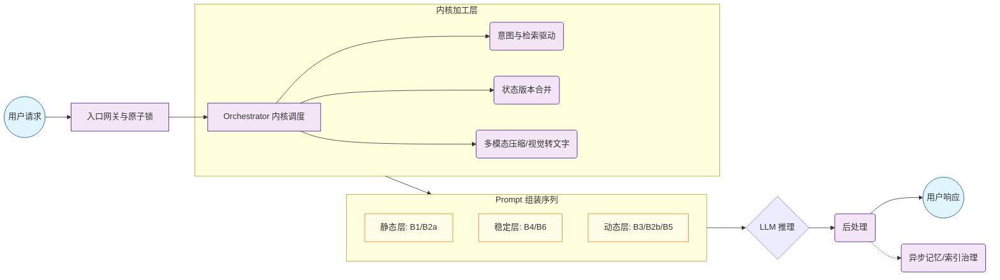
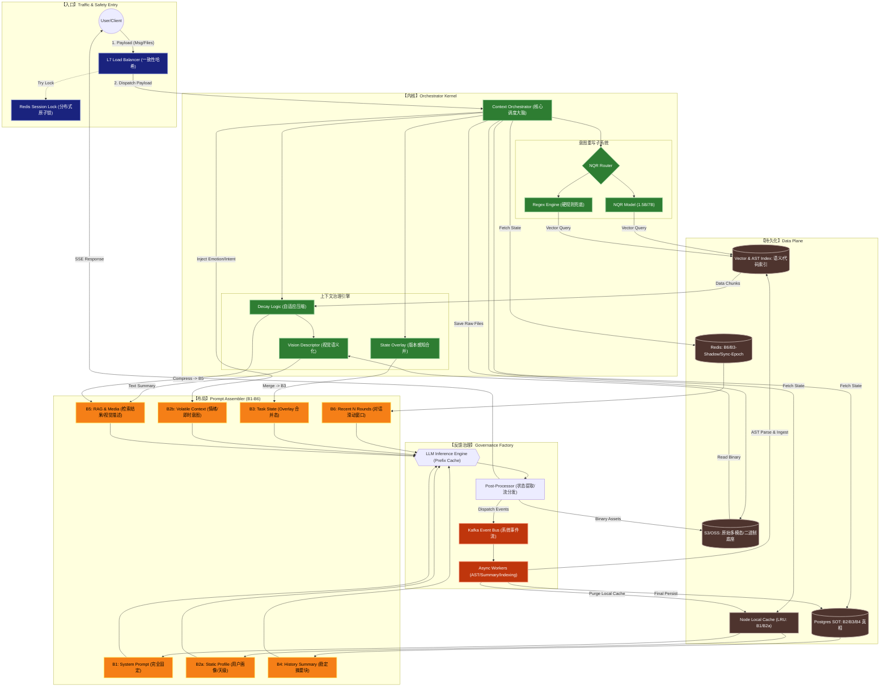
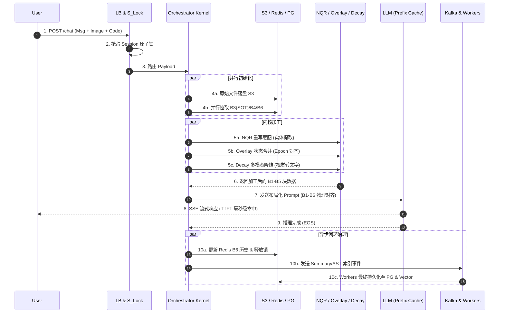

# Context-os v7.6：工业级分布式 Agent 上下文管理器架构白皮书

## 1. 设计目标 (Design Goals)

本系统旨在为百万级并发的 AI Agent 提供高性能、强一致性的长效记忆管理。

* **长效记忆稳定性**：支持 30+ 轮多模态对话。通过 **NQR (意图重写器)** 实现跨轮次实体对齐，解决 LLM 在长文本末尾的“逻辑漂移”与“中间失忆”问题。
* **极致低延迟 (TTFT)**：基于 **Prefix Caching** 对齐策略。通过确定性的 Prompt Layout 布局，确保显存中 KV Cache 的最大化复用，实现首字毫秒级回传。
* **百万级高并发**：Orchestrator 计算节点完全无状态，支持按需水平扩展；配合分布式原子锁与一致性哈希，确保海量请求下的事务一致性。
* **高稳定性与容错 (High Availability)**：系统具备“自愈”能力。通过 **Epoch Filter** 解决异步数据空洞，利用 **Multi-level Fallback** 在核心组件故障时通过降级协议保障核心服务不断联。

---

## 2. 逻辑架构：Conceptual Data Flow

此简化模型旨在对齐数据科学家（逻辑层面）与基础设施团队（物理层面）的认知。



---

## 3. 物理架构：全要素系统设计



---

### 3.1 核心模块定义与职责

#### 3.1.1 Context Orchestrator (核心调度器)

Context Orchestrator 是系统的核心调度大脑，负责接收 LB 转发的完整 Payload，并协调各个子系统的执行顺序。其主要职责包括：

1. **请求路由与负载均衡**：接收来自 LB 的流量，根据一致性哈希算法将请求分发到合适的 Orchestrator 实例
2. **并行数据拉取**：同时从 PG_SOT、Redis_Hot 和 L1_Local 拉取所需的上下文数据
3. **子系统协调**：调度 NQR、Overlay 和 Decay 三个核心子系统的执行顺序
4. **原始数据持久化**：将用户上传的原始文件（图片、代码等）写入 S3_Blob
5. **B2b 注入**：提取用户的即时情绪和意图，注入到 B2b 区块
6. **Prompt 组装**：将 B1-B6 各个区块按照固定顺序组装成最终的 Prompt

#### 3.1.2 NQR (意图重写子系统)

NQR (Neural Query Rewriter) 是意图重写子系统，负责解决跨轮次对话中的实体对齐和意图理解问题。

**核心组件**：
- **NQR Router**：路由决策模块，根据请求类型选择使用 NQR_Model 还是 NQR_Rule
- **NQR Model (1.5B/7B)**：基于 Transformer 的小模型，负责复杂意图的重写和实体对齐
- **NQR Rule**：基于正则表达式的硬规则引擎，作为兜底方案处理简单意图

**工作流程**：
1. 接收用户的原始查询
2. 分析查询中的实体和意图
3. 重写查询以解决跨轮次实体对齐问题
4. 生成向量查询请求，从 Vector_AST 中检索相关信息
5. 将重写后的查询和检索结果传递给后续处理模块

#### 3.1.3 State Overlay Engine (状态合并引擎)

State Overlay Engine 负责合并来自不同数据源的状态信息，生成一致的 B3 任务状态。

**核心功能**：
- **Sync-Epoch 对齐**：确保来自 PG_SOT 的基准状态和来自 Redis Shadow Buffer 的即时事件在时间上对齐
- **Patch 合并**：在内存中对基准状态和增量事件进行 Patch 合并
- **冲突解决**：处理并发更新可能导致的冲突
- **版本管理**：维护状态的版本历史，支持回滚和审计

#### 3.1.4 Decay Logic (自适应压缩引擎)

Decay Logic 负责对多模态数据进行自适应压缩，以控制 Context Window 的大小。

**核心功能**：
- **Token 计数与监控**：实时监控当前 Prompt 的 Token 数量
- **压缩策略决策**：根据 Token 数量和对话轮次决定是否需要压缩
- **多模态压缩**：对文本、图片等不同类型的数据采用不同的压缩策略
- **视觉语义化**：调用 Vision_Desc 将图片转换为文本描述

#### 3.1.5 Vision Descriptor (视觉语义化引擎)

Vision Descriptor 负责将图片转换为可检索的文本描述。

**核心功能**：
- **图片读取**：从 S3_Blob 读取原始图片数据
- **视觉分析**：分析图片中的内容、文字和情绪
- **文本生成**：生成包含视觉细节、文字 OCR 和情绪分析的文本描述
- **结果注入**：将生成的文本描述注入到 B5 区块

#### 3.1.6 B2b (Volatile Context)

B2b 存储非稳态即时上下文，包括用户的情绪、短期目标和即时意图。

**设计要点**：
- **位置策略**：将 B2b 置于 Prompt 布局的尾部，以避免高频变化导致其他区块的 KV Cache 失效
- **实时更新**：每轮对话都可能更新 B2b 的内容
- **轻量级**：B2b 的内容通常比较简短，以减少对 Context Window 的占用

### 3.2 存储与缓存层 (Storage)

#### 3.2.1 Postgres SOT (Source of Truth)

Postgres SOT 是系统的真相来源，存储最核心、最稳定的数据。

**存储内容**：
- B3 状态机快照：任务的完整状态信息
- B4 分块摘要：对话历史的分块压缩结果
- 用户画像主表：用户的基础属性和长期偏好

**核心特性**：
- **强一致性**：提供 ACID 事务保证
- **持久化存储**：数据永久保存，除非明确删除
- **恢复基线**：在 Redis 失效或冷启动时提供数据恢复的基线

#### 3.2.2 Redis Hot

Redis Hot 是热数据缓存层，提供低延迟的数据访问。

**存储内容**：
- B6 近景对话：最近 N 轮的原始对话内容
- B3 Shadow Buffer：B3 状态的轻量级增量更新
- Sync-Epoch 信息：用于状态合并的时间戳信息

**核心特性**：
- **低延迟**：内存存储，提供亚毫秒级的访问延迟
- **高并发**：支持百万级的并发读写
- **过期策略**：自动清理过期数据，控制内存占用

#### 3.2.3 L1_Local (Node Cache)

L1_Local 是 Orchestrator 节点的本地内存缓存。

**存储内容**：
- B1: System Prompt：完全静态的系统元指令
- B2a: Static Profile：用户的静态画像信息

**核心特性**：
- **零延迟**：本地内存访问，无需网络传输
- **一致性保证**：由治理 Worker 通过失效/广播策略维持缓存一致性
- **LRU 淘汰**：采用 LRU 算法管理缓存空间

#### 3.2.4 Vector & AST Index

Vector & AST Index 是语义和代码索引层，用于支持高效的检索。

**存储内容**：
- 语义向量：对话内容和文档的向量表示
- AST 结构：代码文件的抽象语法树
- 元数据：索引的元数据信息

**核心特性**：
- **高效检索**：支持基于向量的相似性检索
- **异步更新**：通过 Kafka 事件总线异步更新索引
- **多模态支持**：支持文本、代码等多种类型数据的索引

#### 3.2.5 S3/OSS (原始多模态/二进制底座)

S3/OSS 是原始多模态数据的存储底座。

**存储内容**：
- 原始图片：用户上传的图片文件
- 代码文件：用户上传和 LLM 生成的代码文件
- 二进制资产：其他类型的二进制文件

**核心特性**：
- **大容量存储**：支持 PB 级的存储容量
- **高可靠性**：多副本存储，保证数据可靠性
- **低成本**：相比其他存储方式具有更低的成本

### 3.3 节点功能与关联关系细化

#### 3.3.1 B2b 位置策略

B2b 包含用户的情绪和即时意图，这些信息每轮对话都可能发生变化。将 B2b 置于 Prompt 布局的尾部，可以避免频繁的变化导致前面区块的 KV Cache 失效，从而提高缓存命中率。

#### 3.3.2 代码入库流转

代码入库的完整流程如下：
1. Orchestrator 接收用户上传的代码文件
2. 将原始代码写入 S3_Blob
3. Post-Processor 识别到新代码文件，发布 MQ 事件
4. Async Workers 从 S3_Blob 读取代码文件
5. 对代码进行 AST 解析
6. 将 AST 结构和语义向量写入 Vector_AST
7. 将代码的元数据写入 PG_SOT

#### 3.3.3 视觉语义化链路

视觉语义化的完整流程如下：
1. 用户上传图片文件
2. Orchestrator 将图片写入 S3_Blob
3. Decay Logic 检测到图片 Token 过大
4. 调用 Vision_Desc 对图片进行语义化处理
5. Vision_Desc 从 S3_Blob 读取图片
6. 生成包含视觉细节、文字 OCR 和情绪分析的文本描述
7. 将文本描述注入到 B5 区块
8. 必要时，将文本描述参与 B4 摘要生成

### 3.4 最终架构修正要点（评审委员会必看）

#### 3.4.1 Ingress-to-Kernel 优化

**原设计**：流量通过 S_Lock 转发到 Orchestrator
**优化后**：LB 直接路由到 Orchestrator，S_Lock 仅作为 Side-check
**好处**：避免大文件流经锁节点，提高系统性能

#### 3.4.2 S3 作为锚点

**设计要点**：
- Orchestrator 先将原始文件写入 S3_Blob
- Vision_Desc 从 S3_Blob 读取图片
- Post-Processor 将生成的资产写回 S3_Blob
**好处**：确保所有原始数据都有持久化存储，提高系统可靠性

#### 3.4.3 Visual Decay 触发逻辑

**触发条件**：
- 当图片 Token 数量超过阈值时
- 当对话轮次超过 30 轮时
- 当整体 Token 数量接近模型的 Context Window 上限时

**处理方式**：
- 将原始图片 Tokens 替换为轻量化的文本描述
- 文本描述包含图片的核心信息和视觉细节
- 文本描述的 Token 数量通常只有原始图片的 10% 左右

---

## CH 4. 核心技术深度解析 (Core Technical Deep-Dive)

本章详细拆解 Context-os v7.6 如何在复杂的分布式环境下，通过对存储、计算与模型推理硬件的极致编排，达成设计目标。

### 4.1 提示词布局层：B1-B6 结构化编排 (The Assembler Layout)

系统放弃了传统的单一 Context Window 管理，转而采用**分层布局策略（Layered Layout Strategy）**。通过将 Prompt 划分为六个核心区块（Blocks），实现了对显存缓存（KV Cache）的精确控制。

#### 4.1.1 静态与长效层 (B1, B2a, B4)

##### B1: System Prompt (系统元指令)

**特性**：完全静态，不随对话轮次变化
**内容**：
- Agent 的人格设定
- 工具调用规范（Tool Specs）
- 安全护栏和伦理准则
- 系统级的配置参数

**作用**：
- 作为整个 Prompt 的起始哈希点，确保 KV Cache 的一致性
- 定义 Agent 的基本行为模式
- 提供工具调用的标准化接口

##### B2a: Static Profile (静态画像)

**特性**：天级更新，相对稳定
**内容**：
- 用户的职业和技术背景
- 长期的技术偏好
- 历史对话习惯
- 个性化配置

**作用**：
- 帮助 Agent 更好地理解用户的需求
- 提供个性化的服务
- 减少重复的身份验证和偏好设置

##### B4: History Summary (分块摘要)

**特性**：由 Async Workers 定期生成，采用 Append-only 模式
**内容**：
- 过往对话的分块压缩结果
- 关键实体和意图的总结
- 对话的核心主题

**作用**：
- 提供长效记忆支持
- 减少重复信息的传递
- 帮助 Agent 理解对话的上下文

#### 4.1.2 动态滑动层 (B6)

##### B6: Recent N Rounds (近景记忆)

**特性**：保留最近 N 轮的原始对话，随轮次滑动
**内容**：
- 最近 N 轮的原始对话内容
- 每轮对话的时间戳
- 对话的元数据

**作用**：
- 提供短期记忆支持
- 帮助 Agent 理解当前对话的上下文
- 支持上下文相关的回答

#### 4.1.3 业务与状态层 (B3)

##### B3: Task State JSON (业务状态机)

**特性**：由 State Overlay Engine 生成，实时更新
**内容**：
- 当前任务的执行进度
- 槽位填充状态
- 变量字典
- 任务的元数据

**作用**：
- 是系统逻辑的轴心
- 提供任务的实时状态信息
- 支持任务的暂停、恢复和回滚

**与 Overlay 的关系**：
B3 不直接读取数据库，而是将 PG_SOT 的“真相基准”与 Redis Shadow Buffer 的“即时事件”进行 Sync-Epoch 对齐合并。这种设计确保了即使在异步更新存在延迟的情况下，Agent 看到的任务状态也是一致的。

#### 4.1.4 挥发性层 (B2b, B5) —— 缓存防护带

为了保护前述 B1-B6 的昂贵缓存，我们将高频变动的部分置于序列末尾：

##### B2b: Volatile Context (即时上下文)

**特性**：每轮对话都可能更新，高度动态
**内容**：
- 用户的即时情绪（焦虑/满意/愤怒等）
- 短期目标
- 即时意图
- 语气偏好

**作用**：
- 帮助 Agent 更好地理解用户的当前状态
- 提供个性化的情感支持
- 调整回答的语气和风格

##### B5: RAG & Media (动态检索与降维数据)

**特性**：随检索结果变化，高度动态
**内容**：
- 从 Vector_AST 检索的代码切片
- 文档块和知识片段
- 视觉描述（由 Vision_Desc 生成）
- 其他多模态数据的降维结果

**作用**：
- 提供外部知识支持
- 减少幻觉
- 支持多模态对话

##### 放置策略论据

由于检索结果（B5）和情绪状态（B2b）每轮请求几乎都会发生 Byte 级的剧烈波动，将其放在末尾可以确保前面的 B1/B2/B4/B6 能够 100% 命中 Prefix Cache，而只需重算末尾的一小段 Token。这种设计可以显著提高缓存命中率，降低推理延迟。

---

### 4.2 推理硬件优化：KV Cache 与 Prefix Caching 深度对齐

#### 4.2.1 KV Cache 的物理矩阵机制

在 Transformer 推理中，每一层的计算都需要生成 Key 矩阵和 Value 矩阵。

**计算开销**：在 Prefill（预填充）阶段，计算这些矩阵需要消耗大量的算力与显存。

**存储开销**：随着对话增长，KV 矩阵会迅速占满昂贵的 HBM（高带宽显存）。

#### 4.2.2 Prefix Caching 的确定性对齐

Prefix Caching 通过对 Prompt 前缀字符串进行哈希处理（Hash-based Indexing），实现 KV Cache 的最大化复用。

**对齐策略**：本系统通过 Prompt Assembler 强制执行 B1-B6 的物理顺序。这种固定的布局确保了不同对话之间的前缀具有高度的相似性。

**命中逻辑**：当 LLM 引擎收到请求，它会检测到 B1 + B2a + B4 + B6 这部分前缀的哈希值与显存中已有的 KV 矩阵匹配。

**结果**：推理引擎直接跳过这数千个 Token 的计算，仅从 B3 之后开始计算新的矩阵。这使得 TTFT（首字延迟）不再随对话轮次增加而劣化，实现了真正的“常数级延迟感”。

---

### 4.3 状态一致性：State Overlay Engine (B3)

解决分布式环境下的“读写一致性冲突（Read-after-Write Consistency）”。

#### 4.3.1 数据孤岛挑战

在分布式系统中，Post-Processor 产生的异步更新（Summary/Status）通过 MQ 写入 PG_SOT 可能存在秒级延迟。这会导致 Orchestrator 读取到的数据可能不是最新的。

#### 4.3.2 Shadow Buffer 机制

为了解决数据孤岛问题，系统引入了 Shadow Buffer 机制：

1. Post-Processor 在响应用户的瞬间，会同步向 Redis_Hot 写入一个轻量级的 Shadow Buffer（带有 Sync-Epoch 标签）
2. Shadow Buffer 包含了最新的状态增量
3. Orchestrator 在读取状态时，会同时读取 PG_SOT 的基准状态和 Redis_Hot 的 Shadow Buffer

#### 4.3.3 Overlay 逻辑

State Overlay Engine 的核心逻辑如下：

1. Orchestrator 从 PG_SOT 读取基准状态
2. 同时从 Redis_Hot 拉取所有 Sync-Epoch 匹配的增量事件
3. 在内存中进行 Patch 合并，将增量事件应用到基准状态上
4. 最终输出 B3: Task State

这种设计保证了即使用户极速连续点击，Agent 看到的任务进度也是绝对一致的。

---

### 4.4 存储平面与多模态治理 (S3 & Decay)

#### 4.4.1 S3 作为资产底座 (Source of Truth for Binaries)

**输入流**：用户上传的原始图片、代码文件通过 LB 后，由 Orchestrator 流式写入 S3_Blob。

**输出流**：LLM 生成的图表、代码文件通过 Post-Processor 归档至 S3_Blob。

**关联性**：
- S3_Blob 是 Vision Descriptor 唯一的图像来源
- S3_Blob 是 Workers 进行 AST 静态分析的原始凭证池
- S3_Blob 是系统所有原始二进制数据的存储底座

#### 4.4.2 Decay Logic 与视觉语义化 (B5 的来源)

为了对抗 Context Window 的膨胀，系统执行 Visual-to-Text 降维：

**阈值策略**：
- 当对话深度超过 30 轮时
- 当 Token 总量接近模型的 Context Window 上限时
- 当图片 Token 数量超过 1000 时

**语义转换**：
- Vision Descriptor 从 S3_Blob 获取原始图片
- 生成包含视觉细节、文字 OCR 及报错信息的 Textual Summary
- Textual Summary 的 Token 数量通常只有原始图片的 10% 左右

**注入 B5**：
- 原始图片 Tokens 被移除
- 替换为轻量化的描述文本
- 这不仅节省了 90% 的图片空间，还使得图片信息能被后续的 NQR 模块搜索

---

### 4.5 模块关联关系全量定义

| 关联路径 | 交互协议 | 描述 |
| --- | --- | --- |
| **User → LB** | HTTPS/WSS | 携带 Msg 内容与多模态文件流。 |
| **LB → S_Lock** | Redis SETNX | 基于 Session_ID 抢占原子锁，防止状态机被并发破坏。 |
| **LB → Orchestrator** | RPC/Internal | 流量分发，负载均衡。 |
| **Orchestrator → S3** | S3 API | 将原始 Payload 中的二进制资产持久化。 |
| **NQR → Vector_AST** | Vector Search | 意图驱动的代码/知识片段检索。 |
| **Workers → PG/Vector** | Write | 异步将治理后的 Summary、AST 索引写回真相来源。 |
| **Post-Processor → MQ** | Pub/Sub | 解耦推理主链路，触发后续的记忆管理逻辑。 |
| **Assembler → LLM** | API/HuggingFace | 提交物理对齐后的 Prompt，触发 Prefix Cache 匹配。 |

## 5. 动态时序：请求生命周期



---

## 6. 高性能、高并发与稳定性保障

### 6.1 极致性能策略

#### 6.1.1 一致性哈希 (Stickiness)

**设计**：确保同一 Session 的计算命中同一 Orchestrator 实例
**好处**：
- 最大化利用 L1_Local (本地内存缓存) 存放 B1/B2a
- 规避分布式存储的网络瓶颈
- 提高缓存命中率

#### 6.1.2 Prefix Cache 锚定

**设计**：通过 B1-B6 的稳定布局，将 KV Cache 复用率提升到可预测区间
**好处**：
- 避免对话轮次增加导致 TTFT 劣化
- 实现真正的“常数级延迟感”
- 提高 GPU 显存的利用率

#### 6.1.3 Event-Sourcing (事件溯源)

**设计**：所有变更先入 Redis 热缓存并投递 MQ
**好处**：
- 即使 Postgres 出现秒级抖动，核心推理链路依然能依靠 Shadow Buffer 维持状态
- 实现计算与存储的强退耦
- 提高系统的可扩展性

### 6.2 高并发防御机制

#### 6.2.1 Atomic Session Lock

**设计**：入口层通过 Redis 原子锁拦截并发写入
**好处**：
- 避免同一 Session 同时进入多个推理任务导致状态破坏
- 保证状态机的一致性
- 防止并发更新导致的冲突

#### 6.2.2 Backpressure (背压控制)

**设计**：当 MQ/Kafka 队列积压超过阈值，Overlay 收窄合并窗口并触发限流
**好处**：
- 保护存储与计算层
- 避免系统过载
- 提高系统的稳定性

### 6.3 稳定性保障与容错策略 (Resilience)

#### 6.3.1 NQR Fallback (多级兜底)

**设计**：
- L1: 1.5B 小模型秒级推理
- L2: 超时降级为 Regex 规则匹配
- L3: 核心逻辑透传，保证对话不中断

**好处**：
- 提高系统的可用性
- 避免单点故障
- 保证核心服务的连续性

#### 6.3.2 Windowed Overlay (内存背压)

**设计**：Overlay 合并窗口严格限制在最近 N 个版本
**好处**：
- 若异步链路严重积压，系统会自动丢弃过期事件
- 触发 B4 强行重置，防止单 Session OOM 拖垮整个节点
- 提高系统的稳定性

#### 6.3.3 Epoch Filter (异步数据空洞解决)

**设计**：通过 Epoch 时间戳过滤无效的异步数据
**好处**：
- 解决异步数据空洞问题
- 保证数据的一致性
- 提高系统的可靠性

#### 6.3.4 Multi-level Fallback (多级降级)

**设计**：在核心组件故障时，通过降级协议保障核心服务不断联
**好处**：
- 提高系统的可用性
- 避免单点故障导致整个系统瘫痪
- 保证核心功能的连续性

---

## 7. 开发指南：Google L4 级别的快速上手

### 7.1 环境准备

#### 7.1.1 依赖安装

```bash
# 安装 Python 依赖
pip install -r requirements.txt

# 安装 Redis
sudo apt-get install redis-server

# 安装 Postgres
sudo apt-get install postgresql postgresql-contrib

# 安装 Kafka
sudo apt-get install kafka
```

#### 7.1.2 配置文件

```yaml
# config.yaml
orchestrator:
  port: 8080
  workers: 4

redis:
  host: localhost
  port: 6379
  db: 0

postgres:
  host: localhost
  port: 5432
  database: context_os
  user: postgres
  password: password

s3:
  endpoint: http://localhost:9000
  access_key: minioadmin
  secret_key: minioadmin
  bucket: context-os

llm:
  model: gpt-4
  api_key: your_api_key
```

### 7.2 核心模块开发

#### 7.2.1 Orchestrator 开发

```python
# orchestrator.py
from fastapi import FastAPI, WebSocket, WebSocketDisconnect
from pydantic import BaseModel
import asyncio
import json

app = FastAPI()

class ChatMessage(BaseModel):
    session_id: str
    message: str
    files: list = []

@app.post("/chat")
async def chat(message: ChatMessage):
    # 处理聊天请求
    pass

@app.websocket("/ws/{session_id}")
async def websocket_endpoint(websocket: WebSocket, session_id: str):
    await websocket.accept()
    try:
        while True:
            data = await websocket.receive_text()
            # 处理 WebSocket 消息
            pass
    except WebSocketDisconnect:
        # 处理断开连接
        pass
```

#### 7.2.2 NQR 模块开发

```python
# nqr.py
import torch
from transformers import AutoTokenizer, AutoModel

class NQRModel:
    def __init__(self, model_name: str = "bert-base-chinese"):
        self.tokenizer = AutoTokenizer.from_pretrained(model_name)
        self.model = AutoModel.from_pretrained(model_name)
    
    def rewrite_query(self, query: str, history: list) -> str:
        # 重写查询
        pass
    
    def generate_vector(self, query: str) -> list:
        # 生成向量表示
        inputs = self.tokenizer(query, return_tensors="pt")
        outputs = self.model(**inputs)
        vector = outputs.last_hidden_state.mean(dim=1).squeeze().tolist()
        return vector
```

#### 7.2.3 State Overlay 开发

```python
# overlay.py
import json
from typing import Dict, List

class StateOverlay:
    def __init__(self):
        self.base_state = {}
        self.shadow_buffer = []
    
    def load_base_state(self, state: Dict):
        self.base_state = state
    
    def add_shadow_event(self, event: Dict):
        self.shadow_buffer.append(event)
    
    def merge_state(self) -> Dict:
        # 合并状态
        merged_state = self.base_state.copy()
        for event in self.shadow_buffer:
            merged_state.update(event)
        return merged_state
```

### 7.3 测试与部署

#### 7.3.1 单元测试

```python
# test_orchestrator.py
import pytest
from fastapi.testclient import TestClient
from orchestrator import app

client = TestClient(app)

def test_chat():
    response = client.post("/chat", json={"session_id": "test", "message": "hello"})
    assert response.status_code == 200
```

#### 7.3.2 集成测试

```python
# test_integration.py
import pytest
import asyncio
from orchestrator import app
from nqr import NQRModel

@pytest.mark.asyncio
async def test_integration():
    # 测试集成功能
    nqr = NQRModel()
    rewritten_query = nqr.rewrite_query("hello", [])
    assert rewritten_query is not None
```

#### 7.3.3 部署

```bash
# 使用 Docker 部署
docker-compose up -d

# 使用 Kubernetes 部署
kubectl apply -f kubernetes/
```

---

## 8. 性能优化与最佳实践

### 8.1 性能优化

#### 8.1.1 缓存优化

- 合理设置 L1_Local 的缓存大小
- 优化 Redis 的内存配置
- 使用 Prefix Cache 提高 GPU 显存利用率

#### 8.1.2 数据库优化

- 为 Postgres 表建立合适的索引
- 优化查询语句
- 使用连接池减少数据库连接开销

#### 8.1.3 并发优化

- 使用异步编程提高并发处理能力
- 合理设置线程池和进程池大小
- 使用消息队列解耦组件

### 8.2 最佳实践

#### 8.2.1 代码规范

- 遵循 PEP 8 代码规范
- 使用类型提示提高代码可读性
- 编写单元测试和集成测试

#### 8.2.2 监控与日志

- 配置 Prometheus 和 Grafana 进行监控
- 使用 ELK 栈进行日志管理
- 设置合理的告警阈值

#### 8.2.3 安全实践

- 使用 HTTPS 加密通信
- 对敏感数据进行加密存储
- 实施访问控制和权限管理

---

## 9. 故障排查与常见问题

### 9.1 常见故障

#### 9.1.1 Redis 连接失败

**症状**：Orchestrator 无法连接到 Redis
**排查步骤**：
1. 检查 Redis 服务是否启动
2. 检查 Redis 配置是否正确
3. 检查网络连接是否正常

#### 9.1.2 Postgres 查询缓慢

**症状**：查询 Postgres 时响应缓慢
**排查步骤**：
1. 检查查询语句是否有合适的索引
2. 检查 Postgres 配置是否合理
3. 检查数据库负载是否过高

#### 9.1.3 LLM 调用失败

**症状**：调用 LLM 时出现错误
**排查步骤**：
1. 检查 API Key 是否正确
2. 检查网络连接是否正常
3. 检查 LLM 服务是否可用

### 9.2 常见问题

#### 9.2.1 如何调整对话轮次 N？

**解答**：在配置文件中修改 `max_conversation_rounds` 参数。

#### 9.2.2 如何调整 Token 阈值？

**解答**：在配置文件中修改 `max_token_count` 参数。

#### 9.2.3 如何扩展系统容量？

**解答**：
1. 增加 Orchestrator 节点
2. 增加 Redis 节点
3. 增加 Postgres 节点
4. 增加 GPU 资源

---

## 10. 未来规划

### 10.1 短期规划（3 个月）

- 支持更多的 LLM 模型
- 优化视觉语义化算法
- 提高系统的可扩展性

### 10.2 中期规划（6 个月）

- 支持多租户
- 增加联邦学习功能
- 优化系统的性能

### 10.3 长期规划（1 年）

- 支持万亿级 Token 处理
- 实现自主进化的 Agent
- 构建完整的 AI 生态系统

---

## 11. 附录

### 11.1 术语表

- **NQR**：Neural Query Rewriter，神经查询重写器
- **KV Cache**：Key-Value Cache，键值缓存
- **Prefix Cache**：前缀缓存，用于提高 LLM 推理性能
- **Sync-Epoch**：同步时间戳，用于状态合并
- **Shadow Buffer**：影子缓冲区，用于存储状态增量
- **SOT**：Source of Truth，真相来源

### 11.2 参考文献

- [Transformer: Attention Is All You Need](https://arxiv.org/abs/1706.03762)
- [GPT-4 Technical Report](https://arxiv.org/abs/2303.08774)
- [Redis Documentation](https://redis.io/documentation)
- [Postgres Documentation](https://www.postgresql.org/docs/)

### 11.3 贡献指南

欢迎贡献代码和文档！请遵循以下步骤：

1. Fork 本仓库
2. 创建特性分支
3. 提交更改
4. 创建 Pull Request
5. 等待审核

---

**版权所有 © 2024 Context-os 团队**

**版本**：v7.6
**发布日期**：2024 年 1 月 22 日