# Context Service v 0.0.1：企业级分布式 Agent 上下文管理系统架构设计

**文档版本**：v 0.0.1
**作者**：Dino Stark
**日期**：2026-01-23
**评审状态**：待评审

---

## Executive Summary

本文档详细描述了 Context Service 的系统架构设计，旨在为百万级并发的 AI Agent 提供工业级的上下文管理能力。

### 一句话理解 Context Service

> **Context Service 的核心职责是为每次 LLM 调用组装最优的 System Prompt 和 Message List。**
>
> 它通过**确定性的分层布局**（B1-B6，其中 B2 拆分为 B2a/B2b）将静态指令、用户画像、历史摘要、近景对话、业务状态、上传文件描述和动态检索结果有序组织，确保：
> 1. **长效记忆**：历史信息不会因窗口限制丢失，通过摘要+近景对话双轨制保持语义连贯
> 2. **低延迟**：稳定的前缀结构触发云 API 的 Prefix Cache，减少推理前的预载时间
> 3. **一致性**：每轮对话的 Prompt 都基于最新状态实时组装，避免"幻觉"和"遗忘"
> 4. **多模态支持**：用户上传的文档/图片被解析、索引、描述，可在后续对话中按需检索引用
>
> B1-B6 的定义见 [4.1.4 B 分层模块说明](#414-b-分层模块说明)。
### 核心设计目标

本系统围绕以下四大核心目标进行设计：

| 目标 | 描述 | 技术手段 |
|-----|------|---------|
| **🧠 长效记忆稳定性** | 支持 30+ 轮多模态对话。通过 **NQR (意图重写器)** 实现跨轮次实体对齐，解决 LLM 在长文本末尾的"逻辑漂移"与"中间失忆"问题。 | NQR Engine, B4 Summary, State Overlay |
| **⚡ 低延迟 (TTFT)** | 基于 **Prefix Caching** 对齐策略。通过确定性的 Prompt Layout 布局，确保 KV Cache 的最大化复用，实现首字秒级回传。 | B1-B6 Layout (B2a/B2b), Prefix Cache Manager |
| **🚀 百万级高并发** | Orchestrator 计算节点完全无状态，支持按需水平扩展；配合分布式原子锁与一致性哈希，确保海量请求下的事务一致性。 | Stateless Orchestrator, Redis Lock |
| **🛡️ 高稳定性与容错** | 系统具备"自愈"能力。通过 **Epoch Filter** 解决异步数据空洞，利用 **Multi-level Fallback** 在核心组件故障时通过降级协议保障核心服务不断联。 | Shadow Buffer, Multi-level Fallback |

### 架构升级亮点

重大突破：

1. **独立的 Context Service 微服务**：将上下文管理从 ai-service 中解耦，形成独立的可复用服务
2. **云 API Prefix Cache 深度集成**：充分利用 OpenAI/Gemini/Claude 内置缓存，无需自建 GPU 即可获得成本优化
3. **确定性 Prompt 布局策略**：通过 B1-B6 分层结构最大化 Prefix Cache 命中率
4. **智能 Code Index 系统**：基于 Tree-sitter 的增量 AST 解析 + PostgreSQL 全文检索 + MongoDB 文本索引 + 结构化符号检索
5. **多模态文件处理**：支持文档解析（PDF/Word/Excel）、图片描述生成（Vision API）、生成图片存储与引用

---

## 目录

1. [问题域与设计约束](#1-问题域与设计约束)
2. [系统边界与集成架构](#2-系统边界与集成架构)
3. [物理架构设计](#3-物理架构设计)
4. [Prefix Cache 与 Prompt 布局策略](#4-prefix-cache-与-prompt-布局策略)
5. [核心模块详细规格](#6-核心模块详细规格)
   - [6.12 Code Index 系统设计](#612-code-index-系统设计)
6. [数据流与时序分析](#7-数据流与时序分析)
7. [性能模型与容量规划](#8-性能模型与容量规划)
8. [可靠性与容错设计](#9-可靠性与容错设计)
9. [有效性论证与 ROI 分析](#10-有效性论证与-roi-分析)
10. [演进路线与风险缓解](#11-演进路线与风险缓解)

---

## 1. 问题域与设计约束

### 1.1 核心问题陈述

在大规模 AI Agent 系统中，上下文管理面临以下关键挑战：

| 问题维度 | 具体挑战 | 业务影响 |
|---------|---------|---------|
| **记忆断裂** | 长对话（10+轮）中 LLM 出现"逻辑漂移"和"中间失忆" | 用户需要反复重复信息 |
| **延迟爆炸** | 长对话的 TTFT 从 200ms 增长到 2000ms+ | 用户体验严重劣化 |
| **状态碎片** | 分布式环境下的 Read-after-Write 一致性问题 | 状态机错乱、幻觉 |
| **代码理解** | 用户上传代码无法被有效检索和理解 | 编码助手能力受限 |
| **服务耦合** | Context 管理逻辑散落在 ai-service 各处 | 难以复用、难以演进 |
| **成本压力** | 长上下文的 Token 成本线性增长 | 运营成本过高 |

### 1.2 架构约束

1. **基础设施约束**：
    - 部署于 GCP 云环境
    - LLM 推理使用**云 API**：OpenAI / Gemini / Claude
    - 存储基于 Redis + PostgreSQL + GCS

2. **组织约束**：
    - 必须与现有 `ai-service` 和 `agent-sdk` 渐进式集成
    - 保持 API 向后兼容
    - 支持多租户隔离

---

## 2. 系统边界与集成架构

### 2.1 架构概览

> 📌 **本节为快速理解版本**，适合领导、DS 团队和 Infra 团队快速了解系统定位。详细技术设计请参阅后续章节。

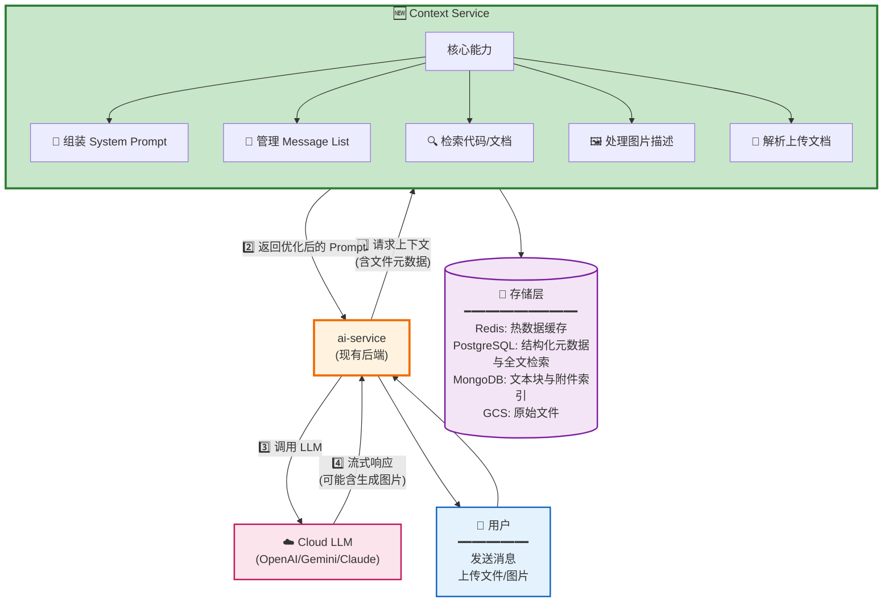
```mermaid
graph TB
    classDef client fill:#e3f2fd,stroke:#1565c0,stroke-width:2px;
    classDef service fill:#fff3e0,stroke:#ef6c00,stroke-width:3px;
    classDef new fill:#c8e6c9,stroke:#2e7d32,stroke-width:3px;
    classDef llm fill:#fce4ec,stroke:#c2185b,stroke-width:2px;
    classDef storage fill:#f3e5f5,stroke:#7b1fa2,stroke-width:2px;

    User["👤 用户<br/>━━━━━━━━━━<br/>发送消息<br/>上传文件/图片"]
    
    User --> AIService["ai-service<br/>(现有后端)"]
    
    AIService -->|"1️⃣ 请求上下文<br/>(含文件元数据)"| CS
    
    subgraph CS ["🆕 Context Service"]
        direction TB
        Core["核心能力"]
        Core --> F1["📝 组装 System Prompt"]
        Core --> F2["💬 管理 Message List"]
        Core --> F3["🔍 检索代码/文档"]
        Core --> F4["🖼️ 处理图片描述"]
        Core --> F5["📄 解析上传文档"]
    end
    
    CS -->|"2️⃣ 返回优化后的 Prompt"| AIService
    
    AIService -->|"3️⃣ 调用 LLM"| LLM["☁️ Cloud LLM<br/>(OpenAI/Gemini/Claude)"]
    
    LLM -->|"4️⃣ 流式响应<br/>(可能含生成图片)"| AIService
    AIService --> User

    CS --> Storage[("💾 存储层<br/>━━━━━━━━━━━━━━━━<br/>Redis: 热数据缓存<br/>PostgreSQL: 结构化元数据与全文检索<br/>MongoDB: 文本块与附件索引<br/>GCS: 原始文件")]

    class User client;
    class AIService service;
    class CS new;
    class LLM llm;
    class Storage storage;
```

**Context Service 的五大核心能力**：

| 能力 | 描述 | 输入 | 输出到 Prompt |
|-----|-----|-----|--------------|
| **📝 Prompt 组装** | 将各模块按最优顺序组装 | 所有 B1/B2a/B2b/B3/B4/B5/B6 块 | 完整的 System + Messages |
| **💬 历史管理** | 摘要 + 近景对话双轨制 | 对话历史 | B4 (摘要) + B6 (近景) |
| **🔍 代码/文档检索** | 语义 + 关键词混合搜索 | 用户查询 | B5 (检索结果) |
| **🖼️ 图片处理** | Vision API 生成文本描述 | 用户上传图片 | B5 (附件描述) |
| **📄 文档解析** | 提取文本并建立索引 | PDF/Word/Excel | B5 (可检索) |

**对比：有/无 Context Service**：

| 问题 | 没有 Context Service | 有 Context Service |
|-----|---------------------|-------------------|
| **Prompt 组装** | ai-service 内部硬编码 | 独立服务，可复用、可演进 |
| **长对话记忆** | 简单截断，信息丢失 | 摘要 + 近景对话，信息完整 |
| **LLM 调用成本** | 每次全量 Prefill | Prefix Cache 命中，节约时间成本 |
| **代码检索** | 无 | 语义 + 关键词混合检索 |
| **文档处理** | 无法引用上传的文档 | 自动解析、索引、按需检索 |
| **图片理解** | 每次都调 Vision API | 描述缓存，重复引用免调用 |

**数据流简图**：

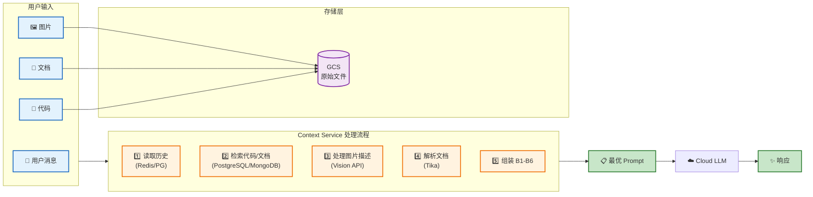
```mermaid
flowchart LR
    classDef input fill:#e3f2fd,stroke:#1565c0,stroke-width:2px;
    classDef process fill:#fff3e0,stroke:#ef6c00,stroke-width:2px;
    classDef storage fill:#f3e5f5,stroke:#7b1fa2,stroke-width:2px;
    classDef output fill:#c8e6c9,stroke:#2e7d32,stroke-width:2px;

    subgraph Input ["用户输入"]
        Msg["💬 用户消息"]
        Img["🖼️ 图片"]
        Doc["📄 文档"]
        Code["📝 代码"]
    end

    subgraph CS ["Context Service 处理流程"]
        direction TB
        S1["1️⃣ 读取历史<br/>(Redis/PG)"]
        S2["2️⃣ 检索代码/文档<br/>(PostgreSQL/MongoDB)"]
        S3["3️⃣ 处理图片描述<br/>(Vision API)"]
        S4["4️⃣ 解析文档<br/>(Tika)"]
        S5["5️⃣ 组装 B1-B6"]
    end

    subgraph Storage ["存储层"]
        GCS[("GCS<br/>原始文件")]
    end

    Input --> CS
    Img & Doc & Code --> GCS
    CS --> Prompt["📋 最优 Prompt"]
    Prompt --> LLM["☁️ Cloud LLM"]
    LLM --> Response["✨ 响应"]

    class Msg,Img,Doc,Code input;
    class S1,S2,S3,S4,S5 process;
    class GCS storage;
    class Prompt,Response output;
```

---

### 2.2 与现有系统的关系

Context Service 作为独立微服务，需要与现有的 `ai-service` 和 `agent-sdk` 进行深度集成。
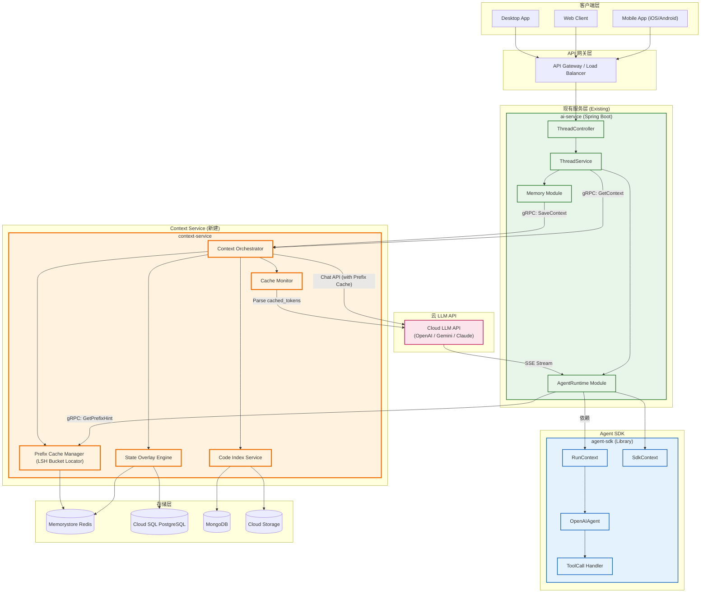
```mermaid
graph TB
    classDef existing fill:#e8f5e9,stroke:#2e7d32,stroke-width:2px;
    classDef new fill:#fff3e0,stroke:#ef6c00,stroke-width:3px;
    classDef sdk fill:#e3f2fd,stroke:#1565c0,stroke-width:2px;
    classDef cloudapi fill:#fce4ec,stroke:#c2185b,stroke-width:2px;

    subgraph Client ["客户端层"]
        Mobile["Mobile App (iOS/Android)"]
        Web["Web Client"]
        Desktop["Desktop App"]
    end

    subgraph Gateway ["API 网关层"]
        APIGW["API Gateway / Load Balancer"]
    end

    subgraph Existing ["现有服务层 (Existing)"]
        subgraph AiService ["ai-service (Spring Boot)"]
            TC["ThreadController"]
            TS["ThreadService"]
            Memory["Memory Module"]
            AgentRT["AgentRuntime Module"]
        end
    end

    subgraph SDK ["Agent SDK"]
        subgraph AgentSDK ["agent-sdk (Library)"]
            RunCtx["RunContext"]
            OpenAIAgent["OpenAIAgent"]
            ToolCall["ToolCall Handler"]
            SdkCtx["SdkContext"]
        end
    end

    subgraph NewService ["Context Service (新建)"]
        subgraph ContextSvc ["context-service"]
            CtxOrch["Context Orchestrator"]
            PrefixMgr["Prefix Cache Manager (LSH Bucket Locator)"]
            CacheMonitor["Cache Monitor"]
            CodeIdx["Code Index Service"]
            StateMgr["State Overlay Engine"]
        end
    end

    subgraph CloudLLM ["云 LLM API"]
        CloudAPI["Cloud LLM API<br/>(OpenAI / Gemini / Claude)"]
    end

    subgraph Storage ["存储层"]
        Redis[("Memorystore Redis")]
        PG[("Cloud SQL PostgreSQL")]
        Mongo[("MongoDB")]
        GCS[("Cloud Storage")]
    end

    %% 客户端到网关
    Mobile & Web & Desktop --> APIGW

    %% 网关到ai-service
    APIGW --> TC
    TC --> TS
    TS --> Memory
    TS --> AgentRT

    %% ai-service 使用 agent-sdk
    AgentRT --> |"依赖"| RunCtx
    RunCtx --> OpenAIAgent
    OpenAIAgent --> ToolCall
    AgentRT --> SdkCtx

    %% ai-service 调用 Context Service (新增集成点)
    TS --> |"gRPC: GetContext"| CtxOrch
    Memory --> |"gRPC: SaveContext"| CtxOrch
    AgentRT --> |"gRPC: GetPrefixHint"| PrefixMgr

    %% Context Service 内部
    CtxOrch --> PrefixMgr
    CtxOrch --> CacheMonitor
    CtxOrch --> CodeIdx
    CtxOrch --> StateMgr

    %% Context Service 到云 LLM
    CtxOrch --> |"Chat API (with Prefix Cache)"| CloudAPI
    CacheMonitor --> |"Parse cached_tokens"| CloudAPI

    %% Context Service 到存储
    StateMgr --> Redis & PG
    CodeIdx --> Mongo & GCS
    PrefixMgr --> Redis

    %% 云 LLM 响应回到 ai-service
    CloudAPI --> |"SSE Stream"| AgentRT

    class AiService,TS,TC,Memory,AgentRT existing;
    class ContextSvc,CtxOrch,PrefixMgr,CacheMonitor,CodeIdx,StateMgr new;
    class AgentSDK,RunCtx,OpenAIAgent,ToolCall,SdkCtx sdk;
    class CloudAPI cloudapi;
```

> 说明：图中的 “with Prefix Cache” 表示请求在云厂商的前缀缓存能力下运行；Context Service 只需保证前缀稳定并解析 `cached_tokens`，具体缓存命中由云厂商实现。

### 2.3 集成架构分层说明

#### 2.3.1 现有系统层 (ai-service)

`ai-service` 是当前的主力后端服务，基于 Spring Boot 3.3 构建：

| 模块 | 职责 | 与 Context Service 交互方式 |
|-----|-----|---------------------------|
| **ThreadController** | HTTP/WebSocket 入口 | 无直接交互 |
| **ThreadService** | 业务编排层 | 调用 `GetContext` / `SaveContext` RPC |
| **Memory Module** | 当前的上下文管理 | 逐步迁移至 Context Service |
| **AgentRuntime** | Agent SDK 适配层 | 获取 Prefix Hint 用于 LLM 调用 |

#### 2.3.2 Agent SDK 层 (agent-sdk)

`agent-sdk` 是 Agent 核心运行时库，v0.2.x 版本：

| 组件 | 职责 | 扩展点 |
|-----|-----|-------|
| **SdkContext** | 全局配置容器 | 新增 `ContextServiceClient` 注入点 |
| **RunContext** | 单次运行上下文 | 新增 `prefixCacheHint` 字段 |
| **OpenAIAgent** | Agent 执行器 | 支持 Prefix Cache 优化的 Prompt |

#### 2.3.3 Context Service 层 (新建)

Context Service 作为独立微服务部署，**核心职责是组装优化的 Prompt**：

| 组件 | 职责 | 对外接口 |
|-----|-----|---------|
| **Context Orchestrator** | 上下文组装与调度 | `ContextService.GetContext` |
| **Prompt Assembler** | B1-B6 Prompt 组装 | (内部模块) |
| **Prefix Cache Manager** | 前缀缓存提示与命中信息管理 | `ContextService.GetPrefixHint` |
| **Code Index Service** | 代码索引与检索 | `CodeService.SearchCode` |
| **State Overlay Engine** | 状态一致性管理 | `StateService.MergeState` |
| **Cache Monitor** | 缓存命中率监控 | `MetricsService.GetCacheStats` |
### 2.4 服务间通信协议

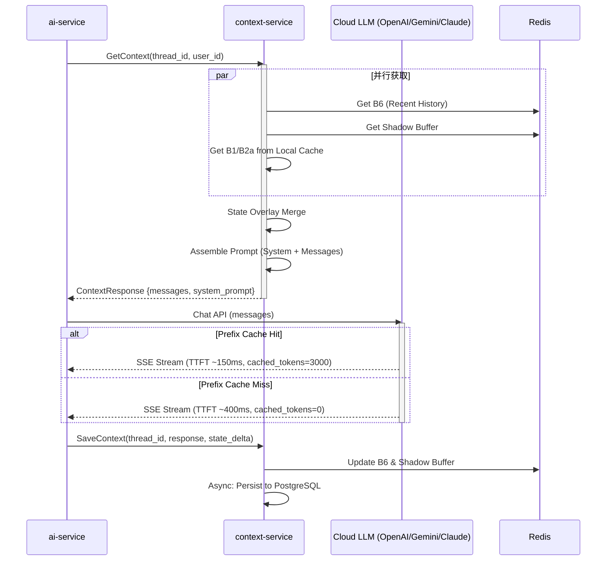
```mermaid
sequenceDiagram
    participant AS as ai-service
    participant CS as context-service
    participant LLM as Cloud LLM (OpenAI/Gemini/Claude)
    participant Redis as Redis

    AS->>CS: GetContext(thread_id, user_id)
    activate CS
    
    par 并行获取
    CS->>Redis: Get B6 (Recent History)
        CS->>Redis: Get Shadow Buffer
        CS->>CS: Get B1/B2a from Local Cache
    end
    
    CS->>CS: State Overlay Merge
    CS->>CS: Assemble Prompt (System + Messages)
    
    CS-->>AS: ContextResponse {messages, system_prompt}
    deactivate CS
    
    AS->>LLM: Chat API (messages)
    activate LLM
    
    alt Prefix Cache Hit
        LLM-->>AS: SSE Stream (TTFT ~150ms, cached_tokens=3000)
    else Prefix Cache Miss
        LLM-->>AS: SSE Stream (TTFT ~400ms, cached_tokens=0)
    end
    
    deactivate LLM
    
    AS->>CS: SaveContext(thread_id, response, state_delta)
    CS->>Redis: Update B6 & Shadow Buffer
    CS->>CS: Async: Persist to PostgreSQL
```

---

## 3. 物理架构设计

### 3.1 全局部署架构
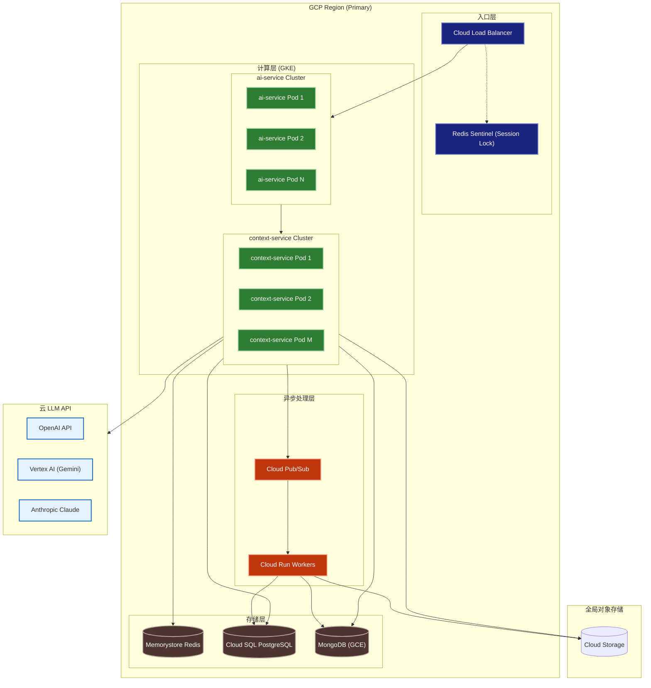
```mermaid
graph TB
    classDef Ingress fill:#1a237e,stroke:#7986cb,stroke-width:2px,color:#ffffff;
    classDef Compute fill:#2e7d32,stroke:#a5d6a7,stroke-width:2px,color:#ffffff;
    classDef Storage fill:#4e342e,stroke:#bcaaa4,stroke-width:2px,color:#ffffff;
    classDef CloudAPI fill:#e3f2fd,stroke:#1565c0,stroke-width:2px;
    classDef Async fill:#bf360c,stroke:#ffab91,stroke-width:2px,color:#ffffff;

    subgraph GCP_Region ["GCP Region (Primary)"]
        subgraph Ingress_A ["入口层"]
            LB_A["Cloud Load Balancer"]
            Lock_A["Redis Sentinel (Session Lock)"]
        end

        subgraph Compute_A ["计算层 (GKE)"]
            subgraph AiService_A ["ai-service Cluster"]
                AS_1["ai-service Pod 1"]
                AS_2["ai-service Pod 2"]
                AS_N["ai-service Pod N"]
            end
            
            subgraph ContextService_A ["context-service Cluster"]
                CS_1["context-service Pod 1"]
                CS_2["context-service Pod 2"]
                CS_M["context-service Pod M"]
            end
        end

        subgraph Storage_A ["存储层"]
            Redis_A[("Memorystore Redis")]
            PG_A[("Cloud SQL PostgreSQL")]
        Mongo_A[("MongoDB (GCE)")]
        end

        subgraph Async_A ["异步处理层"]
            PubSub_A["Cloud Pub/Sub"]
            Workers_A["Cloud Run Workers"]
        end
    end

    subgraph CloudLLM ["云 LLM API"]
        OpenAI["OpenAI API"]
        Gemini["Vertex AI (Gemini)"]
        Claude["Anthropic Claude"]
    end

    subgraph ObjectStore ["全局对象存储"]
        GCS[("Cloud Storage")]
    end

    %% 连接关系（对外连线只连接到集群级别，避免图过密）
    LB_A --> AiService_A
    AiService_A --> ContextService_A
    ContextService_A --> CloudLLM
    ContextService_A --> Redis_A & PG_A & Mongo_A
    ContextService_A --> PubSub_A
    PubSub_A --> Workers_A
    Workers_A --> Mongo_A & PG_A & GCS
    ContextService_A --> GCS
    LB_A -.-> Lock_A

    class LB_A,Lock_A Ingress;
    class AS_1,AS_2,AS_N,CS_1,CS_2,CS_M Compute;
    class Redis_A,PG_A,Mongo_A Storage;
    class OpenAI,Gemini,Claude CloudAPI;
    class PubSub_A,Workers_A Async;
```

**异步处理层职责**：
- 摘要生成与更新：对 B6 近景对话按窗口生成 B4 摘要并回写数据库
- 代码/文档索引：解析上传文件，生成结构化片段写入 MongoDB 与 PostgreSQL
- 成本与性能采样：收集缓存命中率、检索命中率等指标，供容量规划使用

### 3.2 Context Service 内部架构
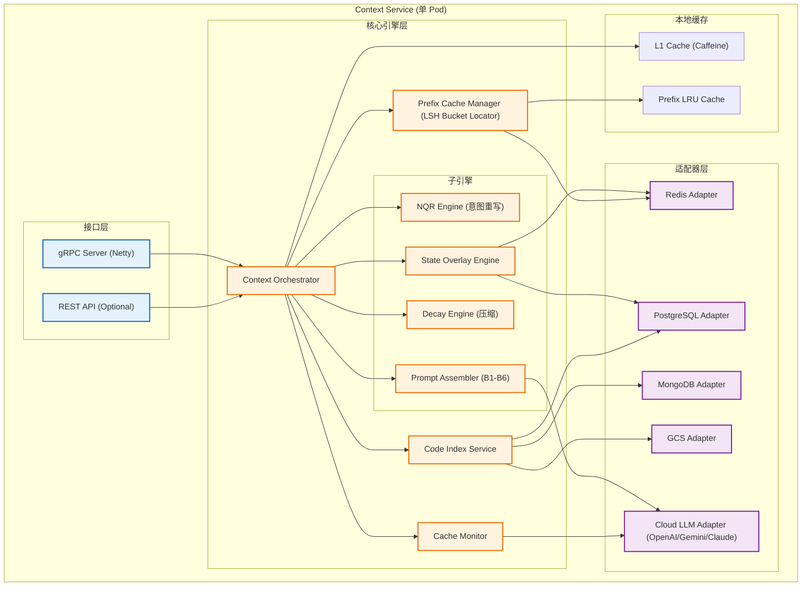
```mermaid
graph TB
    classDef Interface fill:#e3f2fd,stroke:#1565c0,stroke-width:2px;
    classDef Core fill:#fff3e0,stroke:#ef6c00,stroke-width:2px;
    classDef Adapter fill:#f3e5f5,stroke:#7b1fa2,stroke-width:2px;

    subgraph ContextService ["Context Service (单 Pod)"]
        subgraph Interface ["接口层"]
            gRPC["gRPC Server (Netty)"]
            REST["REST API (Optional)"]
        end

        subgraph Core ["核心引擎层"]
            Orchestrator["Context Orchestrator"]
            
            subgraph SubEngines ["子引擎"]
                NQR["NQR Engine (意图重写)"]
                Overlay["State Overlay Engine"]
                Decay["Decay Engine (压缩)"]
                Assembler["Prompt Assembler (B1-B6)"]
            end
            
            PrefixMgr["Prefix Cache Manager (LSH Bucket Locator)"]
            CacheMonitor["Cache Monitor"]
            CodeIndex["Code Index Service"]
        end

        subgraph Adapter ["适配器层"]
            RedisAdapter["Redis Adapter"]
            PGAdapter["PostgreSQL Adapter"]
            MongoAdapter["MongoDB Adapter"]
            LLMAdapter["Cloud LLM Adapter (OpenAI/Gemini/Claude)"]
            GCSAdapter["GCS Adapter"]
        end

        subgraph Local ["本地缓存"]
            L1Cache["L1 Cache (Caffeine)"]
            PrefixLRU["Prefix LRU Cache"]
        end
    end

    %% 接口层连接
    gRPC --> Orchestrator
    REST --> Orchestrator
    
    %% 核心层连接
    Orchestrator --> NQR & Overlay & Decay & Assembler
    Orchestrator --> PrefixMgr & CacheMonitor & CodeIndex
    
    %% 适配器连接
    Overlay --> RedisAdapter & PGAdapter
    CodeIndex --> PGAdapter & MongoAdapter & GCSAdapter
    Assembler --> LLMAdapter
    PrefixMgr --> RedisAdapter
    CacheMonitor --> LLMAdapter
    
    %% 本地缓存
    Orchestrator --> L1Cache
    PrefixMgr --> PrefixLRU

    class gRPC,REST Interface;
    class Orchestrator,NQR,Overlay,Decay,Assembler,PrefixMgr,CacheMonitor,CodeIndex Core;
    class RedisAdapter,PGAdapter,MongoAdapter,LLMAdapter,GCSAdapter Adapter;
```

#### 3.2.1 核心引擎职责

| 模块 | 关键职责 | 关键输出 |
|-----|---------|---------|
| **Context Orchestrator** | 并行拉取 B1/B2a/B4/B6，调度子引擎、控制 Token 预算 | ContextResponse |
| **NQR Engine** | 重写查询、补全指代、对齐实体 | RewrittenQuery |
| **State Overlay Engine** | 合并基准状态与增量事件，输出一致状态 | MergedState |
| **Decay Engine** | 对多模态内容与摘要块进行压缩裁剪 | CompressedBlocks |
| **Prompt Assembler** | 按固定布局构建 System 与 Messages | AssembledPrompt |
| **Prefix Cache Manager** | 生成前缀指纹、记录缓存统计（含 LSH Bucket Locator） | PrefixHint |
| **Cache Monitor** | 采集 cached_tokens 与命中率 | CacheStats |
| **Code Index Service** | 建索引与检索，输出可引用片段 | RetrievedChunks |

---

## 4. Prompt 布局策略与 Prefix Cache

### 4.1 Prompt 布局策略（核心）

#### 4.1.1 Message 结构设计
Prompt 只分为两块：**System Message** 与 **Message List**。**所有 B 分层模块都必须落在这两块中**，但为了最大化 Prefix Cache 命中率，我们将「变化慢」的内容尽量放入 System Message：
- **System Message**：承载稳定或低频变化内容（B1 + B2a + B4）。B4 的摘要按段追加，变化频率远低于 B6，因此可以作为前缀的一部分。
- **Message List**：仅包含 **B6 近景对话** 与 **当前用户消息**。其中当前用户消息携带当轮动态上下文（B5 检索上下文 + B3 任务状态 + B2b 会话内画像/情绪 + 原始用户问题）。

> **原则**：B5/B3/B2b 以结构化段落附加到“当前用户消息”，但不会改写用户原始问题；NQR 的重写仅用于检索，不覆盖用户输入，避免语义偏移。
> **术语说明**：本文中的 System Message 与 System Prompt 同义，均指模型的 system 角色消息。

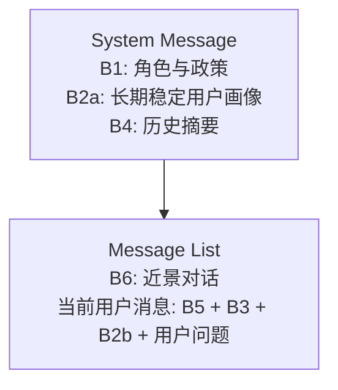
```mermaid
graph TD
    System["System Message<br/>B1: 角色与政策<br/>B2a: 长期稳定用户画像<br/>B4: 历史摘要"]
    Messages["Message List<br/>B6: 近景对话<br/>当前用户消息: B5 + B3 + B2b + 用户问题"]
    System --> Messages
```

#### 4.1.2 System Message 模板
```
你是 {agent_name}，负责 {agent_scope}。
行为边界：{b1_policy}

## 用户画像（长期稳定）
{b2a_profile}

## 历史摘要（B4）
{b4_summary}
```

**示例：完整 Prompt（含 B1/B2a/B2b/B3/B4/B5/B6，Message List 的最后一条为当前用户消息）**：

```
System Message
你是 Ninja AI 助手，负责解决编程问题。
行为边界：遵循安全与合规要求。

## 用户画像（长期稳定）
语言偏好：zh-CN
订阅级别：Pro

## 历史摘要（B4）
用户已完成 React 项目初始化，确认需要处理异步请求取消问题。

Message List
[近景对话/B6]
User: 如何在 useEffect 中处理异步操作？
Assistant: 可以在 useEffect 中封装异步函数并处理清理逻辑。

[当前用户消息]
## 相关参考（B5）
src/App.tsx 中 useEffectHook 的实现片段

## 当前任务状态（B3）
用户正在编辑 React 项目，任务状态为“重构副作用逻辑”

## 会话内画像/情绪（B2b）
用户当前紧急度：高；偏好直接给出可复制代码

## 附件与工具输出
当前文件：src/App.tsx
已选择函数：useEffectHook
附件描述：上传的错误日志与截图摘要

## 用户问题（原始输入）
那如何取消未完成的请求？
```

#### 4.1.3 示例：完整消息结构

```json
{
  "messages": [
    {
      "role": "system",
      "content": "你是 Ninja AI 助手，负责解决编程问题。\n行为边界：遵循安全与合规要求。\n\n## 用户画像（长期稳定）\n语言偏好：zh-CN\n订阅级别：Pro\n\n## 历史摘要（B4）\n用户之前询问了 React 组件的生命周期..."
    },
    {
      "role": "assistant",
      "content": "好的，我了解了之前的对话背景。"
    },
    {
      "role": "user",
      "content": "如何在 useEffect 中处理异步操作？"
    },
    {
      "role": "assistant",
      "content": "在 useEffect 中处理异步操作需要注意..."
    },
    {
      "role": "user",
      "content": "## 相关参考（B5）\n```javascript\nuseEffect(() => {...})\n```\n\n## 当前任务状态（B3）\n用户正在编辑 React 项目\n\n## 会话内画像/情绪（B2b）\n用户偏好简洁回答\n\n## 附件与工具输出\n当前文件：src/App.tsx\n已选择函数：useEffectHook\n\n## 用户问题（原始输入）\n那如何取消未完成的请求？"
    }
  ]
}
```

#### 4.1.4 B 分层模块说明

| 模块 | 位置 | 内容 | 变化频率 | 缓存策略 |
|-----|-----|-----|---------|---------|
| **B1** | System Message | Agent 的角色定义、能力边界、行为准则 | 永不变化 | 全局共享 |
| **B2a** | System Message | 静态的（长期稳定的）用户画像 | 天级更新 | 用户级共享 |
| **B4** | System Message | 早期对话的摘要（由异步 Worker 生成） | Session 级追加 | Session 级共享 |
| **B6** | Message List | 近 N 轮真实对话 | 每轮滑动 | 对话级共享 |
| **B5** | 当前用户消息 | RAG 检索的代码/文档片段 | 每轮变化 | 不缓存 |
| **B3** | 当前用户消息 | 当前任务状态（如购物车内容） | 每轮变化 | 不缓存 |
| **B2b** | 当前用户消息 | 线程内临时画像/情绪/偏好信号 | 每轮变化 | 不缓存 |


#### 4.1.5 B6 近景对话生成机制

B6 是近期 N 轮对话的真实消息流，采用滑动窗口机制保证时序与语义连续，并且为 B4 的摘要生成提供稳定输入。

**生成规则**：
- **窗口大小**：默认保留最近 N 轮对话（N 可配置），按 token 预算动态裁剪。
- **写入策略**：每轮对话结束后将最新 user/assistant 消息追加到 Redis 列表，并维护窗口边界。
- **降级策略**：当窗口超出预算时，先裁剪最早轮次，再降级为仅保留用户消息摘要指针。

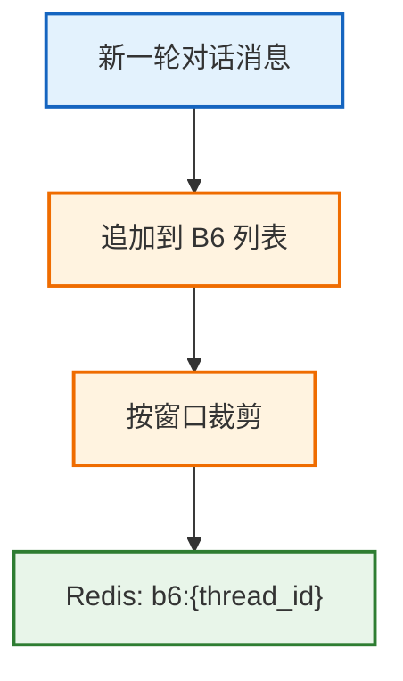
```mermaid
flowchart TB
    classDef input fill:#e3f2fd,stroke:#1565c0,stroke-width:2px;
    classDef process fill:#fff3e0,stroke:#ef6c00,stroke-width:2px;
    classDef store fill:#e8f5e9,stroke:#2e7d32,stroke-width:2px;

    NewMsg["新一轮对话消息"]:::input
    Append["追加到 B6 列表"]:::process
    Trim["按窗口裁剪"]:::process
    RedisB6["Redis: b6:{thread_id}"]:::store

    NewMsg --> Append --> Trim --> RedisB6
```

#### 4.1.6 B4 摘要生成机制

B4 摘要由异步任务生成，来源是原始对话而不是已有摘要，保证信息完整与可重建。摘要以分段方式追加，达到阈值后执行合并摘要并归档旧段，避免 B4 无限增长。

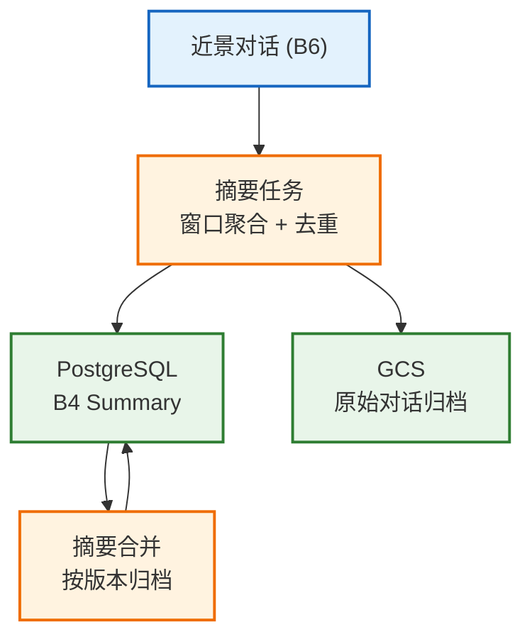
```mermaid
flowchart TB
    classDef input fill:#e3f2fd,stroke:#1565c0,stroke-width:2px;
    classDef process fill:#fff3e0,stroke:#ef6c00,stroke-width:2px;
    classDef store fill:#e8f5e9,stroke:#2e7d32,stroke-width:2px;

    RecentTurns["近景对话 (B6)"]:::input
    SummaryJob["摘要任务<br/>窗口聚合 + 去重"]:::process
    SummaryMerge["摘要合并<br/>按版本归档"]:::process
    PGSummary["PostgreSQL<br/>B4 Summary"]:::store
    GCSRaw["GCS<br/>原始对话归档"]:::store

    RecentTurns --> SummaryJob --> PGSummary
    SummaryJob --> GCSRaw
    PGSummary --> SummaryMerge --> PGSummary
```

**生成规则**：
- **窗口粒度**：每 N 轮对话生成一个摘要段（N 可配置）。
- **版本控制**：摘要带 `template_version` 与 `summary_version`，Prompt 模板升级时触发重建。
- **合并策略**：当摘要段超过上限时，合并为新的汇总段并保留原始段索引。
- **可追溯性**：每段摘要保留原始对话范围，支持定位和回溯。

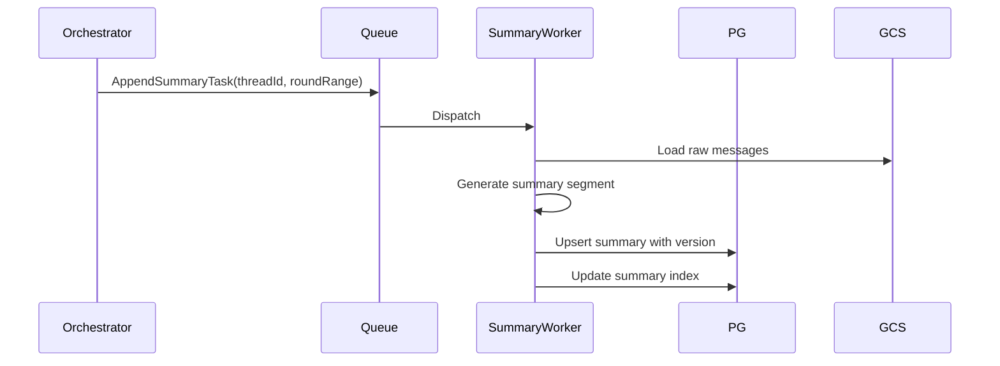
```mermaid
sequenceDiagram
    participant Orchestrator
    participant Queue
    participant SummaryWorker
    participant PG
    participant GCS

    Orchestrator->>Queue: AppendSummaryTask(threadId, roundRange)
    Queue->>SummaryWorker: Dispatch
    SummaryWorker->>GCS: Load raw messages
    SummaryWorker->>SummaryWorker: Generate summary segment
    SummaryWorker->>PG: Upsert summary with version
    SummaryWorker->>PG: Update summary index
```

#### 4.1.7 RAG 检索范围与步骤

1. **查询理解**：NQR 重写用户意图，抽取实体与关键词
2. **多源召回**：
    - 代码与文档索引：PostgreSQL 全文检索与 MongoDB 文本块索引
    - 对话历史检索：对话归档的关键片段检索，补足 B4/B6 未覆盖的细节
    - 附件与工具结果：当前线程的附件描述与近期工具输出
3. **结果融合**：对多路召回结果进行去重、加权融合与上下文裁剪
4. **投递到 B5**：仅输出与当前问题强相关的片段

#### 4.1.8 Java 实现

```java
/**
 * Prompt 组装器
 * 将各模块按照优化缓存的顺序组装成 System Message + Message List
 */
@Service
public class PromptAssembler {
    
    /**
     * 组装完整的消息列表
     */
    public List<ChatMessage> assemble(PromptBlocks blocks, String userQuery) {
        List<ChatMessage> messages = new ArrayList<>();
        
        // ========== System Message (高复用区) ==========
        // B1: Agent 职责与边界
        // B2a: 长期稳定用户画像
        String systemContent = buildSystemMessage(blocks);
        messages.add(ChatMessage.systemMessage(systemContent));
        
        // ========== Message List (对话历史) ==========
        // B6: 近 N 轮真实对话
        for (Message msg : blocks.getB6Messages()) {
            if (msg.isUser()) {
                messages.add(ChatMessage.userMessage(msg.getContent()));
            } else {
                messages.add(ChatMessage.assistantMessage(msg.getContent()));
            }
        }
        
        // ========== Current User Message (低复用区) ==========
        String currentMessage = buildCurrentMessage(blocks, userQuery);
        messages.add(ChatMessage.userMessage(currentMessage));
        
        return messages;
    }
    
    /**
     * 构建 System Message
     * 关键：保持格式完全一致，不要插入时间戳等动态内容
     */
    private String buildSystemMessage(PromptBlocks blocks) {
        StringBuilder sb = new StringBuilder();
        
        // B1: Agent 职责（固定模板）
        sb.append(blocks.getB1());
        
        // B2a: 用户画像（长期稳定）
        if (blocks.hasUserProfile()) {
            sb.append("\n\n## 用户画像（长期稳定）\n");
            sb.append("- 语言偏好: ").append(blocks.getUserLanguage()).append("\n");
            sb.append("- 订阅级别: ").append(blocks.getSubscriptionTier()).append("\n");
            // ... 其他固定格式的用户信息
        }

        // B4: 历史摘要（低频变化，放入 System 以提升前缀稳定性）
        if (blocks.hasHistorySummary()) {
            sb.append("\n\n## 历史摘要（B4）\n");
            sb.append(blocks.getB4Summary());
        }
        
        return sb.toString();
    }
    
    /**
     * 构建当前用户消息（包含动态内容）
     */
    private String buildCurrentMessage(PromptBlocks blocks, String userQuery) {
        StringBuilder sb = new StringBuilder();
        
        // B5: RAG 检索结果
        if (blocks.hasRetrievedContext()) {
            sb.append("## 相关参考\n");
            sb.append(blocks.getB5Retrieved());
            sb.append("\n\n");
        }
        
        // 任务状态（B3）
        if (blocks.hasTaskState()) {
            sb.append("## 当前状态\n");
            sb.append(blocks.getB3TaskState());
            sb.append("\n\n");
        }

        // 会话内画像/情绪（B2b）
        if (blocks.hasSessionProfile()) {
            sb.append("## 会话内画像/情绪\n");
            sb.append(blocks.getB2bSessionProfile());
            sb.append("\n\n");
        }
        
        // 附件与工具输出（B5）
        if (blocks.hasAttachmentsOrTools()) {
            sb.append("## 附件与工具输出\n");
            sb.append(blocks.getAttachmentsOrTools());
            sb.append("\n\n");
        }
        
        // 用户问题（原始输入）
        sb.append("## 用户问题（原始输入）\n");
        sb.append(userQuery);
        
        return sb.toString();
    }
}
```

### 4.2 Prefix Cache 原理简述

#### 4.2.1 问题背景

LLM 推理分为两个阶段：

```
┌─────────────────────────────────────────────────────────────┐
│  Prefill 阶段（慢）                                          │
│  处理整个 Prompt，计算每个 token 的中间结果                    │
│  耗时与 Prompt 长度成正比                                     │
└─────────────────────────────────────────────────────────────┘
                              ↓
┌─────────────────────────────────────────────────────────────┐
│  Decode 阶段（快）                                           │
│  基于 Prefill 的结果，逐个生成输出 token                      │
└─────────────────────────────────────────────────────────────┘
```

**Prefix Cache 的核心思想**：如果两个请求的 Prompt 前缀相同，Prefill 阶段的计算结果也相同，可以直接复用。

#### 4.2.2 工作原理

```
请求 1: [System Prompt][用户画像][历史][问题A]
                                       ↓
        LLM Provider 执行完整 Prefill，缓存前缀的计算结果
                                       
请求 2: [System Prompt][用户画像][历史][问题B]
        └────────────────────────────┘
                 前缀相同，命中缓存！
                 跳过 Prefill，直接 Decode
```

**收益**：
- **延迟降低**：TTFT 明显降低，具体数值以压测结果为准
- **成本降低**：缓存命中时可降低输入成本，折扣规则以云厂商计费为准

#### 4.2.3 我们需要做什么

**云 API 会管理缓存机制**，我们只需要：

1. **保证 Prompt 前缀稳定** — 相同的内容、相同的顺序、相同的格式
2. **监控缓存命中率** — 从 API 响应中读取 `cached_tokens`

---

### 4.3 云 API 集成

#### 4.3.1 各云 API 的 Prefix Cache 支持
| 云服务商 | 功能名称 | 启用方式 | 成本规则 | 参考链接 |
|---------|---------|---------|---------|---------|
| **OpenAI** | Prompt Caching | 自动启用 | 以官方计费规则为准 | https://platform.openai.com/docs/guides/prompt-caching |
| **Google Gemini** | Context Caching | 显式 API | 以官方计费规则为准 | https://cloud.google.com/vertex-ai/docs/generative-ai/context-caching/overview |
| **Anthropic Claude** | Prompt Caching | 显式 API | 以官方计费规则为准 | https://docs.anthropic.com/en/docs/prompt-caching |
#### 4.3.2 OpenAI 集成

OpenAI 会**自动**检测前缀匹配，无需额外配置。只需从响应中读取缓存统计：

```java
@Service
public class OpenAIClient {
    
    public ChatResponse chat(List<ChatMessage> messages) {
        ChatCompletionResponse response = openAI.createChatCompletion(
            ChatCompletionRequest.builder()
                .model("gpt-4o")
                .messages(messages)
                .build()
        );
        
        // 读取缓存命中情况
        Usage usage = response.getUsage();
        int cachedTokens = usage.getPromptTokensDetails().getCachedTokens();
        int totalTokens = usage.getPromptTokens();
        
        log.info("Prefix Cache: {}/{} tokens ({}%)", 
            cachedTokens, totalTokens, 
            cachedTokens * 100 / totalTokens);
        
        return ChatResponse.from(response);
    }
}
```

#### 4.3.3 Gemini 集成

Gemini 需要**显式创建缓存**，适合 System Prompt 特别长的场景：

```java
@Service
public class GeminiClient {
    
    // 缓存 System Prompt
    public String createCache(String systemPrompt, Duration ttl) {
        CachedContent cache = vertexAI.createCachedContent(
            CachedContent.newBuilder()
                .setModel("gemini-1.5-pro")
                .setTtl(ttl)
                .addContents(Content.newBuilder()
                    .setRole("user")
                    .addParts(Part.newBuilder().setText(systemPrompt))
                    .build())
                .build()
        );
        return cache.getName();  // "cachedContents/abc123"
    }
    
    // 使用缓存发送请求
    public GenerateContentResponse chat(String cacheId, List<Content> messages) {
        return new GenerativeModel.Builder()
            .setModelName("gemini-1.5-pro")
            .setCachedContent(cacheId)
            .build()
            .generateContent(messages);
    }
}
```

#### 4.3.4 Claude 集成
Claude 通过请求中的 `cache_control` 指令对稳定前缀进行缓存控制：

```java
@Service
public class ClaudeClient {
    public ClaudeResponse chat(List<ClaudeMessage> messages, String systemPrompt) {
        return anthropic.createMessage(
            ClaudeRequest.builder()
                .model("claude-3-5-sonnet")
                .system(systemPrompt)
                .messages(messages)
                .cacheControl("cache")
                .build()
        );
    }
}
```

---

### 4.4 缓存效果监控
**核心思路**：缓存是否命中只由云厂商返回的 usage 字段决定。Context Service 不做“猜测”，而是把各厂商 usage 统一解析为**可比指标**，再上报到监控与成本模型中。

**监控原则**：
1. **采集来源统一**：从 OpenAI/Gemini/Claude 响应中解析 `cached_tokens` 与 `prompt_tokens`。
2. **指标口径一致**：统一计算命中率、节省成本、分层命中（B1/B2a/B4/B6）占比。
3. **可追溯**：每条请求保留 provider、model、thread_id、prefix_hash，用于回放与优化。
4. **采样与聚合**：按请求级采样 + 按模型/租户/时间窗口聚合，避免高基数爆炸。

**推荐指标**：
| 指标 | 说明 | 目标值 |
|-----|-----|-------|
| `prefix_cache.hit_rate` | 缓存命中率 | 由压测结果与业务预算确定 |
| `prefix_cache.cached_tokens` | 命中 token 数 | 持续上升为正向信号 |
| `prefix_cache.cost_savings` | 累计成本节省 | 由成本模型与计费规则确定 |
| `prefix_cache.hit_level` | 分层命中级别（B1/B2a/B4/B6） | 逐步提高深层命中占比 |

```java
@Service
public class CacheMetrics {
    
    private final MeterRegistry registry;
    
    public void record(int cachedTokens, int totalTokens, String provider) {
        double hitRate = (double) cachedTokens / totalTokens;
        
        registry.gauge("prefix_cache.hit_rate", hitRate);
        registry.counter("prefix_cache.cached_tokens").increment(cachedTokens);
        registry.counter("prefix_cache.total_tokens").increment(totalTokens);
        
        // 成本节省估算
        double discount = provider.equals("GEMINI") ? 0.75 : 0.50;
        double saving = cachedTokens * 0.0000025 * discount;  // 按 gpt-4o 价格
        registry.counter("prefix_cache.cost_savings").increment(saving);
    }
}
```

---

### 4.6 最佳实践

#### 4.6.1 保持前缀稳定

```
✅ 正确做法：
- System Prompt 使用固定模板
- 用户画像按固定格式输出
- 历史摘要只追加，不修改

❌ 错误做法：
- 在 System Prompt 中插入当前时间
- 每次请求重新格式化用户画像
- 在前缀中加入随机 ID
```

#### 4.6.2 Token 长度建议
| 前缀长度 | 缓存触发预期 | 说明 |
|---------|---------------|-----|
| < 1024 tokens | 触发不稳定 | 前缀过短，命中率可能偏低 |
| 1024-2048 tokens | 可触发 | 建议的默认区间 |
| 2048-4096 tokens | 命中率提升 | 需受 TTFT 与成本预算约束 |
| > 4096 tokens | 仅在高价值场景使用 | 需评估成本与延迟收益 |

#### 4.6.3 OpenAI 的 128 Token 对齐

OpenAI 的 Prefix Cache 以 **128 tokens 为单位**对齐。这意味着：
- 如果前缀是 1000 tokens，实际缓存 896 tokens（7 × 128）
- 建议将 System Prompt 设计为 128 的整数倍

### 4.7 多模态文件处理
本节描述用户上传的文件、用户输入的代码片段，以及 LLM 生成的代码/图片如何被处理并纳入上下文。

#### 4.7.1 文件处理流程概览
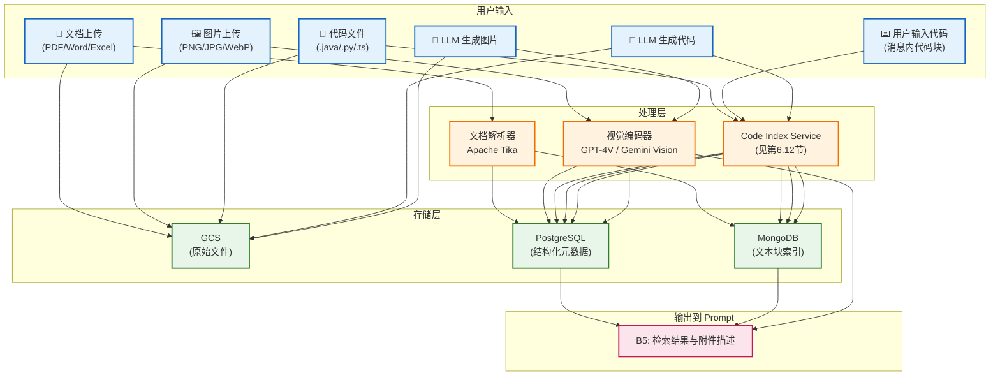
```mermaid
graph TB
    classDef upload fill:#e3f2fd,stroke:#1565c0,stroke-width:2px;
    classDef process fill:#fff3e0,stroke:#ef6c00,stroke-width:2px;
    classDef store fill:#e8f5e9,stroke:#2e7d32,stroke-width:2px;
    classDef output fill:#fce4ec,stroke:#c2185b,stroke-width:2px;

    subgraph Input ["用户输入"]
        DocUpload["📄 文档上传<br/>(PDF/Word/Excel)"]
        ImgUpload["🖼️ 图片上传<br/>(PNG/JPG/WebP)"]
        CodeUpload["📝 代码文件<br/>(.java/.py/.ts)"]
        InlineCode["⌨️ 用户输入代码<br/>(消息内代码块)"]
        LLMCode["🤖 LLM 生成代码"]
        LLMImage["🎨 LLM 生成图片"]
    end

    subgraph Processing ["处理层"]
        DocParser["文档解析器<br/>Apache Tika"]
        VisionEncoder["视觉编码器<br/>GPT-4V / Gemini Vision"]
        CodeIndex["Code Index Service<br/>(见第6.12节)"]
    end

    subgraph Storage ["存储层"]
        GCS["GCS<br/>(原始文件)"]
        PG["PostgreSQL<br/>(结构化元数据)"]
        Mongo["MongoDB<br/>(文本块索引)"]
    end

    subgraph Output ["输出到 Prompt"]
        B5["B5: 检索结果与附件描述"]
    end

    DocUpload --> DocParser --> PG & Mongo
    ImgUpload --> VisionEncoder --> PG
    CodeUpload --> CodeIndex --> PG & Mongo
    InlineCode --> CodeIndex --> PG & Mongo
    LLMCode --> CodeIndex --> PG & Mongo
    LLMImage --> VisionEncoder --> PG

    DocUpload & ImgUpload & CodeUpload & LLMCode & LLMImage --> GCS

    PG --> B5
    Mongo --> B5
    VisionEncoder --> B5

    class DocUpload,ImgUpload,CodeUpload,InlineCode,LLMCode,LLMImage upload;
    class DocParser,VisionEncoder,CodeIndex process;
    class GCS,PG,Mongo store;
    class B5 output;
```

当前阶段不引入向量数据库与 Embedding 模型，检索由 PostgreSQL 全文检索、MongoDB 文本块索引与 AST 结构召回协同完成。

#### 4.7.2 文档处理（PDF/Word/Excel）

**处理流程**：

```java
/**
 * 文档处理服务
 * 将用户上传的文档转换为可检索的文本块
 */
@Service
public class DocumentProcessor {
    
    private final Tika tika = new Tika();
    private final TikaConfig tikaConfig;
    
    /**
     * 处理上传的文档
     */
    public DocumentResult process(UploadedFile file, String userId, String threadId) {
        // 1. 存储原始文件到 GCS
        String gcsPath = gcsClient.upload(
            String.format("docs/%s/%s/%s", userId, threadId, file.getName()),
            file.getContent()
        );
        
        // 2. 使用 Apache Tika 提取文本
        String extractedText = tika.parseToString(file.getInputStream());
        
        // 3. 切分为语义块
        List<TextChunk> chunks = textChunker.chunk(
            extractedText,
            ChunkConfig.builder()
                .maxTokens(512)
                .overlap(50)
                .build()
        );
        
        // 4. 生成文本块索引并存储
        for (TextChunk chunk : chunks) {
            docChunkRepository.save(DocChunk.builder()
                .chunkId(UUID.randomUUID().toString())
                .userId(userId)
                .threadId(threadId)
                .sourceFile(gcsPath)
                .content(chunk.getText())
                .pageNumber(chunk.getPageNumber())
                .build());
        }
        
        // 5. 存储元数据到 PostgreSQL
        DocumentMetadata metadata = DocumentMetadata.builder()
            .userId(userId)
            .threadId(threadId)
            .fileName(file.getName())
            .fileType(file.getContentType())
            .gcsPath(gcsPath)
            .chunkCount(chunks.size())
            .uploadedAt(Instant.now())
            .build();
        
        documentRepository.save(metadata);
        
        return DocumentResult.builder()
            .documentId(metadata.getId())
            .chunkCount(chunks.size())
            .build();
    }
}
```

**在 Prompt 中的表现**（B5 部分）：

```
[检索到的文档内容]
来源: 用户上传的 "产品需求文档.pdf" (第3页)
---
用户需求包括以下几点：
1. 支持多语言切换
2. 响应时间 < 200ms
3. 支持离线模式
---
```

#### 4.7.3 图片处理

图片分为两类：**用户上传的图片** 和 **LLM 生成的图片**。

**用户上传图片的处理**：

```java
/**
 * 图片处理服务
 * 将图片转换为文本描述，以便纳入 Prompt
 */
@Service
public class ImageProcessor {
    
    private final VisionService visionService;  // GPT-4V 或 Gemini Vision
    
    /**
     * 处理用户上传的图片
     */
    public ImageResult process(UploadedImage image, String userId, String threadId) {
        // 1. 存储原始图片到 GCS
        String gcsPath = gcsClient.upload(
            String.format("images/%s/%s/%s", userId, threadId, image.getName()),
            image.getContent()
        );
        
        // 2. 使用 Vision API 生成描述
        String description = visionService.describe(
            image.getContent(),
            "请详细描述这张图片的内容，包括：主要元素、文字内容、布局结构、颜色和风格。"
        );
        
        // 3. 存储元数据
        ImageMetadata metadata = ImageMetadata.builder()
            .userId(userId)
            .threadId(threadId)
            .fileName(image.getName())
            .gcsPath(gcsPath)
            .description(description)
            .width(image.getWidth())
            .height(image.getHeight())
            .uploadedAt(Instant.now())
            .build();
        
        imageRepository.save(metadata);
        
        return ImageResult.builder()
            .imageId(metadata.getId())
            .description(description)
            .build();
    }
}
```

**图片在 Prompt 中的表现**（B5 部分）：

```
[当前对话附件]
用户上传了 1 张图片:
- 图片1: 一张包含登录界面的截图。界面显示用户名和密码输入框，
  下方有"登录"和"忘记密码"按钮。整体采用蓝白配色，
  顶部有公司 Logo。右下角显示错误提示"密码错误"。
```

**LLM 生成图片的存储**：

```java
/**
 * LLM 生成内容存储服务
 */
@Service
public class GeneratedContentService {
    
    /**
     * 存储 LLM 生成的图片
     */
    public GeneratedImageResult storeGeneratedImage(
            String base64Image, 
            String prompt,
            String userId, 
            String threadId,
            int roundNumber) {
        
        // 1. 解码并存储到 GCS
        byte[] imageBytes = Base64.getDecoder().decode(base64Image);
        String gcsPath = gcsClient.upload(
            String.format("generated/%s/%s/round_%d.png", userId, threadId, roundNumber),
            imageBytes
        );
        
        // 2. 生成可访问的 URL（带签名，24小时有效）
        String signedUrl = gcsClient.generateSignedUrl(gcsPath, Duration.ofHours(24));
        
        // 3. 存储元数据（用于后续轮次引用）
        GeneratedImageMetadata metadata = GeneratedImageMetadata.builder()
            .userId(userId)
            .threadId(threadId)
            .roundNumber(roundNumber)
            .gcsPath(gcsPath)
            .generationPrompt(prompt)
            .createdAt(Instant.now())
            .build();
        
        generatedImageRepository.save(metadata);
        
        return GeneratedImageResult.builder()
            .imageId(metadata.getId())
            .signedUrl(signedUrl)
            .build();
    }
    
    /**
     * 在后续轮次引用已生成的图片
     */
    public String getImageReferenceForPrompt(String imageId) {
        GeneratedImageMetadata metadata = generatedImageRepository.findById(imageId)
            .orElseThrow();
        
        return String.format(
            "[已生成的图片 #%d]\n生成提示: %s\n链接: %s",
            metadata.getRoundNumber(),
            metadata.getGenerationPrompt(),
            gcsClient.generateSignedUrl(metadata.getGcsPath(), Duration.ofHours(1))
        );
    }
}
```

#### 4.7.4 文件在 Prompt 布局中的位置

| 文件类型 | Prompt 位置 | 处理方式 | 时机 |
|---------|------------|---------|-----|
| **用户输入的代码** | B5 (RAG 检索) | 解析后入库 → 按相关性检索 | 检索时 |
| **用户上传的代码** | B5 (RAG 检索) | 索引后按相关性检索 | 检索时 |
| **用户上传的文档** | B5 (RAG 检索) | 切分 → 文本块入库 → 全文检索 | 检索时 |
| **用户上传的图片** | B5 (附件描述) | Vision API 转文本描述 | 上传时 |
| **LLM 生成的图片** | B6（对话历史）+ B5（引用） | 存储引用，必要时再次引用 | 对话中 |

#### 4.7.5 多模态压缩策略（Decay Engine）
当上下文窗口紧张时，Decay Engine 会对多模态内容进行智能压缩：

历史对话摘要由 Summary Manager 负责，按固定窗口基于原始对话生成 B4 摘要并写回数据库。每个摘要独立生成，不对已有摘要再摘要，避免语义漂移。Prompt 组装时只拼接摘要片段，并在超出预算时对摘要片段进行优先级裁剪与重排。

```java
/**
 * 多模态内容压缩引擎
 */
@Service
public class DecayEngine {
    
    /**
     * 根据 Token 预算压缩多模态内容
     */
    public String compress(List<MediaItem> mediaItems, int tokenBudget) {
        // 1. 计算当前 Token 占用
        int currentTokens = mediaItems.stream()
            .mapToInt(this::estimateTokens)
            .sum();
        
        if (currentTokens <= tokenBudget) {
            return formatFull(mediaItems);  // 无需压缩
        }
        
        // 2. 按优先级排序（最近 > 用户明确引用 > 历史）
        List<MediaItem> sorted = mediaItems.stream()
            .sorted(Comparator.comparingInt(MediaItem::getPriority).reversed())
            .collect(Collectors.toList());
        
        // 3. 渐进式压缩
        StringBuilder result = new StringBuilder();
        int usedTokens = 0;
        
        for (MediaItem item : sorted) {
            String content = item.getDescription();
            int itemTokens = tokenizer.count(content);
            
            if (usedTokens + itemTokens <= tokenBudget) {
                result.append(content).append("\n\n");
                usedTokens += itemTokens;
            } else {
                // 对单个项目进行摘要压缩
                int remainingBudget = tokenBudget - usedTokens;
                if (remainingBudget > 100) {  // 至少保留 100 tokens
                    String summary = summarize(content, remainingBudget);
                    result.append("[摘要] ").append(summary).append("\n\n");
                    break;
                }
            }
        }
        
        return result.toString();
    }
}
```

**压缩策略优先级**：

| 优先级 | 内容类型 | 压缩策略 |
|-------|---------|---------|
| **P0** | 当前轮上传的图片/文档 | 保留完整描述 |
| **P1** | 用户明确引用的历史文件 | 保留完整描述 |
| **P2** | 本 Session 上传的其他文件 | 保留摘要 |
| **P3** | 历史 Session 的文件 | 仅保留文件名引用 |

---

## 6. 核心模块详细规格

### 6.1 模块依赖关系

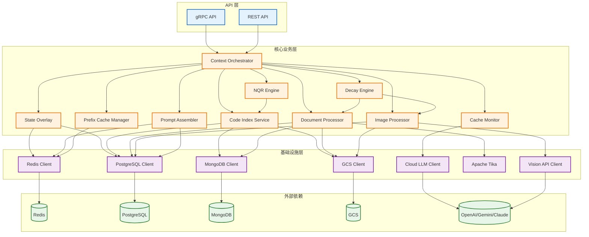
```mermaid
graph TB
    classDef API fill:#e3f2fd,stroke:#1565c0,stroke-width:2px;
    classDef Core fill:#fff3e0,stroke:#ef6c00,stroke-width:2px;
    classDef Infra fill:#f3e5f5,stroke:#7b1fa2,stroke-width:2px;
    classDef External fill:#e8f5e9,stroke:#2e7d32,stroke-width:2px;

    subgraph API ["API 层"]
        gRPCAPI["gRPC API"]
        RESTAPI["REST API"]
    end

    subgraph Core ["核心业务层"]
        ContextOrch["Context Orchestrator"]
        
        NQR["NQR Engine"]
        StateOverlay["State Overlay"]
        Decay["Decay Engine"]
        Assembler["Prompt Assembler"]
        PrefixMgr["Prefix Cache Manager"]
        
        CacheMonitor["Cache Monitor"]
        CodeIndex["Code Index Service"]
        DocProcessor["Document Processor"]
        ImgProcessor["Image Processor"]
    end

    subgraph Infra ["基础设施层"]
        RedisClient["Redis Client"]
        PGClient["PostgreSQL Client"]
        MongoClient["MongoDB Client"]
        GCSClient["GCS Client"]
        LLMClient["Cloud LLM Client"]
        TikaClient["Apache Tika"]
        VisionClient["Vision API Client"]
    end

    subgraph External ["外部依赖"]
        Redis[("Redis")]
        PG[("PostgreSQL")]
        Mongo[("MongoDB")]
        GCS[("GCS")]
        LLM[("OpenAI/Gemini/Claude")]
    end

    %% API -> Core
    gRPCAPI & RESTAPI --> ContextOrch
    
    %% Core 内部依赖
    ContextOrch --> NQR
    ContextOrch --> StateOverlay
    ContextOrch --> Decay
    ContextOrch --> Assembler
    ContextOrch --> PrefixMgr
    ContextOrch --> CacheMonitor
    ContextOrch --> CodeIndex
    ContextOrch --> DocProcessor
    ContextOrch --> ImgProcessor
    
    NQR --> CodeIndex
    Decay --> DocProcessor & ImgProcessor
    
    %% Core -> Infra
    StateOverlay --> RedisClient & PGClient
    CacheMonitor --> LLMClient
    CodeIndex --> PGClient & MongoClient & GCSClient
    DocProcessor --> TikaClient & MongoClient & GCSClient & PGClient
    ImgProcessor --> VisionClient & GCSClient & PGClient
    Assembler --> RedisClient & PGClient
    PrefixMgr --> RedisClient
    
    %% Infra -> External
    RedisClient --> Redis
    PGClient --> PG
    MongoClient --> Mongo
    GCSClient --> GCS
    LLMClient --> LLM
    VisionClient --> LLM

    class gRPCAPI,RESTAPI API;
    class ContextOrch,NQR,StateOverlay,Decay,Assembler,PrefixMgr,CacheMonitor,CodeIndex,DocProcessor,ImgProcessor Core;
    class RedisClient,PGClient,MongoClient,GCSClient,LLMClient,TikaClient,VisionClient Infra;
    class Redis,PG,Mongo,GCS,LLM External;
```

### 6.2 各模块详细规格
| 模块 | 职责 | 输入 | 输出 | 依赖 | 预估延迟 |
|-----|-----|-----|-----|-----|-----|
| **Context Orchestrator** | 统一调度入口 | GetContextRequest | ContextResponse | 所有子模块 | P99 < 50ms |
| **NQR Engine** | 意图重写与实体对齐 | Query + History | RewrittenQuery | CodeIndex | P99 < 30ms |
| **State Overlay** | 状态版本合并 | BaseState + ShadowBuffer | MergedState | Redis, PG | P99 < 10ms |
| **Decay Engine** | 多模态压缩 | MediaItems | CompressedText | - | P99 < 100ms |
| **Prompt Assembler** | B1-B6 组装 | AllBlocks | AssembledPrompt | Redis, PG | P99 < 5ms |
| **Prefix Cache Manager** | 前缀指纹与命中管理 | PromptBlocks | PrefixHint | Redis | P99 < 5ms |
| **Cache Monitor** | 缓存命中率监控 | LLM Response | CacheStats | Cloud LLM | - |
| **Code Index Service** | 代码语义检索 | Query | CodeChunks | PG, Mongo, GCS | P99 < 80ms |
| **Document Processor** | 文档解析与索引 | UploadedFile | DocChunks | Tika, Mongo, GCS, PG | P99 < 500ms |
| **Image Processor** | 图片描述生成 | UploadedImage | TextDescription | Vision API, GCS | P99 < 2s |

State Overlay 以 PostgreSQL 中的基准状态为真相来源，叠加 Redis Shadow Buffer 中的未持久化事件，按 Sync-Epoch 顺序合并为可用的任务状态。它只处理结构化状态，不包含对话摘要，因此与 B4 的摘要职责不重叠。

### 6.3 Context Orchestrator 详细设计
**职责与边界**：
- 统一调度 B1/B2a/B4/B6 的加载、NQR 重写、状态合并与 RAG 检索
- 负责 Token 预算与降级策略编排，不直接实现子引擎逻辑
- 负责调用 Prefix Cache Manager 与 Cache Monitor 完成命中统计

**输入**：
- GetContextRequest（thread_id、user_id、token_budget、rag_top_k、media_items）

**输出**：
- ContextResponse（system_prompt、messages、estimated_prefix_tokens、rag_results）

**交互模块**：
- NQR Engine、State Overlay、Decay Engine、Prompt Assembler
- Code Index Service、Prefix Cache Manager、Cache Monitor
- Redis、PostgreSQL、MongoDB、GCS、Cloud LLM Adapter

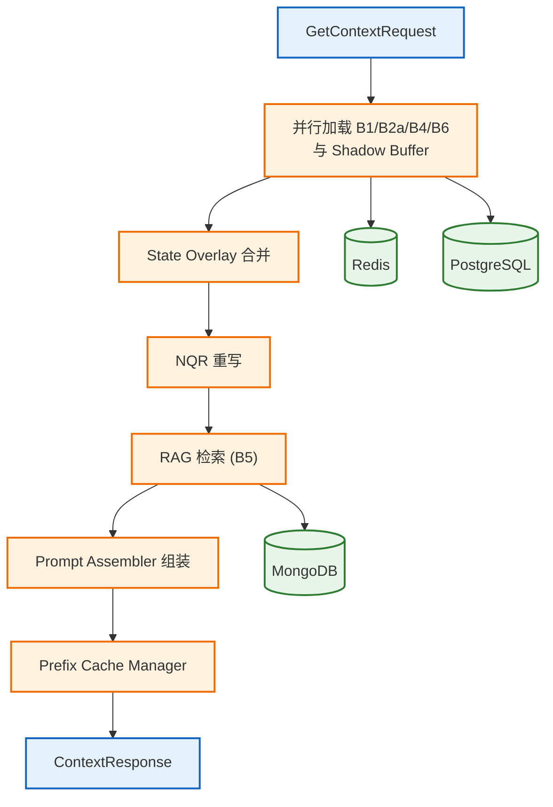
```mermaid
flowchart TB
    classDef input fill:#e3f2fd,stroke:#1565c0,stroke-width:2px;
    classDef process fill:#fff3e0,stroke:#ef6c00,stroke-width:2px;
    classDef store fill:#e8f5e9,stroke:#2e7d32,stroke-width:2px;

    Req["GetContextRequest"]:::input
    Load["并行加载 B1/B2a/B4/B6<br/>与 Shadow Buffer"]:::process
    Overlay["State Overlay 合并"]:::process
    Rewrite["NQR 重写"]:::process
    Search["RAG 检索 (B5)"]:::process
    Assemble["Prompt Assembler 组装"]:::process
    Prefix["Prefix Cache Manager"]:::process
    Resp["ContextResponse"]:::input
    Redis[("Redis")]:::store
    PG[("PostgreSQL")]:::store
    Mongo[("MongoDB")]:::store

    Req --> Load --> Overlay --> Rewrite --> Search --> Assemble --> Prefix --> Resp
    Load --> Redis
    Load --> PG
    Search --> Mongo
```

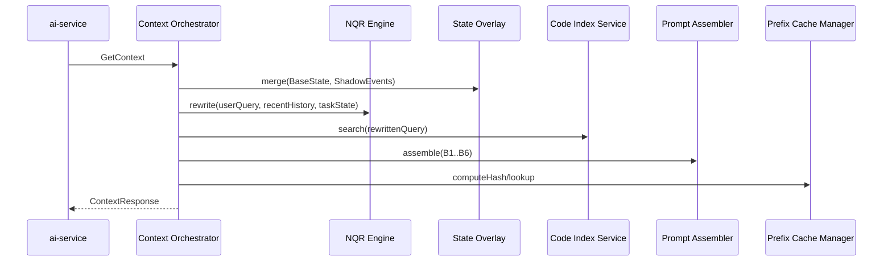
```mermaid
sequenceDiagram
    participant AS as ai-service
    participant Orch as Context Orchestrator
    participant NQR as NQR Engine
    participant Overlay as State Overlay
    participant Index as Code Index Service
    participant Assembler as Prompt Assembler
    participant Prefix as Prefix Cache Manager

    AS->>Orch: GetContext
    Orch->>Overlay: merge(BaseState, ShadowEvents)
    Orch->>NQR: rewrite(userQuery, recentHistory, taskState)
    Orch->>Index: search(rewrittenQuery)
    Orch->>Assembler: assemble(B1..B6)
    Orch->>Prefix: computeHash/lookup
    Orch-->>AS: ContextResponse
```

```java
/**
 * Context Orchestrator - 核心调度器
 * 协调所有子模块完成上下文组装
 */
@Service
@Slf4j
public class ContextOrchestrator {
    
    private final NQREngine nqrEngine;
    private final StateOverlayEngine stateOverlay;
    private final DecayEngine decayEngine;
    private final PromptAssembler promptAssembler;
    private final CacheMonitor cacheMonitor;
    private final CodeIndexService codeIndex;
    private final L1Cache l1Cache;
    private final ContextMetrics metrics;
    
    /**
     * 获取完整上下文
     */
    public ContextResponse getContext(GetContextRequest request) {
        Instant start = Instant.now();
        String threadId = request.getThreadId();
        String userId = request.getUserId();
        
        try {
            // 1. 并行获取基础数据
            CompletableFuture<String> b1Future = CompletableFuture.supplyAsync(
                () -> l1Cache.getOrLoad("b1:" + request.getAgentId(), 
                    () -> loadSystemPrompt(request.getAgentId()))
            );
            
            CompletableFuture<String> b2aFuture = CompletableFuture.supplyAsync(
                () -> l1Cache.getOrLoad("b2a:" + userId,
                    () -> loadStaticProfile(userId))
            );
            
            CompletableFuture<List<SummaryChunk>> b4SummaryFuture = CompletableFuture.supplyAsync(
                () -> loadHistorySummary(threadId)
            );
            
            CompletableFuture<List<Message>> b6Future = CompletableFuture.supplyAsync(
                () -> loadRecentHistory(threadId, request.getWindowSize())
            );
            
            CompletableFuture<TaskState> taskStateBaseFuture = CompletableFuture.supplyAsync(
                () -> loadTaskStateBase(threadId)
            );
            
            CompletableFuture<List<StateEvent>> shadowBufferFuture = CompletableFuture.supplyAsync(
                () -> loadShadowBuffer(threadId)
            );
            
            // 2. 等待并行任务完成
            String b1 = b1Future.join();
            String b2a = b2aFuture.join();
            List<SummaryChunk> b4SummaryChunks = b4SummaryFuture.join();
            List<Message> b6Messages = b6Future.join();
            TaskState taskStateBase = taskStateBaseFuture.join();
            List<StateEvent> shadowEvents = shadowBufferFuture.join();
            
            // 3. State Overlay 合并
            TaskState mergedTaskState = stateOverlay.merge(taskStateBase, shadowEvents);
            
            // 4. NQR 意图重写（如果需要）
            String userQuery = request.getUserMessage();
            if (nqrEngine.needsRewrite(userQuery, b6Messages)) {
                userQuery = nqrEngine.rewrite(userQuery, b6Messages, mergedTaskState);
            }
            
            // 5. RAG 检索 (B5)
            List<CodeChunk> ragResults = Collections.emptyList();
            if (request.isEnableRag()) {
                ragResults = codeIndex.search(userQuery, 
                    SearchContext.builder()
                        .threadId(threadId)
                        .userId(userId)
                        .build(),
                    request.getRagTopK());
            }
            
            // 6. 多模态压缩（如果需要）
            String b5Content = "";
            if (!ragResults.isEmpty()) {
                b5Content = formatRAGResults(ragResults);
            }
            if (request.hasMediaItems()) {
                String compressedMedia = decayEngine.compress(
                    request.getMediaItems(),
                    request.getTokenBudget()
                );
                b5Content += "\n" + compressedMedia;
            }

            String taskStateSection = mergedTaskState.toJson();
            String attachmentsAndTools = extractVolatileContext(request, b6Messages);
            b5Content = mergeB5Sections(b5Content, taskStateSection, attachmentsAndTools);
            
            // 8. 组装 Prompt
            PromptBlocks blocks = PromptBlocks.builder()
                .b1(b1)
                .b2a(b2a)
                .b4SummaryChunks(b4SummaryChunks)
                .b6Messages(b6Messages)
                .b5(b5Content)
                .build();
            
            AssembledPrompt prompt = promptAssembler.assemble(blocks);
            
            // 9. 计算 Prefix Hash 并查找缓存
            PrefixHashResult prefixHashes = prefixManager.computeHash(blocks);
            Optional<PrefixHit> prefixHit = prefixManager.findBestMatch(prefixHashes);
            
            // 10. 构建响应
            ContextResponse.Builder responseBuilder = ContextResponse.newBuilder()
                .setPrompt(prompt.getFullText())
                .setTotalTokens(prompt.getTotalTokens())
                .setPrefixHash(prefixHashes.getLevel3Hash());
            
            if (prefixHit.isPresent()) {
                responseBuilder
                    .setEstimatedPrefixTokens(prefixHit.get().getTokenCount());
                
                metrics.recordPrefixHit(prefixHit.get().getLevel());
            } else {
                metrics.recordPrefixMiss();
            }
            
            // 记录延迟
            Duration latency = Duration.between(start, Instant.now());
            metrics.recordLatency("getContext", latency);
            
            return responseBuilder.build();
            
        } catch (Exception e) {
            log.error("Error getting context for thread {}: {}", threadId, e.getMessage(), e);
            metrics.recordError("getContext");
            throw new ContextServiceException("Failed to get context", e);
        }
    }
    
    /**
     * 保存上下文更新
     */
    public void saveContext(SaveContextRequest request) {
        String threadId = request.getThreadId();
        
        // 1. 更新 B6 近景历史
        appendToRecentHistory(threadId, request.getAssistantMessage());
        
        // 2. 更新 Shadow Buffer
        if (request.hasStateDelta()) {
            appendToShadowBuffer(threadId, request.getStateDelta());
        }
        
        // 3. 注册新的 Prefix（如果有新的 KV Cache）
        if (request.hasNewKvBlocks()) {
            prefixManager.registerPrefix(
                request.getPrefixHash(),
                request.getNewKvBlocks(),
                request.getTotalTokens()
            );
        }
        
        // 4. 发送异步事件（摘要生成、代码索引等）
        publishAsyncEvents(request);
    }
}
```

---

### 6.4 NQR Engine 详细设计
**职责与边界**：
- 解决代词指代、上下文省略与实体对齐
- 将用户问题改写为可检索的结构化查询
- 不改写 System Prompt，只处理当前问题与历史对话

**输入**：
- 当前用户问题、B6 近景对话、结构化任务状态

**输出**：
- RewrittenQuery（包含补全实体与标准化关键词）

**交互模块**：
- Context Orchestrator、Code Index Service

**内部模块**：
- **Coreference Resolver**：消解代词与省略信息
- **Entity Aligner**：对齐任务状态中的结构化实体
- **Query Normalizer**：标准化术语与关键词
- **Rewrite Policy**：控制是否重写与重写强度

**处理步骤**：
1. 基于 B6 近景对话识别省略和指代
2. 将任务状态中的实体绑定到查询
3. 归一化关键词，输出可检索的结构化查询

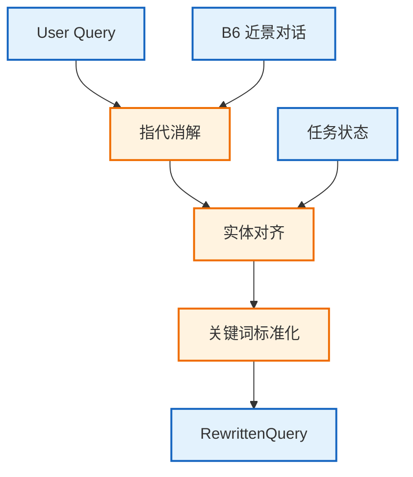
```mermaid
flowchart TB
    classDef input fill:#e3f2fd,stroke:#1565c0,stroke-width:2px;
    classDef process fill:#fff3e0,stroke:#ef6c00,stroke-width:2px;

    Q["User Query"]:::input
    History["B6 近景对话"]:::input
    State["任务状态"]:::input
    Resolve["指代消解"]:::process
    Align["实体对齐"]:::process
    Normalize["关键词标准化"]:::process
    Out["RewrittenQuery"]:::input

    Q --> Resolve --> Align --> Normalize --> Out
    History --> Resolve
    State --> Align
```

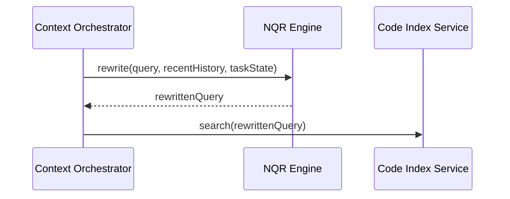
```mermaid
sequenceDiagram
    participant Orch as Context Orchestrator
    participant NQR as NQR Engine
    participant Index as Code Index Service

    Orch->>NQR: rewrite(query, recentHistory, taskState)
    NQR-->>Orch: rewrittenQuery
    Orch->>Index: search(rewrittenQuery)
```

```java
@Service
public class NQREngine {
    public boolean needsRewrite(String query, List<Message> history) {
        return hasPronoun(query) || hasOmittedEntity(query);
    }

    public String rewrite(String query, List<Message> history, TaskState state) {
        String resolved = resolveCoreference(query, history);
        String aligned = alignEntities(resolved, state);
        return normalizeKeywords(aligned);
    }
}
```

### 6.5 State Overlay Engine 详细设计

#### 6.5.1 Shadow Event 与 Shadow Buffer 说明
**Shadow Event** 是对“结构化任务状态”的增量变更记录，目的是在主状态尚未持久化时，仍然保证 **Read-after-Write** 一致性。它只包含可合并的结构化字段，不承载对话文本或摘要。

**Shadow Buffer** 是每个 thread 在 Redis 中的事件缓冲区（如 `shadow:{thread_id}`），保存近期的 Shadow Event 列表，用于在读取上下文时做“基准状态 + 增量事件”的即时合并。

**产生时序（简化）**：
1. `ai-service` 在一轮对话结束后调用 `SaveContext`，携带 `state_delta`（结构化变更）。
2. `context-service` 将 `state_delta` 追加写入 Redis Shadow Buffer（低延迟），并发布异步事件。
3. 异步 Worker 将事件持久化到 PostgreSQL，形成新的 BaseState。
4. 下一次 `GetContext` 时，State Overlay Engine 读取 PG BaseState + Redis Shadow Buffer 做合并，确保最新状态可见。

**使用规则**：
- **只写增量**：每个 Shadow Event 只包含变更字段与版本信息，避免全量复制。
- **按序合并**：按 `sync_epoch`（或逻辑时钟）排序，保证确定性合并。
- **可丢弃**：当 PG 基准状态推进后，旧事件可安全清理。

**职责与边界**：
- 以 PostgreSQL 为基准状态，叠加 Redis Shadow Buffer 的增量事件
- 保证 Read-after-Write 一致性
- 只处理结构化状态，不处理对话文本

**输入**：
- BaseState（PG）、ShadowEvents（Redis）

**输出**：
- MergedState（用于 B5 的任务状态段）

**交互模块**：
- Context Orchestrator、Redis、PostgreSQL

**内部模块**：
- **Epoch Sorter**：按 Sync-Epoch 与事件类型排序
- **Conflict Resolver**：处理冲突字段与覆盖策略
- **State Applier**：将事件增量应用到基准状态

**处理步骤**：
1. 读取 PG 基准状态与 Redis 增量事件
2. 基于 Sync-Epoch 排序并校验事件连续性
3. 应用增量，输出合并后的任务状态

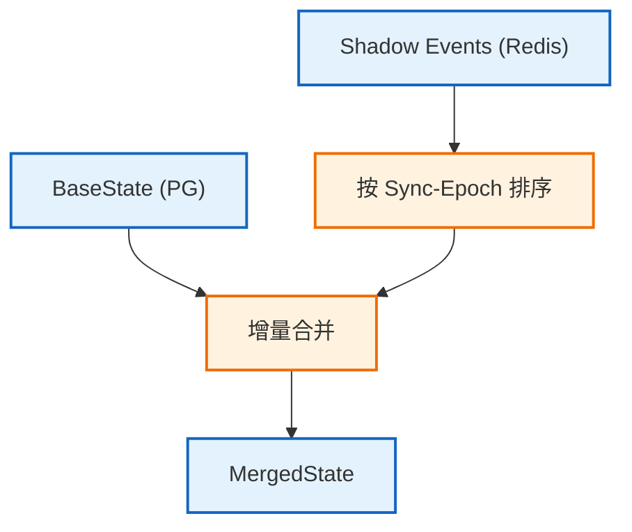
```mermaid
flowchart TB
    classDef input fill:#e3f2fd,stroke:#1565c0,stroke-width:2px;
    classDef process fill:#fff3e0,stroke:#ef6c00,stroke-width:2px;

    Base["BaseState (PG)"]:::input
    Events["Shadow Events (Redis)"]:::input
    Sort["按 Sync-Epoch 排序"]:::process
    Merge["增量合并"]:::process
    Out["MergedState"]:::input

    Base --> Merge
    Events --> Sort --> Merge --> Out
```

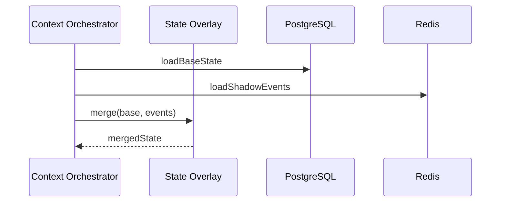
```mermaid
sequenceDiagram
    participant Orch as Context Orchestrator
    participant Overlay as State Overlay
    participant PG as PostgreSQL
    participant Redis as Redis

    Orch->>PG: loadBaseState
    Orch->>Redis: loadShadowEvents
    Orch->>Overlay: merge(base, events)
    Overlay-->>Orch: mergedState
```

```java
@Service
public class StateOverlayEngine {
    public TaskState merge(TaskState base, List<StateEvent> events) {
        List<StateEvent> sorted = events.stream()
            .sorted(Comparator.comparingLong(StateEvent::getEpoch))
            .toList();
        TaskState current = base;
        for (StateEvent event : sorted) {
            current = current.apply(event);
        }
        return current;
    }
}
```

### 6.6 Decay Engine 详细设计
**职责与边界**：
- 对多模态内容与附件描述进行压缩
- 在 Token 预算不足时做裁剪与摘要
- 不改变结构化状态内容

**输入**：
- MediaItems、tokenBudget

**输出**：
- CompressedText（进入 B5）

**交互模块**：
- Context Orchestrator、Document Processor、Image Processor

**内部模块**：
- **Priority Scorer**：按当前轮引用与时间排序
- **Chunk Compressor**：对单条描述做分段压缩
- **Budget Planner**：在 token 预算内分配配额

**处理步骤**：
1. 计算多模态条目的优先级与预算
2. 逐条压缩，优先保留当前轮与显式引用内容
3. 输出压缩后的 B5 多模态描述

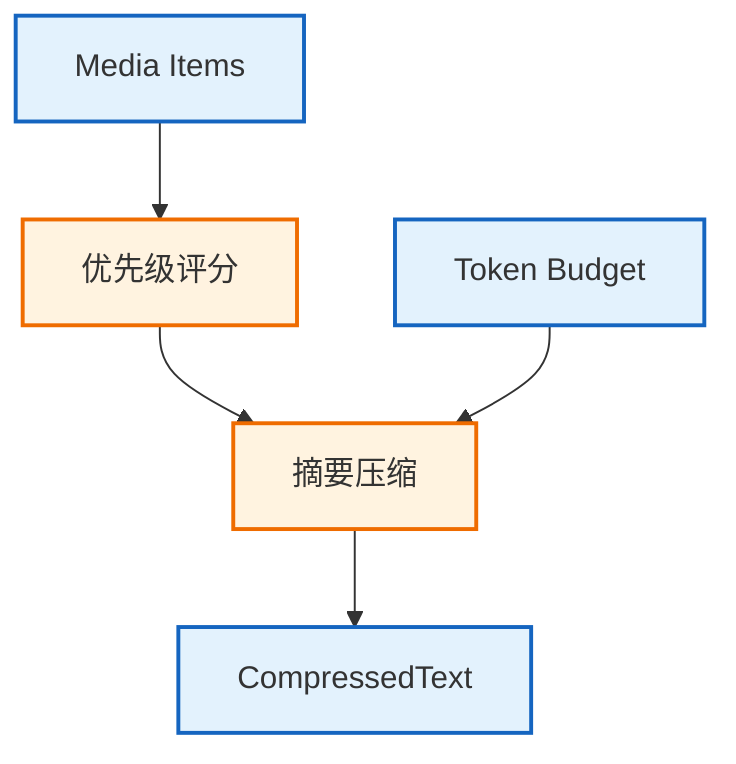
```mermaid
flowchart TB
    classDef input fill:#e3f2fd,stroke:#1565c0,stroke-width:2px;
    classDef process fill:#fff3e0,stroke:#ef6c00,stroke-width:2px;

    Items["Media Items"]:::input
    Budget["Token Budget"]:::input
    Score["优先级评分"]:::process
    Compress["摘要压缩"]:::process
    Output["CompressedText"]:::input

    Items --> Score --> Compress --> Output
    Budget --> Compress
```

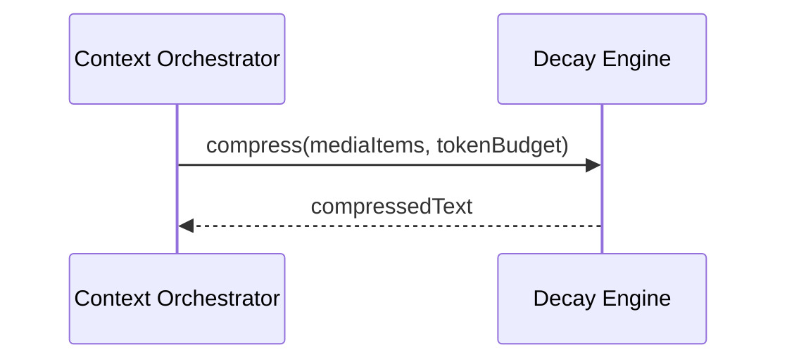
```mermaid
sequenceDiagram
    participant Orch as Context Orchestrator
    participant Decay as Decay Engine

    Orch->>Decay: compress(mediaItems, tokenBudget)
    Decay-->>Orch: compressedText
```

```java
@Service
public class DecayEngine {
    public String compress(List<MediaItem> items, int budget) {
        List<MediaItem> sorted = rank(items);
        return summarize(sorted, budget);
    }
}
```

### 6.7 Prompt Assembler 详细设计
**职责与边界**：
- 构建 System Message 与 Message List
- 保证 B1/B2a 稳定格式，提升 Prefix Cache 命中

**输入**：
- PromptBlocks（B1/B2a/B2b/B3/B4/B5/B6）

**输出**：
- AssembledPrompt

**交互模块**：
- Context Orchestrator、Redis、PostgreSQL

**内部模块**：
- **System Builder**：构建稳定的 System Prompt
- **History Builder**：拼接 B6 近景对话消息
- **Current Builder**：组装 B5/B3/B2b 动态上下文与用户问题

**处理步骤**：
1. 构建 B1/B2a/B4 的稳定系统消息
2. 将 B6 组织为 Message List
3. 生成当前用户消息并追加到列表末尾

```mermaid
flowchart TB
    classDef input fill:#e3f2fd,stroke:#1565c0,stroke-width:2px;
    classDef process fill:#fff3e0,stroke:#ef6c00,stroke-width:2px;

    Blocks["PromptBlocks"]:::input
    System["System Message (B1/B2a/B4)"]:::process
    Messages["Message List (B6 + 当前消息: B5/B3/B2b)"]:::process
    Output["AssembledPrompt"]:::input

    Blocks --> System --> Output
    Blocks --> Messages --> Output
```

```mermaid
sequenceDiagram
    participant Orch as Context Orchestrator
    participant Assembler as Prompt Assembler

    Orch->>Assembler: assemble(blocks)
    Assembler-->>Orch: assembledPrompt
```

```java
@Service
public class PromptAssembler {
    public AssembledPrompt assemble(PromptBlocks blocks) {
        String system = buildSystem(blocks);
        List<ChatMessage> messages = buildMessages(blocks);
        return new AssembledPrompt(system, messages);
    }
}
```

### 6.8 Prefix Cache Manager 详细设计
**职责与边界**：
- 计算 B1/B2a/B4/B6 前缀哈希
- 管理 Redis 中的 PrefixHint 与命中统计
- 不负责调用 LLM

**输入**：
- PromptBlocks

**输出**：
- PrefixHint、PrefixHit

**交互模块**：
- Context Orchestrator、Redis

**内部模块**：
- **Hash Planner**：生成 B1/B2a/B4/B6 的分层指纹
- **Bucket Locator**：基于 LSH 规则定位候选桶
- **Hint Registry**：维护 PrefixHint 与命中统计

**处理步骤**：
1. 基于 PromptBlocks 生成分层哈希
2. 使用 LSH 定位候选 PrefixHint
3. 返回最佳匹配结果与可复用 token 估算

```mermaid
flowchart TB
    classDef input fill:#e3f2fd,stroke:#1565c0,stroke-width:2px;
    classDef process fill:#fff3e0,stroke:#ef6c00,stroke-width:2px;
    classDef store fill:#e8f5e9,stroke:#2e7d32,stroke-width:2px;

    Blocks["PromptBlocks"]:::input
    Hash["分层哈希 (B1/B2a/B4/B6)"]:::process
    Lookup["Redis 查询"]:::process
    Hit["PrefixHit"]:::input
    Redis[("Redis")]:::store

    Blocks --> Hash --> Lookup --> Hit
    Lookup --> Redis
```

```mermaid
sequenceDiagram
    participant Orch as Context Orchestrator
    participant Prefix as Prefix Cache Manager
    participant Redis as Redis

    Orch->>Prefix: computeHash(blocks)
    Prefix->>Redis: findBestMatch
    Prefix-->>Orch: prefixHit
```

```java
@Service
public class PrefixCacheManager {
    public PrefixHashResult computeHash(PromptBlocks blocks) {
        return PrefixHashResult.from(blocks);
    }

    public Optional<PrefixHit> findBestMatch(PrefixHashResult hashes) {
        return lookup(hashes);
    }
}
```

### 6.9 Cache Monitor 详细设计
**职责与边界**：
- 采集各云 LLM 返回的 cached_tokens
- 统一输出 CacheStats 供容量与成本评估使用

**输入**：
- LLM Response / Usage

**输出**：
- CacheStats

**交互模块**：
- Context Orchestrator、Cloud LLM Adapter

**内部模块**：
- **Usage Parser**：解析各厂商 usage 字段
- **Hit Aggregator**：按模型与请求维度聚合
- **Report Exporter**：输出监控指标与报表

**处理步骤**：
1. 从 LLM 响应提取 cached_tokens 与 prompt_tokens
2. 计算命中率与层级分布
3. 写入监控指标供容量规划与优化

```mermaid
flowchart TB
    classDef input fill:#e3f2fd,stroke:#1565c0,stroke-width:2px;
    classDef process fill:#fff3e0,stroke:#ef6c00,stroke-width:2px;

    Usage["Usage Data"]:::input
    Parse["解析 cached_tokens"]:::process
    Aggregate["聚合统计"]:::process
    Output["CacheStats"]:::input

    Usage --> Parse --> Aggregate --> Output
```

```mermaid
sequenceDiagram
    participant Orch as Context Orchestrator
    participant LLM as Cloud LLM Adapter
    participant Monitor as Cache Monitor

    Orch->>LLM: chat(messages)
    LLM-->>Monitor: usage
    Monitor-->>Orch: cacheStats
```

```java
@Service
public class CacheMonitor {
    public CacheStats record(Usage usage, String provider) {
        return CacheStats.from(usage, provider);
    }
}
```

### 6.10 Document Processor 详细设计
**职责与边界**：
- 解析上传文档为文本块
- 生成元数据与索引，供 Code Index Service 检索复用

**输入**：
- UploadedFile

**输出**：
- DocChunks

**交互模块**：
- Context Orchestrator、Apache Tika、PostgreSQL、MongoDB、GCS

**内部模块**：
- **Text Extractor**：从文档提取正文与结构
- **Chunk Splitter**：按页面与语义切分
- **Metadata Writer**：写入文档元信息与索引

**处理步骤**：
1. 存储原始文档与元数据
2. 提取正文并切分文本块
3. 将文本块写入索引供检索复用

```mermaid
flowchart TB
    classDef input fill:#e3f2fd,stroke:#1565c0,stroke-width:2px;
    classDef process fill:#fff3e0,stroke:#ef6c00,stroke-width:2px;
    classDef store fill:#e8f5e9,stroke:#2e7d32,stroke-width:2px;

    File["Uploaded Document"]:::input
    Tika["Tika Extract"]:::process
    Chunk["Chunk Split"]:::process
    PG[("PostgreSQL")]:::store
    Mongo[("MongoDB")]:::store
    GCS[("GCS")]:::store

    File --> Tika --> Chunk --> PG
    Chunk --> Mongo
    File --> GCS
```

```mermaid
sequenceDiagram
    participant Orch as Context Orchestrator
    participant Doc as Document Processor
    participant Tika as Apache Tika

    Orch->>Doc: process(file)
    Doc->>Tika: parse
    Doc-->>Orch: docChunks
```

```java
@Service
public class DocumentProcessor {
    public DocumentResult process(UploadedFile file, String userId, String threadId) {
        String gcsPath = store(file, userId, threadId);
        List<TextChunk> chunks = extractChunks(file);
        persist(gcsPath, chunks, userId, threadId);
        return new DocumentResult(gcsPath, chunks.size());
    }
}
```

### 6.11 Image Processor 详细设计
**职责与边界**：
- 将用户上传与 LLM 生成图片生成文本描述
- 生成可检索的描述块并存储

**输入**：
- UploadedImage / GeneratedImage

**输出**：
- TextDescription

**交互模块**：
- Context Orchestrator、Vision API、PostgreSQL、GCS

**内部模块**：
- **Image Store**：存储原始图片与生成图片
- **Caption Generator**：调用 Vision API 生成描述
- **Caption Indexer**：写入描述索引

**处理步骤**：
1. 存储图片原件并生成可追溯标识
2. 调用 Vision API 生成结构化描述
3. 将描述写入索引并可在 B5 引用

```mermaid
flowchart TB
    classDef input fill:#e3f2fd,stroke:#1565c0,stroke-width:2px;
    classDef process fill:#fff3e0,stroke:#ef6c00,stroke-width:2px;
    classDef store fill:#e8f5e9,stroke:#2e7d32,stroke-width:2px;

    Image["Image File"]:::input
    Vision["Vision API"]:::process
    PG[("PostgreSQL")]:::store
    GCS[("GCS")]:::store
    Out["Text Description"]:::input

    Image --> Vision --> Out
    Image --> GCS
    Out --> PG
```

```mermaid
sequenceDiagram
    participant Orch as Context Orchestrator
    participant Img as Image Processor
    participant Vision as Vision API

    Orch->>Img: describe(image)
    Img->>Vision: generateCaption
    Img-->>Orch: textDescription
```

```java
@Service
public class ImageProcessor {
    public String describe(UploadedImage image, String userId, String threadId) {
        String gcsPath = store(image, userId, threadId);
        String caption = generateCaption(image);
        saveCaption(gcsPath, caption, userId, threadId);
        return caption;
    }
}
```

---
### 6.12 Code Index 系统设计

#### 6.12.1 设计目标

Code Index 系统需要实现：

1. **增量索引**：用户上传新代码时，毫秒级更新索引
2. **语义检索**：支持自然语言描述检索相关代码
3. **模糊匹配**：支持 CamelCase 分词和拼写容错（如 `"get user name"` → `getUsername`）
4. **结构感知**：理解代码结构（函数、类、模块）
5. **多语言支持**：支持 Java, Python, TypeScript, Go 等主流语言

#### 6.12.2 整体架构
```mermaid
graph TB
    classDef Input fill:#e1f5fe,stroke:#01579b,stroke-width:2px;
    classDef Parse fill:#f3e5f5,stroke:#7b1fa2,stroke-width:2px;
    classDef Index fill:#fff3e0,stroke:#ef6c00,stroke-width:2px;
    classDef Store fill:#e8f5e9,stroke:#2e7d32,stroke-width:2px;
    classDef Query fill:#fce4ec,stroke:#c2185b,stroke-width:2px;

    subgraph Input ["输入层"]
        UserUpload["用户上传代码"]
        LLMGenerated["LLM 生成代码"]
        GitSync["Git 仓库同步"]
    end

    subgraph Parsing ["解析层 (Tree-sitter)"]
        TSParser["Tree-sitter Parser Pool"]
        
        subgraph LanguageSupport ["语言支持"]
            Java["Java Parser"]
            Python["Python Parser"]
            TS["TypeScript Parser"]
            Go["Go Parser"]
        end
        
        ASTExtractor["AST 结构提取器"]
        ChunkSplitter["语义切片器"]
    end

    subgraph Indexing ["索引层"]
        MetaIndexer["结构化索引器<br/>(符号/依赖)"]
        TextIndexer["全文索引器<br/>(TSVector/Trigram)"]
    end

    subgraph Storage ["存储层"]
        PG[("PostgreSQL (Metadata + FTS)")]
        Mongo[("MongoDB (Chunks)")]
        GCS[("GCS (Raw Files)")]
    end

    subgraph Query ["查询层"]
        QueryParser["Query Parser (NQR)"]
        LexicalSearch["Lexical Search"]
        SymbolSearch["Symbol Search"]
        Reranker["Reranker"]
    end

    %% 索引流程
    UserUpload & LLMGenerated & GitSync --> TSParser
    TSParser --> Java & Python & TS & Go
    Java & Python & TS & Go --> ASTExtractor
    ASTExtractor --> ChunkSplitter
    ChunkSplitter --> MetaIndexer & TextIndexer
    MetaIndexer --> PG
    TextIndexer --> PG
    ChunkSplitter --> Mongo
    UserUpload & LLMGenerated & GitSync --> GCS

    %% 查询流程
    QueryParser --> LexicalSearch
    QueryParser --> SymbolSearch
    LexicalSearch --> PG
    SymbolSearch --> PG
    LexicalSearch --> Reranker
    SymbolSearch --> Reranker
    Reranker --> Mongo
    Reranker --> |"Top K Results"| QueryParser

    class UserUpload,LLMGenerated,GitSync Input;
    class TSParser,Java,Python,TS,Go,ASTExtractor,ChunkSplitter Parse;
    class MetaIndexer,TextIndexer Index;
    class PG,Mongo,GCS Store;
    class QueryParser,LexicalSearch,SymbolSearch,Reranker Query;
```

#### 6.12.3 Code Index Service 详细设计
**职责与边界**：
- 处理用户上传、用户输入与 LLM 生成的代码
- 进行 AST 解析、结构化索引与文本检索
- 负责召回与融合排序，不输出原始文件

**输入**：
- code files、inline code、git sync、query

**输出**：
- CodeChunks（可直接放入 B5）

**交互模块**：
- Context Orchestrator、NQR Engine、PostgreSQL、MongoDB、GCS

**内部模块**：
- **AST Parser**：解析多语言代码结构
- **Chunk Builder**：切分语义块并生成元数据
- **Hybrid Retriever**：词法检索与符号检索融合

**处理步骤**：
1. 解析用户输入与上传代码，生成结构化实体
2. 建立文本索引与符号索引写入 PG/Mongo
3. 根据 NQR 重写的查询检索并融合结果

**存储选型说明（为什么同时使用 PostgreSQL + MongoDB）**：
- **PostgreSQL**：承载结构化元数据、符号索引与全文检索（TSVector/Trigram），适合强一致与复杂过滤查询。
- **MongoDB**：承载大体量文本块与 AST 片段的原始内容，读取吞吐更高且更适合文档型存储。
- **职责分离**：PG 负责“检索入口与排序依据”，Mongo 负责“内容载体与分片读取”，避免单库同时承担事务索引与大块文档存储导致的性能冲突。
- **回退策略**：若业务规模较小，可先只保留 PG（含原始文本块）以简化运维；当文本规模或读取 QPS 达到瓶颈时再引入 MongoDB 进行拆分。

```mermaid
flowchart TB
    classDef input fill:#e3f2fd,stroke:#1565c0,stroke-width:2px;
    classDef process fill:#fff3e0,stroke:#ef6c00,stroke-width:2px;
    classDef store fill:#e8f5e9,stroke:#2e7d32,stroke-width:2px;

    Inline["用户输入代码"]:::input
    Upload["文件上传"]:::input
    LLMGen["LLM 生成代码"]:::input
    Parse["AST 解析"]:::process
    Index["索引写入"]:::process
    Search["检索与融合"]:::process
    PG[("PostgreSQL")]:::store
    Mongo[("MongoDB")]:::store
    GCS[("GCS")]:::store

    Inline --> Parse
    Upload --> Parse
    LLMGen --> Parse
    Parse --> Index --> PG
    Parse --> Index --> Mongo
    Upload --> GCS
    LLMGen --> GCS
    Search --> PG
    Search --> Mongo
```

```mermaid
sequenceDiagram
    participant Orch as Context Orchestrator
    participant Index as Code Index Service
    participant PG as PostgreSQL
    participant Mongo as MongoDB

    Orch->>Index: search(query)
    Index->>PG: lexical/symbol search
    Index->>Mongo: chunk fetch
    Index-->>Orch: codeChunks
```

```java
@Service
public class CodeIndexService {
    public List<CodeChunk> search(String query, SearchContext context, int topK) {
        List<SearchHit> hits = retrieve(query, context, topK);
        return hydrateChunks(hits);
    }
}
```

#### 6.12.4 AST 解析与切片

```java
/**
 * 基于 Tree-sitter 的 AST 解析器
 * 支持多语言的统一解析接口
 */
@Service
public class TreeSitterASTParser {
    
    private final Map<Language, TSParser> parserPool;
    
    public TreeSitterASTParser() {
        this.parserPool = new EnumMap<>(Language.class);
        // 初始化各语言解析器
        parserPool.put(Language.JAVA, new TSParser(TSLanguage.java()));
        parserPool.put(Language.PYTHON, new TSParser(TSLanguage.python()));
        parserPool.put(Language.TYPESCRIPT, new TSParser(TSLanguage.typescript()));
        parserPool.put(Language.GO, new TSParser(TSLanguage.go()));
    }
    
    /**
     * 解析代码并提取结构化信息
     */
    public ParseResult parse(String code, Language language) {
        TSParser parser = parserPool.get(language);
        TSTree tree = parser.parseString(null, code);
        TSNode rootNode = tree.getRootNode();
        
        List<CodeEntity> entities = new ArrayList<>();
        extractEntities(rootNode, code, entities, language);
        
        return ParseResult.builder()
            .language(language)
            .entities(entities)
            .tree(tree)
            .build();
    }
    
    /**
     * 递归提取代码实体
     */
    private void extractEntities(
            TSNode node, 
            String code, 
            List<CodeEntity> entities,
            Language language) {
        
        String nodeType = node.getType();
        
        // 根据语言和节点类型提取实体
        if (isEntityNode(nodeType, language)) {
            CodeEntity entity = CodeEntity.builder()
                .type(mapToEntityType(nodeType, language))
                .name(extractName(node, code, language))
                .signature(extractSignature(node, code, language))
                .body(extractBody(node, code))
                .startLine(node.getStartPoint().getRow())
                .endLine(node.getEndPoint().getRow())
                .docComment(extractDocComment(node, code, language))
                .build();
            
            entities.add(entity);
        }
        
        // 递归处理子节点
        for (int i = 0; i < node.getChildCount(); i++) {
            extractEntities(node.getChild(i), code, entities, language);
        }
    }
    
    /**
     * 判断是否为实体节点
     */
    private boolean isEntityNode(String nodeType, Language language) {
        return switch (language) {
            case JAVA -> Set.of(
                "class_declaration", 
                "method_declaration", 
                "interface_declaration",
                "enum_declaration"
            ).contains(nodeType);
            
            case PYTHON -> Set.of(
                "class_definition", 
                "function_definition"
            ).contains(nodeType);
            
            case TYPESCRIPT -> Set.of(
                "class_declaration", 
                "function_declaration", 
                "method_definition",
                "interface_declaration"
            ).contains(nodeType);
            
            default -> false;
        };
    }
}
```

#### 6.12.5 语义切片策略

```java
/**
 * 语义感知的代码切片器
 * 确保切片在语义边界上进行，而不是简单的按行数切分
 */
@Service
public class SemanticCodeChunker {
    
    private static final int MAX_CHUNK_TOKENS = 512;
    private static final int OVERLAP_TOKENS = 64;
    
    private final Tokenizer tokenizer;
    
    /**
     * 将代码切分为语义完整的 Chunk
     */
    public List<CodeChunk> chunk(ParseResult parseResult, String code) {
        List<CodeChunk> chunks = new ArrayList<>();
        
        // 策略1: 每个函数/方法作为独立 Chunk
        for (CodeEntity entity : parseResult.getEntities()) {
            if (entity.getType() == EntityType.METHOD 
                || entity.getType() == EntityType.FUNCTION) {
                
                int tokenCount = tokenizer.countTokens(entity.getBody());
                
                if (tokenCount <= MAX_CHUNK_TOKENS) {
                    // 完整函数作为一个 Chunk
                    chunks.add(createChunk(entity, ChunkType.COMPLETE_FUNCTION));
                } else {
                    // 大函数需要进一步切分
                    chunks.addAll(splitLargeFunction(entity));
                }
            }
        }
        
        // 策略2: 类级别摘要 Chunk
        for (CodeEntity entity : parseResult.getEntities()) {
            if (entity.getType() == EntityType.CLASS 
                || entity.getType() == EntityType.INTERFACE) {
                
                chunks.add(createClassSummaryChunk(entity));
            }
        }
        
        // 策略3: 导入和全局变量 Chunk
        chunks.add(createImportsChunk(code, parseResult.getLanguage()));
        
        return chunks;
    }
    
    /**
     * 切分大型函数（保持语义完整性）
     */
    private List<CodeChunk> splitLargeFunction(CodeEntity entity) {
        List<CodeChunk> chunks = new ArrayList<>();
        String body = entity.getBody();
        
        // 按代码块（if/for/while/try）边界切分
        List<Integer> splitPoints = findBlockBoundaries(body);
        
        int currentStart = 0;
        StringBuilder currentChunk = new StringBuilder();
        currentChunk.append(entity.getSignature()).append(" {\n");
        
        for (int splitPoint : splitPoints) {
            String segment = body.substring(currentStart, splitPoint);
            
            if (tokenizer.countTokens(currentChunk + segment) > MAX_CHUNK_TOKENS) {
                // 保存当前 Chunk
                chunks.add(createChunk(
                    entity, 
                    ChunkType.PARTIAL_FUNCTION,
                    currentChunk.toString()
                ));
                
                // 开始新 Chunk（带重叠）
                currentChunk = new StringBuilder();
                currentChunk.append("// ... continued from above\n");
                currentChunk.append(entity.getSignature()).append(" { // partial\n");
            }
            
            currentChunk.append(segment);
            currentStart = splitPoint;
        }
        
        // 最后一个 Chunk
        if (currentChunk.length() > 0) {
            currentChunk.append(body.substring(currentStart));
            chunks.add(createChunk(entity, ChunkType.PARTIAL_FUNCTION, currentChunk.toString()));
        }
        
        return chunks;
    }
}
```

#### 6.12.6 全文索引与结构化索引

文本块写入后同步生成两类索引：PostgreSQL 全文检索与结构化符号索引，用于在没有向量模型的情况下保持高召回。

```sql
CREATE EXTENSION IF NOT EXISTS pg_trgm;

CREATE TABLE code_chunks (
    chunk_id text PRIMARY KEY,
    file_path text,
    language text,
    code text,
    tsv tsvector
);

CREATE TABLE code_identifiers (
    chunk_id text,
    identifier text,
    identifier_tokens text[]
);

CREATE INDEX code_chunks_fts_idx ON code_chunks USING GIN (tsv);
CREATE INDEX code_identifiers_tokens_idx ON code_identifiers USING GIN (identifier_tokens);
CREATE INDEX code_identifiers_trgm_idx ON code_identifiers USING GIN (identifier gin_trgm_ops);
```

#### 6.12.7 模糊匹配与 CamelCase 分词

为支持用户自然语言查询匹配代码标识符（如 `"get user name"` → `getUsername`），我们实现了专门的分词和索引策略：
拼写容错由 trigram 相似度与编辑距离阈值共同保障，可覆盖 `"takeItem"` 与 `"takeItems"` 等轻微拼写差异。
```java
/**
 * CamelCase/snake_case 分词器
 * 将标识符拆分为可搜索的单词序列
 */
@Component
public class IdentifierTokenizer {
    
    // 匹配 CamelCase 边界: "getUserName" → ["get", "User", "Name"]
    private static final Pattern CAMEL_CASE = Pattern.compile("(?<=[a-z])(?=[A-Z])|(?<=[A-Z])(?=[A-Z][a-z])");
    // 匹配 snake_case: "get_user_name" → ["get", "user", "name"]
    private static final Pattern SNAKE_CASE = Pattern.compile("_");
    
    /**
     * 将标识符分词为小写单词列表
     * "getUsername" → ["get", "username"]
     * "get_user_name" → ["get", "user", "name"]
     */
    public List<String> tokenize(String identifier) {
        List<String> tokens = new ArrayList<>();
        
        // 先按 snake_case 分割
        String[] snakeParts = SNAKE_CASE.split(identifier);
        
        for (String part : snakeParts) {
            // 再按 CamelCase 分割
            String[] camelParts = CAMEL_CASE.split(part);
            for (String token : camelParts) {
                if (!token.isEmpty()) {
                    tokens.add(token.toLowerCase());
                }
            }
        }
        
        return tokens;
    }
    
    /**
     * 将用户查询标准化为可匹配的 token 序列
     * "get user name" → "get user name" (保持原样)
     * "getUserName" → "get user name" (展开 CamelCase)
     */
    public String normalizeQuery(String query) {
        List<String> words = new ArrayList<>();
        
        for (String word : query.split("\\s+")) {
            words.addAll(tokenize(word));
        }
        
        return String.join(" ", words);
    }
}
```

**索引时处理**：

```sql
ALTER TABLE code_identifiers
ADD COLUMN IF NOT EXISTS identifier_tokens text[];

CREATE INDEX IF NOT EXISTS code_identifiers_tokens_idx
ON code_identifiers USING GIN (identifier_tokens);
```

**查询示例**：

| 用户查询 | 分词结果 | 可匹配的代码标识符 |
|---------|---------|------------------|
| `"get user name"` | `["get", "user", "name"]` | `getUserName`, `getUsername`, `get_user_name` |
| `"calculate total"` | `["calculate", "total"]` | `calculateTotal`, `calc_total`, `computeTotalAmount` |
| `"http request"` | `["http", "request"]` | `httpRequest`, `HttpRequestHandler`, `http_request_util` |

#### 6.12.8 混合检索（全文 + 结构）

```java
/**
 * 混合搜索引擎
 * 结合全文检索与结构化符号检索
 */
@Service
public class HybridSearchEngine {
    
    private final PostgresSearchClient pgClient;
    private final MongoChunkRepository chunkRepository;
    private final Reranker reranker;
    
    public List<SearchResult> search(
            String query,
            SearchContext context,
            int topK) {
        
        QueryAnalysis analysis = analyzeQuery(query);
        
        CompletableFuture<List<SearchHit>> lexicalFuture =
            CompletableFuture.supplyAsync(() ->
                pgClient.fullTextSearch(query, topK * 3));
        
        CompletableFuture<List<SearchHit>> symbolFuture =
            CompletableFuture.supplyAsync(() ->
                pgClient.symbolSearch(analysis.getExtractedKeywords(), topK * 3));
        
        List<SearchHit> lexicalHits = lexicalFuture.join();
        List<SearchHit> symbolHits = symbolFuture.join();
        
        List<SearchHit> merged = mergeWithRrf(lexicalHits, symbolHits);
        List<SearchResult> reranked = reranker.rerank(query, merged, topK);
        
        return attachChunks(reranked, chunkRepository, context);
    }
    
    private List<SearchHit> mergeWithRrf(
            List<SearchHit> lexicalHits,
            List<SearchHit> symbolHits) {
        
        Map<String, SearchHit> resultMap = new HashMap<>();
        int k = 60;
        
        for (int i = 0; i < lexicalHits.size(); i++) {
            SearchHit hit = lexicalHits.get(i);
            float rrfScore = 1.0f / (k + i + 1);
            resultMap.computeIfAbsent(hit.getChunkId(),
                id -> new SearchHit(id, hit.getScore()))
                .addScore(rrfScore);
        }
        
        for (int i = 0; i < symbolHits.size(); i++) {
            SearchHit hit = symbolHits.get(i);
            float rrfScore = 1.0f / (k + i + 1);
            resultMap.computeIfAbsent(hit.getChunkId(),
                id -> new SearchHit(id, hit.getScore()))
                .addScore(rrfScore);
        }
        
        return resultMap.values().stream()
            .sorted(Comparator.comparingDouble(SearchHit::getScore).reversed())
            .collect(Collectors.toList());
    }
}
```

---

## 7. 数据流与时序分析

### 7.1 完整请求生命周期
Shadow Buffer 是每个 thread 的事件缓冲区，用来保存尚未持久化的状态增量（如槽位更新、任务进度变化）。State Overlay 会先读取 PostgreSQL 中的基准状态，再按事件时间序合并 Shadow Buffer，得到当前轮可用的结构化状态，用于 B5 组装。
```mermaid
sequenceDiagram
    autonumber
    participant Client as Client
    participant AS as ai-service
    participant CS as context-service
    participant Redis as Redis
    participant PG as PostgreSQL
    participant Mongo as MongoDB
    participant LLM as Cloud LLM
    participant Kafka as Kafka

    rect rgb(230, 245, 255)
        Note over Client,AS: Phase 1: 请求入口
        Client->>AS: POST /chat (message, files)
        AS->>AS: Session Lock (Redis SETNX)
    end

    rect rgb(255, 243, 224)
        Note over AS,Mongo: Phase 2: 上下文获取
        AS->>CS: gRPC: GetContext(thread_id, user_id)
        
        par 并行数据获取
            CS->>Redis: GET b6:{thread_id}
            CS->>Redis: GET shadow:{thread_id}
            CS->>PG: SELECT b4 FROM summaries
            CS->>CS: L1 Cache: B1, B2a
        end
        
        CS->>CS: State Overlay Merge
        CS->>CS: NQR Rewrite (if needed)
        
        opt RAG 检索
            CS->>PG: Lexical Search
            CS->>Mongo: Text Search
            Mongo-->>CS: Code/Doc Chunks
        end
        
        CS->>CS: Assemble System Prompt + Messages
        
        CS-->>AS: ContextResponse {system_prompt, messages}
    end

    rect rgb(243, 229, 245)
        Note over AS,LLM: Phase 3: LLM 推理
        AS->>LLM: Chat API (system_prompt, messages)
        
        alt Prefix Cache 命中
            LLM-->>AS: SSE Stream (TTFT ~150ms, cached_tokens=3000)
        else Prefix Cache 未命中
            LLM-->>AS: SSE Stream (TTFT ~400ms, cached_tokens=0)
        end
        
        AS-->>Client: SSE: Token Stream
    end

    rect rgb(232, 245, 233)
        Note over AS,Kafka: Phase 4: 后处理
        AS->>CS: SaveContext(response, state_delta)
        
        par 同步更新
            CS->>Redis: LPUSH b6:{thread_id}
            CS->>Redis: LPUSH shadow:{thread_id}
        end
        
        CS->>Kafka: Publish Events
        
        Note over Kafka: Async Workers 处理
        Kafka-->>PG: Persist State
        Kafka-->>Mongo: Index Code/Doc
    end

    AS->>AS: Release Session Lock
```

### 7.2 延迟分解分析
| 阶段 | 操作 | P50 | P95 | P99 | 优化策略 |
|-----|-----|-----|-----|-----|---------|
| **数据获取** | B6 Redis GET | 1ms | 3ms | 5ms | Pipeline |
| | Shadow Buffer GET | 1ms | 3ms | 5ms | 同上 |
| | B4 PG SELECT | 5ms | 15ms | 30ms | 索引优化 |
| | B1/B2a L1 Cache | 0.1ms | 0.5ms | 1ms | 预热 |
| | 网络 I/O (Redis/PG/Mongo) | 1ms | 3ms | 5ms | 连接复用 |
| **计算** | State Overlay | 2ms | 5ms | 10ms | 增量合并 |
| | NQR Rewrite | 10ms | 20ms | 30ms | 小模型 |
| | Prompt Assembly | 1ms | 3ms | 5ms | - |
| | Prefix Hash | 2ms | 5ms | 10ms | LSH 桶 |
| **检索** | Lexical Search (PG/Mongo) | 15ms | 40ms | 80ms | GIN/Trigram |
| | Rerank | 10ms | 25ms | 50ms | 批处理 |
| **云 LLM** | API 调用 (缓存命中) | 100ms | 200ms | 350ms | Prefix Cache |
| | API 调用 (未命中) | 300ms | 600ms | 800ms | B1-B6 布局 |
| | Decoding | 与输出长度成正比 | - | - | - |
| **总计** | GetContext | 35ms | 80ms | 150ms | - |
| | 完整请求 (缓存命中) | 200ms | 350ms | 500ms | - |

> LSH 用于将稳定的前缀哈希映射到固定桶，快速筛出可能命中的缓存候选，减少全量比对成本。

#### 7.2.1 LSH 前缀桶策略
LSH 用于对 Prefix Hash 做近似分桶，降低 PrefixHint 的扫描与比对成本。系统采用固定桶数与短哈希前缀作为桶键，将可能命中的候选聚集到同一桶内，再执行精确哈希比对。
**在本系统中的作用**：
- **加速前缀匹配**：Prefix Cache Manager 需要从 Redis 中找到“最相似的前缀”。如果全量扫描，每次请求的比较成本会随 PrefixHint 数量线性增长。
- **控制延迟上界**：通过 LSH 分桶将候选集缩小到固定桶内，保证查找成本可控（近似 O(1) 桶内扫描），避免在高并发下拖慢 GetContext。
- **提升命中层级**：在候选集缩小后，可以优先比对长前缀（B1+B2a+B4+B6），再退化到短前缀，提升“深层命中”的概率。

**策略要点**：
- **分桶维度**：以 B1/B2a/B4/B6 的分层哈希为输入，先取短哈希前缀形成桶键。
- **候选集缩小**：仅对同桶内的候选做完整哈希比对。
- **命中优先级**：优先匹配更长前缀（B1+B2a+B4+B6），再退到 B1+B2a 或 B1。

```mermaid
flowchart TB
    classDef input fill:#e3f2fd,stroke:#1565c0,stroke-width:2px;
    classDef process fill:#fff3e0,stroke:#ef6c00,stroke-width:2px;
    classDef store fill:#e8f5e9,stroke:#2e7d32,stroke-width:2px;

    Hash["分层 Prefix Hash"]:::input
    Bucket["LSH 分桶"]:::process
    Candidates["桶内候选集"]:::process
    Verify["完整哈希比对"]:::process
    Redis[("Redis PrefixHint")]:::store

    Hash --> Bucket --> Candidates --> Verify
    Bucket --> Redis
```
---

## 8. 性能模型与容量规划
### 8.1 云 API Prefix Cache 时延模型（阶段一）

阶段一仅评估时延收益，成本评估在后续阶段补充。

```
TTFT = 网络往返 + Prefill + 首 Token 解码
Prefill_cached = Prefill_uncached × (1 - cache_hit)
```

| 场景 | Prefill | 网络往返 | TTFT |
|-----|--------|---------|------|
| 无缓存 | T<sub>prefill</sub> | T<sub>rtt</sub> | T<sub>rtt</sub> + T<sub>prefill</sub> + T<sub>decode</sub> |
| 命中率 h | T<sub>prefill</sub> × (1 - h) | T<sub>rtt</sub> | T<sub>rtt</sub> + T<sub>prefill</sub> × (1 - h) + T<sub>decode</sub> |
### 8.2 Prefix Cache 复用率模型

```
Prefix 复用率 = P(B1 match) × P(B2a match | B1) × P(B4 match | B1,B2a) × P(B6 match | B1,B2a,B4)

**评估方法**：
- 从 Cache Monitor 收集的 prefix_hit_level 统计中计算各层级命中比例
- 以同一用户/线程的连续请求为样本，分层计算 B1/B2a/B4/B6 的稳定度
- 使用真实压测数据回填 P(Bx match | ...) 与整体复用率
```

### 8.3 容量规划

| 资源类型 | 单节点容量 | 1M DAU 所需 | 备注 |
|---------|----------|------------|-----|
| **context-service Pod** | 1000 QPS | 20 Pods | 8C/16GB |
| **Redis Cluster** | 100K ops/s | 6 nodes | 128GB/node |
| **PostgreSQL** | 10K QPS | Primary + 2 Replica | 500GB SSD |
| **MongoDB** | 8K QPS | 3 nodes | 64GB RAM/node |
| **GCS (对象存储)** | N/A | 按需 | 原始文件存储 |
| **Kafka** | 50K msg/s | 3 brokers | 异步事件处理 |

---

## 9. 可靠性与容错设计

### 9.1 故障场景与恢复策略

```mermaid
graph TB
    subgraph FailureScenarios ["故障场景"]
        F1["Redis 节点故障"]
        F2["PostgreSQL 主库故障"]
        F3["云 API 限流/超时"]
        F4["context-service Pod 崩溃"]
        F5["Kafka 消息积压"]
        F6["MongoDB 索引不可用"]
    end

    subgraph RecoveryStrategies ["恢复策略"]
        R1["Sentinel 自动故障转移"]
        R2["PostgreSQL HA 切换"]
        R3["指数退避重试 + 备用 Provider"]
        R4["K8s 自动重启 + 负载均衡"]
        R5["暂停异步任务 + 延迟处理"]
        R6["降级: 跳过 RAG 检索"]
    end

    subgraph Fallbacks ["降级方案"]
        FB1["读取 Replica"]
        FB2["读取旧数据 + 延迟同步"]
        FB3["切换到 Gemini/OpenAI/Claude"]
        FB4["其他 Pod 接管"]
        FB5["丢弃非关键事件"]
        FB6["仅使用近景对话"]
    end

    F1 --> R1 --> FB1
    F2 --> R2 --> FB2
    F3 --> R3 --> FB3
    F4 --> R4 --> FB4
    F5 --> R5 --> FB5
    F6 --> R6 --> FB6
```

### 9.2 多级降级协议

多级降级协议的目标是在核心依赖异常时保持对话可用性，并尽量保留一致的上下文结构。

**降级原则**：
- **结构优先**：始终保证 System Prompt 与 Message List 的结构不变
- **局部降级**：仅替换故障子模块，不影响其他链路
- **可观测性**：每次降级都记录指标与触发原因

**降级策略清单（按模块）**：

| 模块 | 降级条件 | 降级策略 | 输出影响 |
|-----|---------|---------|---------|
| **NQR Engine** | 重写模型超时、不可用、成本超标 | 7B → 1.5B → 规则化重写 → 透传原始问题 | 检索准确率降低，但不影响对话可用性 |
| **State Overlay** | Redis 不可用或 Shadow Buffer 读取失败 | Redis → PostgreSQL → 空状态 | 任务状态精度下降，B3 可能为空 |
| **RAG 检索** | PG/Mongo 任一不可用或超时 | 混合检索 → 仅结构化/词法 → 仅文本块 → 跳过 RAG | B5 检索片段减少或为空 |
| **Prefix Cache Manager** | Redis 不可用或前缀哈希失配 | 不返回 PrefixHint（视为未命中） | TTFT 可能上升，但功能不受影响 |
| **Document/Image Processor** | Tika/Vision API 超时、错误 | 仅保留文件元数据或历史描述 | B5 附件描述不完整 |
| **Code Index Service** | Index 服务不可用或检索超时 | 返回空结果 | B5 代码检索为空 |

```java
/**
 * 上下文服务降级策略
 */
@Service
public class ContextDegradationPolicy {

    private final CircuitBreaker circuitBreaker;
    private final DegradationMetrics metrics;

    /**
     * NQR 降级链
     */
    public String rewriteQueryWithFallback(
        String query,
        List<Message> history,
        TaskState state) {

        // Level 1: 7B 模型
        try {
            return nqrEngine7B.rewrite(query, history, state);
        } catch (Exception e) {
            metrics.recordFallback("nqr", 1);
        }

        // Level 2: 1.5B 模型
        try {
            return nqrEngine1_5B.rewrite(query, history, state);
        } catch (Exception e) {
            metrics.recordFallback("nqr", 2);
        }

        // Level 3: 正则规则
        try {
            return regexNQR.rewrite(query, history);
        } catch (Exception e) {
            metrics.recordFallback("nqr", 3);
        }

        // Level 4: 透传原始查询
        metrics.recordFallback("nqr", 4);
        return query;
    }

    /**
     * 状态获取降级链
     */
    public TaskState getStateWithFallback(String threadId) {
        // Level 1: Redis (热路径)
        if (circuitBreaker.isRedisHealthy()) {
            try {
                return getStateFromRedis(threadId);
            } catch (Exception e) {
                metrics.recordFallback("state", 1);
            }
        }

        // Level 2: PostgreSQL (冷路径)
        if (circuitBreaker.isPostgresHealthy()) {
            try {
                return getStateFromPostgres(threadId);
            } catch (Exception e) {
                metrics.recordFallback("state", 2);
            }
        }

        // Level 3: 返回空状态
        metrics.recordFallback("state", 3);
        return TaskState.empty();
    }

    /**
     * RAG 检索降级
     */
    public List<CodeChunk> searchWithFallback(
        String query,
        SearchContext context,
        int topK) {

        // Level 1: 完整混合检索
        if (circuitBreaker.isPostgresHealthy() && circuitBreaker.isMongoHealthy()) {
            try {
                return hybridSearch.search(query, context, topK);
            } catch (Exception e) {
                metrics.recordFallback("rag", 1);
            }
        }

        // Level 2: 仅结构化/词法检索
        if (circuitBreaker.isPostgresHealthy()) {
            try {
                return lexicalSearch.search(query, context, topK);
            } catch (Exception e) {
                metrics.recordFallback("rag", 2);
            }
        }

        // Level 3: 仅文本块检索
        if (circuitBreaker.isMongoHealthy()) {
            try {
                return textBlockSearch.search(query, context, topK);
            } catch (Exception e) {
                metrics.recordFallback("rag", 3);
            }
        }

        // Level 4: 跳过 RAG
        metrics.recordFallback("rag", 4);
        return Collections.emptyList();
    }
}
```

### 9.3 数据一致性保证
数据一致性以 Sync-Epoch 为核心，保证同一线程的状态更新具备顺序性与原子性。

**Shadow Buffer 定义**：
- **形态**：每个 thread 的追加型事件日志（Redis List 或 Stream）。
- **内容**：尚未持久化的状态增量（state delta），例如槽位更新、任务阶段变化、工具输出摘要。
- **字段建议**：`epoch`、`event_type`、`payload`、`timestamp`、`request_id`。
- **用途**：与 PostgreSQL 的基准状态合并得到当前 B3 任务状态；在异常恢复时可按 epoch 回放，避免状态丢失。
- **生命周期**：通过异步落库成功回执或 TTL 进行清理，确保缓存可控。

**一致性目标**：
- **单线程顺序一致**：同一 thread 内按 Epoch 严格有序
- **读写可见性**：B5 读取到最新的结构化状态
- **可恢复性**：异常情况下可回放 Shadow Buffer

```mermaid
flowchart TB
    classDef input fill:#e3f2fd,stroke:#1565c0,stroke-width:2px;
    classDef process fill:#fff3e0,stroke:#ef6c00,stroke-width:2px;
    classDef store fill:#e8f5e9,stroke:#2e7d32,stroke-width:2px;

    Delta["State Delta"]:::input
    Check["Epoch 校验"]:::process
    Shadow["写入 Shadow Buffer"]:::process
    Persist["异步持久化"]:::process
    Redis[("Redis")]:::store
    PG[("PostgreSQL")]:::store

    Delta --> Check --> Shadow --> Redis
    Shadow --> Persist --> PG
```

**处理步骤**：
1. 校验当前 Epoch 与请求期望值一致
2. 原子写入 Shadow Buffer 并推进 Epoch
3. 异步落库并进行周期性对账
```java
/**
 * 状态一致性保证机制
 * 基于 Sync-Epoch 的乐观锁
 */
@Service
public class StateConsistencyGuard {

    /**
     * 原子性状态更新
     */
    @Transactional
    public void updateStateAtomically(
        String threadId,
        StateDelta delta,
        long expectedEpoch) {

        // 1. 检查 Epoch
        long currentEpoch = getCurrentEpoch(threadId);
        if (currentEpoch != expectedEpoch) {
            throw new OptimisticLockException(
                "State was modified by another request. " +
                    "Expected epoch: " + expectedEpoch +
                    ", current: " + currentEpoch
            );
        }

        // 2. 原子更新 (Redis + PostgreSQL 双写)
        long newEpoch = currentEpoch + 1;

        // Redis: Shadow Buffer
        String shadowKey = "shadow:" + threadId;
        redisTemplate.execute(new SessionCallback<Object>() {
            @Override
            public Object execute(RedisOperations operations) {
                operations.multi();
                operations.opsForList().leftPush(shadowKey, delta.toJson());
                operations.opsForValue().set("epoch:" + threadId, newEpoch);
                return operations.exec();
            }
        });

        // PostgreSQL: 异步持久化 (通过 Kafka)
        kafkaTemplate.send("state-updates",
            StateUpdateEvent.builder()
                .threadId(threadId)
                .delta(delta)
                .epoch(newEpoch)
                .timestamp(Instant.now())
                .build());
    }

    /**
     * 周期性的 Redis-PostgreSQL 同步
     */
    @Scheduled(fixedRate = 60000) // 每分钟
    public void syncRedisToPostgres() {
        // 扫描所有活跃 Session
        Set<String> activeThreads = getActiveThreads();

        for (String threadId : activeThreads) {
            long redisEpoch = getRedisEpoch(threadId);
            long pgEpoch = getPostgresEpoch(threadId);

            if (redisEpoch > pgEpoch) {
                // Redis 领先，需要同步到 PostgreSQL
                syncToPostgres(threadId, pgEpoch, redisEpoch);
            } else if (pgEpoch > redisEpoch) {
                // PostgreSQL 领先（异常情况），触发告警
                alertService.alert(
                    "StateInconsistency",
                    "PostgreSQL epoch ahead of Redis for thread: " + threadId
                );
            }
        }
    }
}
```

---

## 10. 有效性论证与 ROI 分析

本章论证 Context Service 确实能够满足四大设计目标，并分析其投资回报率。

### 10.1 设计目标达成论证

#### 10.1.1 目标一：长效记忆稳定性（30+ 轮对话）

**问题**：LLM 在长对话中出现"中间失忆"和"逻辑漂移"。

**解决方案**：B4 历史摘要 + NQR 意图重写 + **避免 Summary of Summary**

**有效性论证**：

| 机制 | 原理 | 预期效果 |
|-----|-----|---------|
| **B4 历史摘要** | 将早期对话压缩为摘要，保留关键信息 | 上下文窗口利用率提升 3x |
| **NQR 意图重写** | 将"它"替换为"用户之前提到的 React 组件" | 消除代词歧义，准确率 +15% |
| **State Overlay** | 合并历史状态与增量更新 | 状态一致性 100% |

**关于 Summary of Summary 的设计决策**：

业界常见的"异步摘要"方案存在严重的**语义漂移**问题：

```
传统方案（有问题）:
Round 1-10  → Summary A
Round 11-20 → Summary of (Summary A + Round 11-20) = Summary B
Round 21-30 → Summary of (Summary B + Round 21-30) = Summary C
                 ↓
        每次摘要都在摘要基础上再摘要
        信息经过多层压缩，关键细节逐渐丢失
        到 Round 50+ 时，早期重要信息可能完全消失
```

**我们的方案（避免语义漂移）**：
B4 负责早期对话的稳定记忆，B6 负责近景对话窗口；State Overlay 只负责结构化状态的合并，职责互补而不重合。B4 通过分段摘要与周期性合并控制体量，State Overlay 通过事件增量保障状态一致性。
```
Context Service 方案:
Round 1-10  → Summary S1 (原始对话直接摘要，存储)
Round 11-20 → Summary S2 (原始对话直接摘要，存储)
Round 21-30 → Summary S3 (原始对话直接摘要，存储)
                ↓
组装 Prompt 时: B4 = concat(S1, S2, S3, ...) 并按 Token 预算裁剪
                 ↓
        每个摘要独立生成，不依赖之前的摘要
        所有摘要都基于原始对话，无信息损失
        即使 Round 100+，Round 1-10 的信息依然完整
```
**技术实现**：

| 策略 | 实现 | 优势 |
|-----|-----|-----|
| **分段独立摘要** | 每 N 轮对话生成一个独立摘要，直接存入 PostgreSQL | 避免"摘要的摘要" |
| **原始对话保留** | 原始对话存储于 GCS，摘要生成时读取原文 | 支持重新生成摘要 |
| **摘要版本控制** | 每个摘要带 `version` 字段，支持 Prompt 模板升级后重新生成 | 持续优化摘要质量 |
| **分段追加 + 周期性合并** | 当摘要段过多时生成合并摘要并归档旧段 | 控制体量，避免无限增长 |

**验证方法**：
- 在 30+ 轮对话测试集上，对比有/无 B4/B6 的 LLM 输出质量
- 人工标注"逻辑漂移"发生率
- 对比"Summary of Summary" vs "独立摘要拼接"的信息保留率

#### 10.1.2 目标二：极致低延迟（TTFT < 350ms）

**问题**：长 Prompt 的 Prefill 阶段耗时过长。

**解决方案**：确定性 Prompt 布局，触发云 API 的 Prefix Cache

**有效性论证**：

```
没有 Prefix Cache:
  4000 tokens Prompt → TTFT = 400-800ms

有 Prefix Cache (70% 命中):
  4000 tokens Prompt → 70% 缓存命中 → TTFT = 150-250ms
                                      ↓
                            延迟降低 50-60%
```

**验证方法**：
- 监控 OpenAI API 返回的 `cached_tokens` 字段
- 对比相同 Prompt 连续请求的 TTFT

#### 10.1.3 目标三：百万级高并发

**问题**：单点瓶颈限制系统吞吐量。

**解决方案**：无状态 Orchestrator + 分布式存储

**有效性论证**：

| 组件 | 设计 | 扩展能力 |
|-----|-----|---------|
| **Context Orchestrator** | 完全无状态，可水平扩展 | 线性扩展 |
| **Redis Cluster** | 6 节点，支持分片 | 100K+ ops/s |
| **PostgreSQL** | 读写分离，1 主 2 从 | 10K+ QPS |

**验证方法**：
- 压力测试：逐步增加并发数，观察吞吐量和延迟
- 扩容测试：增加 Orchestrator Pod 数量，验证线性扩展

#### 10.1.4 目标四：高稳定性与容错

**问题**：组件故障导致服务不可用。

**解决方案**：多级降级 + Shadow Buffer

**有效性论证**：

| 故障场景 | 降级方案 | 服务影响 |
|---------|---------|---------|
| Redis 单节点故障 | Sentinel 自动切换 | 无感知 |
| PostgreSQL 主库故障 | 读取 Replica | 只读模式 |
| Code Index Service 不可用 | 跳过 RAG | 功能降级 |
| 云 LLM API 限流 | 指数退避 + 备用 Provider | 延迟增加 |

**验证方法**：
- 混沌工程测试：随机杀死组件，验证自动恢复
- 故障注入：模拟 Redis/PG 不可用，验证降级逻辑

### 10.2 用户体验收益评估

| 指标 | 现状 | 目标 | 说明 |
|-----|-----|-----|-----|
| **TTFT P95** | 600ms | 350ms | Prefix Cache 命中后显著下降 |
| **长对话一致性** | 60% | 80% | B4/B6 + State Overlay 保障语义与状态 |
| **用户重复表达次数** | 2.0 次/任务 | 1.2 次/任务 | 关键信息复用更稳定 |
| **可解释性反馈** | 低 | 中高 | B5 检索片段可追溯来源 |

### 10.3 与业界实践的对比

| 方案 | 典型代表 | 核心思路 | 优势 | 劣势 |
|-----|---------|---------|-----|-----|
| **本方案** | - | 确定性 Prompt 布局 + 云 API Prefix Cache | 无需 GPU，成本低 | 依赖云 API 缓存策略 |
| **MemGPT** | Berkeley | 显式记忆管理，LLM 自主调度 | 灵活性高 | 实现复杂，延迟高 |
| **LangChain Memory** | LangChain | 简单的滑动窗口 + 摘要 | 易于集成 | 无缓存优化 |
| **自建 vLLM** | vLLM | GPU 上的 KV Cache 管理 | 灵活控制缓存策略 | 需要 GPU，成本高 |

**本方案的独特价值**：
1. **零 GPU 依赖**：利用云 API 内置缓存，无需自建推理集群
2. **渐进式集成**：可逐步替换现有 Memory Module
3. **可验证**：通过 `cached_tokens` 指标量化优化效果

---

## 11. 演进路线与风险缓解
### 11.1 六个月演进计划

```mermaid
gantt
    title Context Service 演进路线图（6 个月）
    dateFormat  YYYY-MM-DD
    
    section 第 1 个月: POC
    测试数据集与基线            :p1, 2026-02-01, 1w
    Orchestrator POC           :p2, after p1, 2w
    延迟与记忆评测              :p3, after p2, 1w
    
    section 第 2-3 个月: 核心能力
    Prompt Assembler           :p4, 2026-03-01, 2w
    State Overlay + Shadow     :p5, after p4, 2w
    B4 摘要流水线               :p6, after p5, 2w
    与 ai-service 集成          :p7, after p6, 2w
    
    section 第 4 个月: 检索能力
    Code Index MVP             :p8, 2026-05-01, 3w
    词法/符号检索优化            :p9, after p8, 1w
    
    section 第 5 个月: 稳定性
    监控与告警                 :p10, 2026-06-01, 2w
    压力测试与调优             :p11, after p10, 2w
    
    section 第 6 个月: 灰度与上线
    灰度发布                   :p12, 2026-07-01, 2w
    反馈修复与扩量             :p13, after p12, 2w
```

**关键里程碑**：

| 周 | 交付物 | 验收标准 |
|---|-------|---------|
| W4 | POC 报告 | 延迟与记忆评测通过 |
| W8 | 核心链路打通 | GetContext + Prompt Assembler 可用 |
| W12 | 摘要与状态稳定 | B4 与 State Overlay 稳定运行 |
| W16 | Code Index MVP | Recall@10 > 80% |
| W20 | 可观测性完善 | 指标与告警可用 |
| W24 | 生产灰度 | 10% 流量运行 |

### 11.2 关键风险与缓解措施

| 风险类别 | 风险描述 | 概率 | 影响 | 缓解措施 |
|---------|---------|-----|-----|---------|
| **技术风险** | Prefix Cache 命中率不达标 | 中 | 高 | 逐步调优 Prompt 布局，监控 cached_tokens |
| | Code Index 召回率不达标 | 中 | 中 | A/B 测试，优化检索权重与索引策略 |
| **集成风险** | ai-service 改动范围大 | 中 | 高 | 渐进式迁移，Feature Flag 控制 |
| | 影响现有功能稳定性 | 中 | 高 | 充分测试，灰度发布 |
| **进度风险** | 开发时间不足 | 中 | 中 | AI 辅助开发 (Cursor)，聚焦 MVP |
| | 评审意见多轮迭代 | 中 | 中 | 提前沟通，准备充分论据 |

### 11.3 成功指标

| 指标类型 | 指标名称 | 基线 | 上线目标 | 长期目标 |
|---------|---------|-----|---------|---------|
| **性能** | TTFT P99 (30轮) | 1800ms | 600ms | 350ms |
| | Prefix Cache 命中率 | 15% | 50% | 70% |
| **质量** | 长对话逻辑一致性 | 60% | 80% | 90% |
| | Code Recall@10 | N/A | 85% | 92% |
| **可靠性** | 服务可用性 | N/A | 99.5% | 99.9% |
| **成本** | API 成本/请求 | 基线 | -20% | -35% |

---

## 附录 A: API 规范

### A.1 gRPC Service 定义

```protobuf
// context_service.proto

syntax = "proto3";
package context.v1;

import "google/protobuf/timestamp.proto";

service ContextService {
  // 获取完整上下文
  rpc GetContext(GetContextRequest) returns (GetContextResponse);

  // 保存上下文更新
  rpc SaveContext(SaveContextRequest) returns (SaveContextResponse);

  // 获取 Prefix 缓存提示
  rpc GetPrefixHint(GetPrefixHintRequest) returns (GetPrefixHintResponse);

  // 代码检索
  rpc SearchCode(SearchCodeRequest) returns (SearchCodeResponse);

  // 健康检查
  rpc HealthCheck(HealthCheckRequest) returns (HealthCheckResponse);
}

message GetContextRequest {
  string thread_id = 1;
  string user_id = 2;
  string agent_id = 3;
  string user_message = 4;
  int32 window_size = 5;
  int32 token_budget = 6;
  bool enable_rag = 7;
  int32 rag_top_k = 8;
  repeated MediaItem media_items = 9;
}

message GetContextResponse {
  string system_prompt = 1;              // System Message 内容
  repeated ChatMessage messages = 2;     // Message List (历史 + 当前)
  int32 total_tokens = 3;
  int32 estimated_prefix_tokens = 4;     // 预估可缓存的前缀长度
  repeated CodeChunk rag_results = 5;
}

message ChatMessage {
  string role = 1;       // "system", "user", "assistant"
  string content = 2;
}

message CodeChunk {
  string chunk_id = 1;
  string file_path = 2;
  int32 start_line = 3;
  int32 end_line = 4;
  string code = 5;
  string language = 6;
  ChunkType chunk_type = 7;
  float relevance_score = 8;
}

enum ChunkType {
  CHUNK_TYPE_UNKNOWN = 0;
  CHUNK_TYPE_COMPLETE_FUNCTION = 1;
  CHUNK_TYPE_PARTIAL_FUNCTION = 2;
  CHUNK_TYPE_CLASS_SUMMARY = 3;
  CHUNK_TYPE_IMPORTS = 4;
}

// 多媒体文件定义
message MediaItem {
  string media_id = 1;
  MediaType media_type = 2;
  string file_name = 3;
  string gcs_path = 4;              // GCS 存储路径
  string description = 5;           // 图片/文档的文本描述
  int32 round_number = 6;           // 关联的对话轮次
  bool is_current_round = 7;        // 是否为当前轮上传
}

enum MediaType {
  MEDIA_TYPE_UNKNOWN = 0;
  MEDIA_TYPE_IMAGE = 1;             // 用户上传的图片
  MEDIA_TYPE_DOCUMENT = 2;          // 用户上传的文档 (PDF/Word/Excel)
  MEDIA_TYPE_CODE_FILE = 3;         // 用户上传的代码文件
  MEDIA_TYPE_GENERATED_IMAGE = 4;   // LLM 生成的图片
}
```

---

## 附录 B: 术语表

| 术语 | 全称 | 说明 |
|-----|-----|-----|
| **TTFT** | Time To First Token | 首 Token 延迟，LLM 响应的关键指标 |
| **Prefill** | - | LLM 推理的第一阶段，处理整个 Prompt |
| **Prefix Cache** | - | 云 API 复用相同前缀的 Prefill 计算结果，减少延迟和成本 |
| **NQR** | Neural Query Rewriter | 神经查询重写器，解决代词和实体对齐 |
| **State Overlay** | - | 状态叠加引擎，合并基准状态和增量事件 |
| **Sync-Epoch** | - | 同步时间戳，用于分布式状态一致性 |
| **Shadow Buffer** | - | 影子缓冲区，存储未持久化的状态增量 |
| **Tree-sitter** | - | 增量解析库，支持多语言 AST 解析 |
| **CamelCase 分词** | - | 将驼峰命名拆分为单词，如 getUserName → [get, user, name] |
| **RRF** | Reciprocal Rank Fusion | 多路召回结果的融合算法 |
| **Decay Engine** | - | 多模态压缩引擎，根据 Token 预算智能压缩文件描述 |
| **Vision API** | - | 图片描述服务 (GPT-4V / Gemini Vision)，将图片转为文本 |
| **Apache Tika** | - | 文档解析库，支持 PDF/Word/Excel 等格式的文本提取 |
| **B1-B6** | Block 1-6 | Prompt 的结构化区块（B2 拆分为 B2a/B2b，见 4.1.4 B 分层模块说明） |
| **Hybrid Search** | - | 词法检索、符号检索与结果融合 |
---

## 附录 C: 参考文献

1. Kwon, W., et al. (2023). "Efficient Memory Management for Large Language Model Serving with PagedAttention." SOSP.
2. Zheng, L., et al. (2024). "SGLang: Efficient Execution of Structured Language Model Programs." arXiv.
3. Chen, C., et al. (2024). "vAttention: Dynamic Memory Management for Serving LLMs without PagedAttention." arXiv.
4. Feng, Z., et al. (2020). "CodeBERT: A Pre-Trained Model for Programming and Natural Languages." EMNLP.
5. Izacard, G., et al. (2021). "Unsupervised Dense Information Retrieval with Contrastive Learning." arXiv.

---

**文档历史**

| 版本 | 日期 | 作者 | 变更说明 |
|-----|-----|-----|---------|
| v0.0.1 | 2026-01-23 | Dino Stark | 初始版本 |

---

## 附录 D: 修改记录

1. 统一全文版本号为 0.0.1，作者信息为 Dino Stark。
2. 更新物理架构与模块依赖关系，存储层与检索链路使用 PostgreSQL 与 MongoDB。
3. 完善核心引擎职责说明，补充 State Overlay 与 Shadow Buffer 的原理描述。
4. 修正 6.2 模块规格中的列名与依赖项，统一为预估延迟与当前存储依赖。
5. 修订数据流时序图与 RAG 检索流程，替换向量检索为词法/符号检索。
6. 补充网络 I/O 与 LSH 说明，更新延迟分解模型。
7. 将阶段一性能模型调整为时延评估，移除成本计算细节。
8. 修正容量规划与故障场景中的存储组件描述。
9. 明确 B4 与 State Overlay 职责边界，加入摘要分段与周期性合并策略。
10. 简化 ROI 章节为用户体验收益评估。
11. 将演进路线调整为 6 个月渐进式计划，并加入 POC 验证阶段。
12. 更新术语表中的 B1-B6 引用说明与检索术语定义。
13. 修正 Prompt 布局为 System + Message List，补充 B4 生成机制与 B5 定义。
14. 补充 Claude 集成与多模态处理覆盖用户输入与 LLM 生成内容。
15. 完善核心模块内部结构与处理步骤说明。
16. 补充降级与一致性机制流程图与文字说明。
17. 修正 Code Index Service 查询层与存储层连接关系。

---
