# Context Service v 0.0.1：企业级分布式 Agent 上下文管理系统架构设计

**文档版本**：v 0.0.1
**作者**：Dino Stark
**日期**：2026-01-23
**评审状态**：待评审

---

## Executive Summary

本文档详细描述了 Context Service 的系统架构设计，旨在为百万级并发的 AI Agent 提供工业级的上下文管理能力。

### 一句话理解 Context Service

> **Context Service 的核心职责是为每次 LLM 调用组装最优的 System Prompt 和 Message List。**
>
> 它通过**确定性的分层布局**（B1-B6，其中 B2 拆分为 B2a/B2b）将静态指令、用户画像、历史摘要、近景对话、业务状态、上传文件描述和动态检索结果有序组织，确保：
> 1. **长效记忆**：历史信息不会因窗口限制丢失，通过摘要+近景对话双轨制保持语义连贯
> 2. **低延迟**：稳定的前缀结构触发云 API 的 Prefix Cache，减少推理前的预载时间
> 3. **一致性**：每轮对话的 Prompt 都基于最新状态实时组装，避免"幻觉"和"遗忘"
> 4. **多模态支持**：用户上传的文档/图片被解析、索引、描述，可在后续对话中按需检索引用
>
> B1-B6 的定义见 [4.1.4 B 分层模块说明](#414-b-分层模块说明)。
### 核心设计目标

本系统围绕以下四大核心目标进行设计：

| 目标 | 描述 | 技术手段 |
|-----|------|---------|
| **🧠 长效记忆稳定性** | 支持 30+ 轮多模态对话。通过 **NQR (意图重写器)** 实现跨轮次实体对齐，解决 LLM 在长文本末尾的"逻辑漂移"与"中间失忆"问题。 | NQR Engine, B4 Summary, State Overlay |
| **⚡ 低延迟 (TTFT)** | 基于 **Prefix Caching** 对齐策略。通过确定性的 Prompt Layout 布局，确保 KV Cache 的最大化复用，实现首字秒级回传。 | B1-B6 Layout (B2a/B2b), Prefix Cache Manager |
| **🚀 百万级高并发** | Orchestrator 计算节点完全无状态，支持按需水平扩展；配合分布式原子锁与一致性哈希，确保海量请求下的事务一致性。 | Stateless Orchestrator, Redis Lock |
| **🛡️ 高稳定性与容错** | 系统具备"自愈"能力。通过 **Epoch Filter** 解决异步数据空洞，利用 **Multi-level Fallback** 在核心组件故障时通过降级协议保障核心服务不断联。 | Shadow Buffer, Multi-level Fallback |

### 架构升级亮点

重大突破：

1. **独立的 Context Service 微服务**：将上下文管理从 ai-service 中解耦，形成独立的可复用服务
2. **云 API Prefix Cache 深度集成**：充分利用 OpenAI/Gemini/Claude 内置缓存，无需自建 GPU 即可获得成本优化
3. **确定性 Prompt 布局策略**：通过 B1-B6 分层结构最大化 Prefix Cache 命中率
4. **智能 Code Index 系统**：基于 Tree-sitter 的增量 AST 解析 + PostgreSQL 全文检索 + MongoDB 文本索引 + 结构化符号检索
5. **多模态文件处理**：支持文档解析（PDF/Word/Excel）、图片描述生成（Vision API）、生成图片存储与引用

---

## 目录

1. [问题域与设计约束](#1-问题域与设计约束)
2. [系统边界与集成架构](#2-系统边界与集成架构)
3. [物理架构设计](#3-物理架构设计)
4. [Prefix Cache 与 Prompt 布局策略](#4-prefix-cache-与-prompt-布局策略)
5. [核心模块详细规格](#6-核心模块详细规格)
   - [6.12 Code Index 系统设计](#612-code-index-系统设计)
6. [数据流与时序分析](#7-数据流与时序分析)
7. [性能模型与容量规划](#8-性能模型与容量规划)
8. [可靠性与容错设计](#9-可靠性与容错设计)
9. [有效性论证与 ROI 分析](#10-有效性论证与-roi-分析)
10. [演进路线与风险缓解](#11-演进路线与风险缓解)

---

## 1. 问题域与设计约束

### 1.1 核心问题陈述

在大规模 AI Agent 系统中，上下文管理面临以下关键挑战：

| 问题维度 | 具体挑战 | 业务影响 |
|---------|---------|---------|
| **记忆断裂** | 长对话（10+轮）中 LLM 出现"逻辑漂移"和"中间失忆" | 用户需要反复重复信息 |
| **延迟爆炸** | 长对话的 TTFT 从 200ms 增长到 2000ms+ | 用户体验严重劣化 |
| **状态碎片** | 分布式环境下的 Read-after-Write 一致性问题 | 状态机错乱、幻觉 |
| **代码理解** | 用户上传代码无法被有效检索和理解 | 编码助手能力受限 |
| **服务耦合** | Context 管理逻辑散落在 ai-service 各处 | 难以复用、难以演进 |
| **成本压力** | 长上下文的 Token 成本线性增长 | 运营成本过高 |

### 1.2 架构约束

1. **基础设施约束**：
    - 部署于 GCP 云环境
    - LLM 推理使用**云 API**：OpenAI / Gemini / Claude
    - 存储基于 Redis + PostgreSQL + GCS

2. **组织约束**：
    - 必须与现有 `ai-service` 和 `agent-sdk` 渐进式集成
    - 保持 API 向后兼容
    - 支持多租户隔离

---

## 2. 系统边界与集成架构

### 2.1 架构概览

> 📌 **本节为快速理解版本**，适合领导、DS 团队和 Infra 团队快速了解系统定位。详细技术设计请参阅后续章节。

```mermaid
graph TB
    classDef client fill:#e3f2fd,stroke:#1565c0,stroke-width:2px;
    classDef service fill:#fff3e0,stroke:#ef6c00,stroke-width:3px;
    classDef new fill:#c8e6c9,stroke:#2e7d32,stroke-width:3px;
    classDef llm fill:#fce4ec,stroke:#c2185b,stroke-width:2px;
    classDef storage fill:#f3e5f5,stroke:#7b1fa2,stroke-width:2px;

    User["👤 用户<br/>━━━━━━━━━━<br/>发送消息<br/>上传文件/图片"]
    
    User --> AIService["ai-service<br/>(现有后端)"]
    
    AIService -->|"1️⃣ 请求上下文<br/>(含文件元数据)"| CS
    
    subgraph CS ["🆕 Context Service"]
        direction TB
        Core["核心能力"]
        Core --> F1["📝 组装 System Prompt"]
        Core --> F2["💬 管理 Message List"]
        Core --> F3["🔍 检索代码/文档"]
        Core --> F4["🖼️ 处理图片描述"]
        Core --> F5["📄 解析上传文档"]
    end
    
    CS -->|"2️⃣ 返回优化后的 Prompt"| AIService
    
    AIService -->|"3️⃣ 调用 LLM"| LLM["☁️ Cloud LLM<br/>(OpenAI/Gemini/Claude)"]
    
    LLM -->|"4️⃣ 流式响应<br/>(可能含生成图片)"| AIService
    AIService --> User

    CS --> Storage[("💾 存储层<br/>━━━━━━━━━━━━━━━━<br/>Redis: 热数据缓存<br/>PostgreSQL: 结构化元数据与全文检索<br/>MongoDB: 文本块与附件索引<br/>GCS: 原始文件")]

    class User client;
    class AIService service;
    class CS new;
    class LLM llm;
    class Storage storage;
```

**Context Service 的五大核心能力**：

| 能力 | 描述 | 输入 | 输出到 Prompt |
|-----|-----|-----|--------------|
| **📝 Prompt 组装** | 将各模块按最优顺序组装 | 所有 B1/B2a/B2b/B3/B4/B5/B6 块 | 完整的 System + Messages |
| **💬 历史管理** | 摘要 + 近景对话双轨制 | 对话历史 | B4 (摘要) + B6 (近景) |
| **🔍 代码/文档检索** | 语义 + 关键词混合搜索 | 用户查询 | B5 (检索结果) |
| **🖼️ 图片处理** | Vision API 生成文本描述 | 用户上传图片 | B5 (附件描述) |
| **📄 文档解析** | 提取文本并建立索引 | PDF/Word/Excel | B5 (可检索) |

**对比：有/无 Context Service**：

| 问题 | 没有 Context Service | 有 Context Service |
|-----|---------------------|-------------------|
| **Prompt 组装** | ai-service 内部硬编码 | 独立服务，可复用、可演进 |
| **长对话记忆** | 简单截断，信息丢失 | 摘要 + 近景对话，信息完整 |
| **LLM 调用成本** | 每次全量 Prefill | Prefix Cache 命中，节约时间成本 |
| **代码检索** | 无 | 语义 + 关键词混合检索 |
| **文档处理** | 无法引用上传的文档 | 自动解析、索引、按需检索 |
| **图片理解** | 每次都调 Vision API | 描述缓存，重复引用免调用 |

**数据流简图**：

```mermaid
flowchart LR
    classDef input fill:#e3f2fd,stroke:#1565c0,stroke-width:2px;
    classDef process fill:#fff3e0,stroke:#ef6c00,stroke-width:2px;
    classDef storage fill:#f3e5f5,stroke:#7b1fa2,stroke-width:2px;
    classDef output fill:#c8e6c9,stroke:#2e7d32,stroke-width:2px;

    subgraph Input ["用户输入"]
        Msg["💬 用户消息"]
        Img["🖼️ 图片"]
        Doc["📄 文档"]
        Code["📝 代码"]
    end

    subgraph CS ["Context Service 处理流程"]
        direction TB
        S1["1️⃣ 读取历史<br/>(Redis/PG)"]
        S2["2️⃣ 检索代码/文档<br/>(PostgreSQL/MongoDB)"]
        S3["3️⃣ 处理图片描述<br/>(Vision API)"]
        S4["4️⃣ 解析文档<br/>(Tika)"]
        S5["5️⃣ 组装 B1-B6"]
    end

    subgraph Storage ["存储层"]
        GCS[("GCS<br/>原始文件")]
    end

    Input --> CS
    Img & Doc & Code --> GCS
    CS --> Prompt["📋 最优 Prompt"]
    Prompt --> LLM["☁️ Cloud LLM"]
    LLM --> Response["✨ 响应"]

    class Msg,Img,Doc,Code input;
    class S1,S2,S3,S4,S5 process;
    class GCS storage;
    class Prompt,Response output;
```

---

### 2.2 与现有系统的关系

Context Service 作为独立微服务，需要与现有的 `ai-service` 和 `agent-sdk` 进行深度集成。


> 说明：图中的 “with Prefix Cache” 表示请求在云厂商的前缀缓存能力下运行；Context Service 只需保证前缀稳定并解析 `cached_tokens`，具体缓存命中由云厂商实现。

### 2.3 集成架构分层说明

#### 2.3.1 现有系统层 (ai-service)

`ai-service` 是当前的主力后端服务，基于 Spring Boot 3.3 构建：

| 模块 | 职责 | 与 Context Service 交互方式 |
|-----|-----|---------------------------|
| **ThreadController** | HTTP/WebSocket 入口 | 无直接交互 |
| **ThreadService** | 业务编排层 | 调用 `GetContext` / `SaveContext` RPC |
| **Memory Module** | 当前的上下文管理 | 逐步迁移至 Context Service |
| **AgentRuntime** | Agent SDK 适配层 | 获取 Prefix Hint 用于 LLM 调用 |

#### 2.3.2 Agent SDK 层 (agent-sdk)

`agent-sdk` 是 Agent 核心运行时库，v0.2.x 版本：

| 组件 | 职责 | 扩展点 |
|-----|-----|-------|
| **SdkContext** | 全局配置容器 | 新增 `ContextServiceClient` 注入点 |
| **RunContext** | 单次运行上下文 | 新增 `prefixCacheHint` 字段 |
| **OpenAIAgent** | Agent 执行器 | 支持 Prefix Cache 优化的 Prompt |

#### 2.3.3 Context Service 层 (新建)

Context Service 作为独立微服务部署，**核心职责是组装优化的 Prompt**：

| 组件 | 职责 | 对外接口 |
|-----|-----|---------|
| **Context Orchestrator** | 上下文组装与调度 | `ContextService.GetContext` |
| **Prompt Assembler** | B1-B6 Prompt 组装 | (内部模块) |
| **Prefix Cache Manager** | 前缀缓存提示与命中信息管理 | `ContextService.GetPrefixHint` |
| **Code Index Service** | 代码索引与检索 | `CodeService.SearchCode` |
| **State Overlay Engine** | 状态一致性管理 | `StateService.MergeState` |
| **Cache Monitor** | 缓存命中率监控 | `MetricsService.GetCacheStats` |
### 2.4 服务间通信协议


---

## 3. 物理架构设计

### 3.1 全局部署架构


**异步处理层职责**：
- 摘要生成与更新：对 B6 近景对话按窗口生成 B4 摘要并回写数据库
- 代码/文档索引：解析上传文件，生成结构化片段写入 MongoDB 与 PostgreSQL
- 成本与性能采样：收集缓存命中率、检索命中率等指标，供容量规划使用

### 3.2 Context Service 内部架构
```mermaid
graph TB
    classDef Interface fill:#e3f2fd,stroke:#1565c0,stroke-width:2px;
    classDef Core fill:#fff3e0,stroke:#ef6c00,stroke-width:2px;
    classDef Adapter fill:#f3e5f5,stroke:#7b1fa2,stroke-width:2px;

    subgraph ContextService ["Context Service (单 Pod)"]
        subgraph Interface ["接口层"]
            gRPC["gRPC Server (Netty)"]
            REST["REST API (Optional)"]
        end

        subgraph Core ["核心引擎层"]
            Orchestrator["Context Orchestrator"]
            
            subgraph SubEngines ["子引擎"]
                NQR["NQR Engine (意图重写)"]
                Overlay["State Overlay Engine"]
                Decay["Decay Engine (压缩)"]
                Assembler["Prompt Assembler (B1-B6)"]
            end
            
            PrefixMgr["Prefix Cache Manager (LSH Bucket Locator)"]
            CacheMonitor["Cache Monitor"]
            CodeIndex["Code Index Service"]
        end

        subgraph Adapter ["适配器层"]
            RedisAdapter["Redis Adapter"]
            PGAdapter["PostgreSQL Adapter"]
            MongoAdapter["MongoDB Adapter"]
            LLMAdapter["Cloud LLM Adapter (OpenAI/Gemini/Claude)"]
            GCSAdapter["GCS Adapter"]
        end

        subgraph Local ["本地缓存"]
            L1Cache["L1 Cache (Caffeine)"]
            PrefixLRU["Prefix LRU Cache"]
        end
    end

    %% 接口层连接
    gRPC --> Orchestrator
    REST --> Orchestrator
    
    %% 核心层连接
    Orchestrator --> NQR & Overlay & Decay & Assembler
    Orchestrator --> PrefixMgr & CacheMonitor & CodeIndex
    
    %% 适配器连接
    Overlay --> RedisAdapter & PGAdapter
    CodeIndex --> PGAdapter & MongoAdapter & GCSAdapter
    Assembler --> LLMAdapter
    PrefixMgr --> RedisAdapter
    CacheMonitor --> LLMAdapter
    
    %% 本地缓存
    Orchestrator --> L1Cache
    PrefixMgr --> PrefixLRU

    class gRPC,REST Interface;
    class Orchestrator,NQR,Overlay,Decay,Assembler,PrefixMgr,CacheMonitor,CodeIndex Core;
    class RedisAdapter,PGAdapter,MongoAdapter,LLMAdapter,GCSAdapter Adapter;
```

#### 3.2.1 核心引擎职责

| 模块 | 关键职责 | 关键输出 |
|-----|---------|---------|
| **Context Orchestrator** | 并行拉取 B1/B2a/B4/B6，调度子引擎、控制 Token 预算 | ContextResponse |
| **NQR Engine** | 重写查询、补全指代、对齐实体 | RewrittenQuery |
| **State Overlay Engine** | 合并基准状态与增量事件，输出一致状态 | MergedState |
| **Decay Engine** | 对多模态内容与摘要块进行压缩裁剪 | CompressedBlocks |
| **Prompt Assembler** | 按固定布局构建 System 与 Messages | AssembledPrompt |
| **Prefix Cache Manager** | 生成前缀指纹、记录缓存统计（含 LSH Bucket Locator） | PrefixHint |
| **Cache Monitor** | 采集 cached_tokens 与命中率 | CacheStats |
| **Code Index Service** | 建索引与检索，输出可引用片段 | RetrievedChunks |

---

## 4. Prompt 布局策略与 Prefix Cache

### 4.1 Prompt 布局策略（核心）

#### 4.1.1 Message 结构设计
Prompt 只分为两块：**System Message** 与 **Message List**。**所有 B 分层模块都必须落在这两块中**，但为了最大化 Prefix Cache 命中率，我们将「变化慢」的内容尽量放入 System Message：
- **System Message**：承载稳定或低频变化内容（B1 + B2a + B4）。B4 的摘要按段追加，变化频率远低于 B6，因此可以作为前缀的一部分。
- **Message List**：仅包含 **B6 近景对话** 与 **当前用户消息**。其中当前用户消息携带当轮动态上下文（B5 检索上下文 + B3 任务状态 + B2b 会话内画像/情绪 + 原始用户问题）。

> **原则**：B5/B3/B2b 以结构化段落附加到“当前用户消息”，但不会改写用户原始问题；NQR 的重写仅用于检索，不覆盖用户输入，避免语义偏移。
> **术语说明**：本文中的 System Message 与 System Prompt 同义，均指模型的 system 角色消息。

```mermaid
graph TD
    System["System Message<br/>B1: 角色与政策<br/>B2a: 长期稳定用户画像<br/>B4: 历史摘要"]
    Messages["Message List<br/>B6: 近景对话<br/>当前用户消息: B5 + B3 + B2b + 用户问题"]
    System --> Messages
```

#### 4.1.2 System Message 模板
```
你是 {agent_name}，负责 {agent_scope}。
行为边界：{b1_policy}

## 用户画像（长期稳定）
{b2a_profile}

## 历史摘要（B4）
{b4_summary}
```

**示例：完整 Prompt（含 B1/B2a/B2b/B3/B4/B5/B6，Message List 的最后一条为当前用户消息）**：

```
System Message
你是 Ninja AI 助手，负责解决编程问题。
行为边界：遵循安全与合规要求。

## 用户画像（长期稳定）
语言偏好：zh-CN
订阅级别：Pro

## 历史摘要（B4）
用户已完成 React 项目初始化，确认需要处理异步请求取消问题。

Message List
[近景对话/B6]
User: 如何在 useEffect 中处理异步操作？
Assistant: 可以在 useEffect 中封装异步函数并处理清理逻辑。

[当前用户消息]
## 相关参考（B5）
src/App.tsx 中 useEffectHook 的实现片段

## 当前任务状态（B3）
用户正在编辑 React 项目，任务状态为“重构副作用逻辑”

## 会话内画像/情绪（B2b）
用户当前紧急度：高；偏好直接给出可复制代码

## 附件与工具输出
当前文件：src/App.tsx
已选择函数：useEffectHook
附件描述：上传的错误日志与截图摘要

## 用户问题（原始输入）
那如何取消未完成的请求？
```

#### 4.1.3 示例：完整消息结构

```json
{
  "messages": [
    {
      "role": "system",
      "content": "你是 Ninja AI 助手，负责解决编程问题。\n行为边界：遵循安全与合规要求。\n\n## 用户画像（长期稳定）\n语言偏好：zh-CN\n订阅级别：Pro\n\n## 历史摘要（B4）\n用户之前询问了 React 组件的生命周期..."
    },
    {
      "role": "assistant",
      "content": "好的，我了解了之前的对话背景。"
    },
    {
      "role": "user",
      "content": "如何在 useEffect 中处理异步操作？"
    },
    {
      "role": "assistant",
      "content": "在 useEffect 中处理异步操作需要注意..."
    },
    {
      "role": "user",
      "content": "## 相关参考（B5）\n```javascript\nuseEffect(() => {...})\n```\n\n## 当前任务状态（B3）\n用户正在编辑 React 项目\n\n## 会话内画像/情绪（B2b）\n用户偏好简洁回答\n\n## 附件与工具输出\n当前文件：src/App.tsx\n已选择函数：useEffectHook\n\n## 用户问题（原始输入）\n那如何取消未完成的请求？"
    }
  ]
}
```

#### 4.1.4 B 分层模块说明

| 模块 | 位置 | 内容 | 变化频率 | 缓存策略 |
|-----|-----|-----|---------|---------|
| **B1** | System Message | Agent 的角色定义、能力边界、行为准则 | 永不变化 | 全局共享 |
| **B2a** | System Message | 静态的（长期稳定的）用户画像 | 天级更新 | 用户级共享 |
| **B4** | System Message | 早期对话的摘要（由异步 Worker 生成） | Session 级追加 | Session 级共享 |
| **B6** | Message List | 近 N 轮真实对话 | 每轮滑动 | 对话级共享 |
| **B5** | 当前用户消息 | RAG 检索的代码/文档片段 | 每轮变化 | 不缓存 |
| **B3** | 当前用户消息 | 当前任务状态（如购物车内容） | 每轮变化 | 不缓存 |
| **B2b** | 当前用户消息 | 线程内临时画像/情绪/偏好信号 | 每轮变化 | 不缓存 |


#### 4.1.5 B6 近景对话生成机制

B6 是近期 N 轮对话的真实消息流，采用滑动窗口机制保证时序与语义连续，并且为 B4 的摘要生成提供稳定输入。

**生成规则**：
- **窗口大小**：默认保留最近 N 轮对话（N 可配置），按 token 预算动态裁剪。
- **写入策略**：每轮对话结束后将最新 user/assistant 消息追加到 Redis 列表，并维护窗口边界。
- **降级策略**：当窗口超出预算时，先裁剪最早轮次，再降级为仅保留用户消息摘要指针。

```mermaid
flowchart TB
    classDef input fill:#e3f2fd,stroke:#1565c0,stroke-width:2px;
    classDef process fill:#fff3e0,stroke:#ef6c00,stroke-width:2px;
    classDef store fill:#e8f5e9,stroke:#2e7d32,stroke-width:2px;

    NewMsg["新一轮对话消息"]:::input
    Append["追加到 B6 列表"]:::process
    Trim["按窗口裁剪"]:::process
    RedisB6["Redis: b6:{thread_id}"]:::store

    NewMsg --> Append --> Trim --> RedisB6
```

#### 4.1.6 B4 摘要生成机制

B4 摘要由异步任务生成，来源是原始对话而不是已有摘要，保证信息完整与可重建。摘要以分段方式追加，达到阈值后执行合并摘要并归档旧段，避免 B4 无限增长。

```mermaid
flowchart TB
    classDef input fill:#e3f2fd,stroke:#1565c0,stroke-width:2px;
    classDef process fill:#fff3e0,stroke:#ef6c00,stroke-width:2px;
    classDef store fill:#e8f5e9,stroke:#2e7d32,stroke-width:2px;

    RecentTurns["近景对话 (B6)"]:::input
    SummaryJob["摘要任务<br/>窗口聚合 + 去重"]:::process
    SummaryMerge["摘要合并<br/>按版本归档"]:::process
    PGSummary["PostgreSQL<br/>B4 Summary"]:::store
    GCSRaw["GCS<br/>原始对话归档"]:::store

    RecentTurns --> SummaryJob --> PGSummary
    SummaryJob --> GCSRaw
    PGSummary --> SummaryMerge --> PGSummary
```

**生成规则**：
- **窗口粒度**：每 N 轮对话生成一个摘要段（N 可配置）。
- **版本控制**：摘要带 `template_version` 与 `summary_version`，Prompt 模板升级时触发重建。
- **合并策略**：当摘要段超过上限时，合并为新的汇总段并保留原始段索引。
- **可追溯性**：每段摘要保留原始对话范围，支持定位和回溯。


#### 4.1.7 RAG 检索范围与步骤

1. **查询理解**：NQR 重写用户意图，抽取实体与关键词
2. **多源召回**：
    - 代码与文档索引：PostgreSQL 全文检索与 MongoDB 文本块索引
    - 对话历史检索：对话归档的关键片段检索，补足 B4/B6 未覆盖的细节
    - 附件与工具结果：当前线程的附件描述与近期工具输出
3. **结果融合**：对多路召回结果进行去重、加权融合与上下文裁剪
4. **投递到 B5**：仅输出与当前问题强相关的片段

#### 4.1.8 Java 实现

```java
/**
 * Prompt 组装器
 * 将各模块按照优化缓存的顺序组装成 System Message + Message List
 */
@Service
public class PromptAssembler {
    
    /**
     * 组装完整的消息列表
     */
    public List<ChatMessage> assemble(PromptBlocks blocks, String userQuery) {
        List<ChatMessage> messages = new ArrayList<>();
        
        // ========== System Message (高复用区) ==========
        // B1: Agent 职责与边界
        // B2a: 长期稳定用户画像
        String systemContent = buildSystemMessage(blocks);
        messages.add(ChatMessage.systemMessage(systemContent));
        
        // ========== Message List (对话历史) ==========
        // B6: 近 N 轮真实对话
        for (Message msg : blocks.getB6Messages()) {
            if (msg.isUser()) {
                messages.add(ChatMessage.userMessage(msg.getContent()));
            } else {
                messages.add(ChatMessage.assistantMessage(msg.getContent()));
            }
        }
        
        // ========== Current User Message (低复用区) ==========
        String currentMessage = buildCurrentMessage(blocks, userQuery);
        messages.add(ChatMessage.userMessage(currentMessage));
        
        return messages;
    }
    
    /**
     * 构建 System Message
     * 关键：保持格式完全一致，不要插入时间戳等动态内容
     */
    private String buildSystemMessage(PromptBlocks blocks) {
        StringBuilder sb = new StringBuilder();
        
        // B1: Agent 职责（固定模板）
        sb.append(blocks.getB1());
        
        // B2a: 用户画像（长期稳定）
        if (blocks.hasUserProfile()) {
            sb.append("\n\n## 用户画像（长期稳定）\n");
            sb.append("- 语言偏好: ").append(blocks.getUserLanguage()).append("\n");
            sb.append("- 订阅级别: ").append(blocks.getSubscriptionTier()).append("\n");
            // ... 其他固定格式的用户信息
        }

        // B4: 历史摘要（低频变化，放入 System 以提升前缀稳定性）
        if (blocks.hasHistorySummary()) {
            sb.append("\n\n## 历史摘要（B4）\n");
            sb.append(blocks.getB4Summary());
        }
        
        return sb.toString();
    }
    
    /**
     * 构建当前用户消息（包含动态内容）
     */
    private String buildCurrentMessage(PromptBlocks blocks, String userQuery) {
        StringBuilder sb = new StringBuilder();
        
        // B5: RAG 检索结果
        if (blocks.hasRetrievedContext()) {
            sb.append("## 相关参考\n");
            sb.append(blocks.getB5Retrieved());
            sb.append("\n\n");
        }
        
        // 任务状态（B3）
        if (blocks.hasTaskState()) {
            sb.append("## 当前状态\n");
            sb.append(blocks.getB3TaskState());
            sb.append("\n\n");
        }

        // 会话内画像/情绪（B2b）
        if (blocks.hasSessionProfile()) {
            sb.append("## 会话内画像/情绪\n");
            sb.append(blocks.getB2bSessionProfile());
            sb.append("\n\n");
        }
        
        // 附件与工具输出（B5）
        if (blocks.hasAttachmentsOrTools()) {
            sb.append("## 附件与工具输出\n");
            sb.append(blocks.getAttachmentsOrTools());
            sb.append("\n\n");
        }
        
        // 用户问题（原始输入）
        sb.append("## 用户问题（原始输入）\n");
        sb.append(userQuery);
        
        return sb.toString();
    }
}
```

### 4.2 Prefix Cache 原理简述

#### 4.2.1 问题背景

LLM 推理分为两个阶段：

```
┌─────────────────────────────────────────────────────────────┐
│  Prefill 阶段（慢）                                          │
│  处理整个 Prompt，计算每个 token 的中间结果                    │
│  耗时与 Prompt 长度成正比                                     │
└─────────────────────────────────────────────────────────────┘
                              ↓
┌─────────────────────────────────────────────────────────────┐
│  Decode 阶段（快）                                           │
│  基于 Prefill 的结果，逐个生成输出 token                      │
└─────────────────────────────────────────────────────────────┘
```

**Prefix Cache 的核心思想**：如果两个请求的 Prompt 前缀相同，Prefill 阶段的计算结果也相同，可以直接复用。

#### 4.2.2 工作原理

```
请求 1: [System Prompt][用户画像][历史][问题A]
                                       ↓
        LLM Provider 执行完整 Prefill，缓存前缀的计算结果
                                       
请求 2: [System Prompt][用户画像][历史][问题B]
        └────────────────────────────┘
                 前缀相同，命中缓存！
                 跳过 Prefill，直接 Decode
```

**收益**：
- **延迟降低**：TTFT 明显降低，具体数值以压测结果为准
- **成本降低**：缓存命中时可降低输入成本，折扣规则以云厂商计费为准

#### 4.2.3 我们需要做什么

**云 API 会管理缓存机制**，我们只需要：

1. **保证 Prompt 前缀稳定** — 相同的内容、相同的顺序、相同的格式
2. **监控缓存命中率** — 从 API 响应中读取 `cached_tokens`

---

### 4.3 云 API 集成

#### 4.3.1 各云 API 的 Prefix Cache 支持
| 云服务商 | 功能名称 | 启用方式 | 成本规则 | 参考链接 |
|---------|---------|---------|---------|---------|
| **OpenAI** | Prompt Caching | 自动启用 | 以官方计费规则为准 | https://platform.openai.com/docs/guides/prompt-caching |
| **Google Gemini** | Context Caching | 显式 API | 以官方计费规则为准 | https://cloud.google.com/vertex-ai/docs/generative-ai/context-caching/overview |
| **Anthropic Claude** | Prompt Caching | 显式 API | 以官方计费规则为准 | https://docs.anthropic.com/en/docs/prompt-caching |
#### 4.3.2 OpenAI 集成

OpenAI 会**自动**检测前缀匹配，无需额外配置。只需从响应中读取缓存统计：

```java
@Service
public class OpenAIClient {
    
    public ChatResponse chat(List<ChatMessage> messages) {
        ChatCompletionResponse response = openAI.createChatCompletion(
            ChatCompletionRequest.builder()
                .model("gpt-4o")
                .messages(messages)
                .build()
        );
        
        // 读取缓存命中情况
        Usage usage = response.getUsage();
        int cachedTokens = usage.getPromptTokensDetails().getCachedTokens();
        int totalTokens = usage.getPromptTokens();
        
        log.info("Prefix Cache: {}/{} tokens ({}%)", 
            cachedTokens, totalTokens, 
            cachedTokens * 100 / totalTokens);
        
        return ChatResponse.from(response);
    }
}
```

#### 4.3.3 Gemini 集成

Gemini 需要**显式创建缓存**，适合 System Prompt 特别长的场景：

```java
@Service
public class GeminiClient {
    
    // 缓存 System Prompt
    public String createCache(String systemPrompt, Duration ttl) {
        CachedContent cache = vertexAI.createCachedContent(
            CachedContent.newBuilder()
                .setModel("gemini-1.5-pro")
                .setTtl(ttl)
                .addContents(Content.newBuilder()
                    .setRole("user")
                    .addParts(Part.newBuilder().setText(systemPrompt))
                    .build())
                .build()
        );
        return cache.getName();  // "cachedContents/abc123"
    }
    
    // 使用缓存发送请求
    public GenerateContentResponse chat(String cacheId, List<Content> messages) {
        return new GenerativeModel.Builder()
            .setModelName("gemini-1.5-pro")
            .setCachedContent(cacheId)
            .build()
            .generateContent(messages);
    }
}
```

#### 4.3.4 Claude 集成
Claude 通过请求中的 `cache_control` 指令对稳定前缀进行缓存控制：

```java
@Service
public class ClaudeClient {
    public ClaudeResponse chat(List<ClaudeMessage> messages, String systemPrompt) {
        return anthropic.createMessage(
            ClaudeRequest.builder()
                .model("claude-3-5-sonnet")
                .system(systemPrompt)
                .messages(messages)
                .cacheControl("cache")
                .build()
        );
    }
}
```

---

### 4.4 缓存效果监控
**核心思路**：缓存是否命中只由云厂商返回的 usage 字段决定。Context Service 不做“猜测”，而是把各厂商 usage 统一解析为**可比指标**，再上报到监控与成本模型中。

**监控原则**：
1. **采集来源统一**：从 OpenAI/Gemini/Claude 响应中解析 `cached_tokens` 与 `prompt_tokens`。
2. **指标口径一致**：统一计算命中率、节省成本、分层命中（B1/B2a/B4/B6）占比。
3. **可追溯**：每条请求保留 provider、model、thread_id、prefix_hash，用于回放与优化。
4. **采样与聚合**：按请求级采样 + 按模型/租户/时间窗口聚合，避免高基数爆炸。

**推荐指标**：
| 指标 | 说明 | 目标值 |
|-----|-----|-------|
| `prefix_cache.hit_rate` | 缓存命中率 | 由压测结果与业务预算确定 |
| `prefix_cache.cached_tokens` | 命中 token 数 | 持续上升为正向信号 |
| `prefix_cache.cost_savings` | 累计成本节省 | 由成本模型与计费规则确定 |
| `prefix_cache.hit_level` | 分层命中级别（B1/B2a/B4/B6） | 逐步提高深层命中占比 |

```java
@Service
public class CacheMetrics {
    
    private final MeterRegistry registry;
    
    public void record(int cachedTokens, int totalTokens, String provider) {
        double hitRate = (double) cachedTokens / totalTokens;
        
        registry.gauge("prefix_cache.hit_rate", hitRate);
        registry.counter("prefix_cache.cached_tokens").increment(cachedTokens);
        registry.counter("prefix_cache.total_tokens").increment(totalTokens);
        
        // 成本节省估算
        double discount = provider.equals("GEMINI") ? 0.75 : 0.50;
        double saving = cachedTokens * 0.0000025 * discount;  // 按 gpt-4o 价格
        registry.counter("prefix_cache.cost_savings").increment(saving);
    }
}
```

---

### 4.6 最佳实践

#### 4.6.1 保持前缀稳定

```
✅ 正确做法：
- System Prompt 使用固定模板
- 用户画像按固定格式输出
- 历史摘要只追加，不修改

❌ 错误做法：
- 在 System Prompt 中插入当前时间
- 每次请求重新格式化用户画像
- 在前缀中加入随机 ID
```

#### 4.6.2 Token 长度建议
| 前缀长度 | 缓存触发预期 | 说明 |
|---------|---------------|-----|
| < 1024 tokens | 触发不稳定 | 前缀过短，命中率可能偏低 |
| 1024-2048 tokens | 可触发 | 建议的默认区间 |
| 2048-4096 tokens | 命中率提升 | 需受 TTFT 与成本预算约束 |
| > 4096 tokens | 仅在高价值场景使用 | 需评估成本与延迟收益 |

#### 4.6.3 OpenAI 的 128 Token 对齐

OpenAI 的 Prefix Cache 以 **128 tokens 为单位**对齐。这意味着：
- 如果前缀是 1000 tokens，实际缓存 896 tokens（7 × 128）
- 建议将 System Prompt 设计为 128 的整数倍

### 4.7 多模态文件处理
本节描述用户上传的文件、用户输入的代码片段，以及 LLM 生成的代码/图片如何被处理并纳入上下文。

#### 4.7.1 文件处理流程概览
```mermaid
graph TB
    classDef upload fill:#e3f2fd,stroke:#1565c0,stroke-width:2px;
    classDef process fill:#fff3e0,stroke:#ef6c00,stroke-width:2px;
    classDef store fill:#e8f5e9,stroke:#2e7d32,stroke-width:2px;
    classDef output fill:#fce4ec,stroke:#c2185b,stroke-width:2px;

    subgraph Input ["用户输入"]
        DocUpload["📄 文档上传<br/>(PDF/Word/Excel)"]
        ImgUpload["🖼️ 图片上传<br/>(PNG/JPG/WebP)"]
        CodeUpload["📝 代码文件<br/>(.java/.py/.ts)"]
        InlineCode["⌨️ 用户输入代码<br/>(消息内代码块)"]
        LLMCode["🤖 LLM 生成代码"]
        LLMImage["🎨 LLM 生成图片"]
    end

    subgraph Processing ["处理层"]
        DocParser["文档解析器<br/>Apache Tika"]
        VisionEncoder["视觉编码器<br/>GPT-4V / Gemini Vision"]
        CodeIndex["Code Index Service<br/>(见第6.12节)"]
    end

    subgraph Storage ["存储层"]
        GCS["GCS<br/>(原始文件)"]
        PG["PostgreSQL<br/>(结构化元数据)"]
        Mongo["MongoDB<br/>(文本块索引)"]
    end

    subgraph Output ["输出到 Prompt"]
        B5["B5: 检索结果与附件描述"]
    end

    DocUpload --> DocParser --> PG & Mongo
    ImgUpload --> VisionEncoder --> PG
    CodeUpload --> CodeIndex --> PG & Mongo
    InlineCode --> CodeIndex --> PG & Mongo
    LLMCode --> CodeIndex --> PG & Mongo
    LLMImage --> VisionEncoder --> PG

    DocUpload & ImgUpload & CodeUpload & LLMCode & LLMImage --> GCS

    PG --> B5
    Mongo --> B5
    VisionEncoder --> B5

    class DocUpload,ImgUpload,CodeUpload,InlineCode,LLMCode,LLMImage upload;
    class DocParser,VisionEncoder,CodeIndex process;
    class GCS,PG,Mongo store;
    class B5 output;
```

当前阶段不引入向量数据库与 Embedding 模型，检索由 PostgreSQL 全文检索、MongoDB 文本块索引与 AST 结构召回协同完成。

#### 4.7.2 文档处理（PDF/Word/Excel）

**处理流程**：

```java
/**
 * 文档处理服务
 * 将用户上传的文档转换为可检索的文本块
 */
@Service
public class DocumentProcessor {
    
    private final Tika tika = new Tika();
    private final TikaConfig tikaConfig;
    
    /**
     * 处理上传的文档
     */
    public DocumentResult process(UploadedFile file, String userId, String threadId) {
        // 1. 存储原始文件到 GCS
        String gcsPath = gcsClient.upload(
            String.format("docs/%s/%s/%s", userId, threadId, file.getName()),
            file.getContent()
        );
        
        // 2. 使用 Apache Tika 提取文本
        String extractedText = tika.parseToString(file.getInputStream());
        
        // 3. 切分为语义块
        List<TextChunk> chunks = textChunker.chunk(
            extractedText,
            ChunkConfig.builder()
                .maxTokens(512)
                .overlap(50)
                .build()
        );
        
        // 4. 生成文本块索引并存储
        for (TextChunk chunk : chunks) {
            docChunkRepository.save(DocChunk.builder()
                .chunkId(UUID.randomUUID().toString())
                .userId(userId)
                .threadId(threadId)
                .sourceFile(gcsPath)
                .content(chunk.getText())
                .pageNumber(chunk.getPageNumber())
                .build());
        }
        
        // 5. 存储元数据到 PostgreSQL
        DocumentMetadata metadata = DocumentMetadata.builder()
            .userId(userId)
            .threadId(threadId)
            .fileName(file.getName())
            .fileType(file.getContentType())
            .gcsPath(gcsPath)
            .chunkCount(chunks.size())
            .uploadedAt(Instant.now())
            .build();
        
        documentRepository.save(metadata);
        
        return DocumentResult.builder()
            .documentId(metadata.getId())
            .chunkCount(chunks.size())
            .build();
    }
}
```

**在 Prompt 中的表现**（B5 部分）：

```
[检索到的文档内容]
来源: 用户上传的 "产品需求文档.pdf" (第3页)
---
用户需求包括以下几点：
1. 支持多语言切换
2. 响应时间 < 200ms
3. 支持离线模式
---
```

#### 4.7.3 图片处理

图片分为两类：**用户上传的图片** 和 **LLM 生成的图片**。

**用户上传图片的处理**：

```java
/**
 * 图片处理服务
 * 将图片转换为文本描述，以便纳入 Prompt
 */
@Service
public class ImageProcessor {
    
    private final VisionService visionService;  // GPT-4V 或 Gemini Vision
    
    /**
     * 处理用户上传的图片
     */
    public ImageResult process(UploadedImage image, String userId, String threadId) {
        // 1. 存储原始图片到 GCS
        String gcsPath = gcsClient.upload(
            String.format("images/%s/%s/%s", userId, threadId, image.getName()),
            image.getContent()
        );
        
        // 2. 使用 Vision API 生成描述
        String description = visionService.describe(
            image.getContent(),
            "请详细描述这张图片的内容，包括：主要元素、文字内容、布局结构、颜色和风格。"
        );
        
        // 3. 存储元数据
        ImageMetadata metadata = ImageMetadata.builder()
            .userId(userId)
            .threadId(threadId)
            .fileName(image.getName())
            .gcsPath(gcsPath)
            .description(description)
            .width(image.getWidth())
            .height(image.getHeight())
            .uploadedAt(Instant.now())
            .build();
        
        imageRepository.save(metadata);
        
        return ImageResult.builder()
            .imageId(metadata.getId())
            .description(description)
            .build();
    }
}
```

**图片在 Prompt 中的表现**（B5 部分）：

```
[当前对话附件]
用户上传了 1 张图片:
- 图片1: 一张包含登录界面的截图。界面显示用户名和密码输入框，
  下方有"登录"和"忘记密码"按钮。整体采用蓝白配色，
  顶部有公司 Logo。右下角显示错误提示"密码错误"。
```

**LLM 生成图片的存储**：

```java
/**
 * LLM 生成内容存储服务
 */
@Service
public class GeneratedContentService {
    
    /**
     * 存储 LLM 生成的图片
     */
    public GeneratedImageResult storeGeneratedImage(
            String base64Image, 
            String prompt,
            String userId, 
            String threadId,
            int roundNumber) {
        
        // 1. 解码并存储到 GCS
        byte[] imageBytes = Base64.getDecoder().decode(base64Image);
        String gcsPath = gcsClient.upload(
            String.format("generated/%s/%s/round_%d.png", userId, threadId, roundNumber),
            imageBytes
        );
        
        // 2. 生成可访问的 URL（带签名，24小时有效）
        String signedUrl = gcsClient.generateSignedUrl(gcsPath, Duration.ofHours(24));
        
        // 3. 存储元数据（用于后续轮次引用）
        GeneratedImageMetadata metadata = GeneratedImageMetadata.builder()
            .userId(userId)
            .threadId(threadId)
            .roundNumber(roundNumber)
            .gcsPath(gcsPath)
            .generationPrompt(prompt)
            .createdAt(Instant.now())
            .build();
        
        generatedImageRepository.save(metadata);
        
        return GeneratedImageResult.builder()
            .imageId(metadata.getId())
            .signedUrl(signedUrl)
            .build();
    }
    
    /**
     * 在后续轮次引用已生成的图片
     */
    public String getImageReferenceForPrompt(String imageId) {
        GeneratedImageMetadata metadata = generatedImageRepository.findById(imageId)
            .orElseThrow();
        
        return String.format(
            "[已生成的图片 #%d]\n生成提示: %s\n链接: %s",
            metadata.getRoundNumber(),
            metadata.getGenerationPrompt(),
            gcsClient.generateSignedUrl(metadata.getGcsPath(), Duration.ofHours(1))
        );
    }
}
```

#### 4.7.4 文件在 Prompt 布局中的位置

| 文件类型 | Prompt 位置 | 处理方式 | 时机 |
|---------|------------|---------|-----|
| **用户输入的代码** | B5 (RAG 检索) | 解析后入库 → 按相关性检索 | 检索时 |
| **用户上传的代码** | B5 (RAG 检索) | 索引后按相关性检索 | 检索时 |
| **用户上传的文档** | B5 (RAG 检索) | 切分 → 文本块入库 → 全文检索 | 检索时 |
| **用户上传的图片** | B5 (附件描述) | Vision API 转文本描述 | 上传时 |
| **LLM 生成的图片** | B6（对话历史）+ B5（引用） | 存储引用，必要时再次引用 | 对话中 |

#### 4.7.5 多模态压缩策略（Decay Engine）
当上下文窗口紧张时，Decay Engine 会对多模态内容进行智能压缩：

历史对话摘要由 Summary Manager 负责，按固定窗口基于原始对话生成 B4 摘要并写回数据库。每个摘要独立生成，不对已有摘要再摘要，避免语义漂移。Prompt 组装时只拼接摘要片段，并在超出预算时对摘要片段进行优先级裁剪与重排。

```java
/**
 * 多模态内容压缩引擎
 */
@Service
public class DecayEngine {
    
    /**
     * 根据 Token 预算压缩多模态内容
     */
    public String compress(List<MediaItem> mediaItems, int tokenBudget) {
        // 1. 计算当前 Token 占用
        int currentTokens = mediaItems.stream()
            .mapToInt(this::estimateTokens)
            .sum();
        
        if (currentTokens <= tokenBudget) {
            return formatFull(mediaItems);  // 无需压缩
        }
        
        // 2. 按优先级排序（最近 > 用户明确引用 > 历史）
        List<MediaItem> sorted = mediaItems.stream()
            .sorted(Comparator.comparingInt(MediaItem::getPriority).reversed())
            .collect(Collectors.toList());
        
        // 3. 渐进式压缩
        StringBuilder result = new StringBuilder();
        int usedTokens = 0;
        
        for (MediaItem item : sorted) {
            String content = item.getDescription();
            int itemTokens = tokenizer.count(content);
            
            if (usedTokens + itemTokens <= tokenBudget) {
                result.append(content).append("\n\n");
                usedTokens += itemTokens;
            } else {
                // 对单个项目进行摘要压缩
                int remainingBudget = tokenBudget - usedTokens;
                if (remainingBudget > 100) {  // 至少保留 100 tokens
                    String summary = summarize(content, remainingBudget);
                    result.append("[摘要] ").append(summary).append("\n\n");
                    break;
                }
            }
        }
        
        return result.toString();
    }
}
```

**压缩策略优先级**：

| 优先级 | 内容类型 | 压缩策略 |
|-------|---------|---------|
| **P0** | 当前轮上传的图片/文档 | 保留完整描述 |
| **P1** | 用户明确引用的历史文件 | 保留完整描述 |
| **P2** | 本 Session 上传的其他文件 | 保留摘要 |
| **P3** | 历史 Session 的文件 | 仅保留文件名引用 |

---

## 6. 核心模块详细规格

### 6.1 模块依赖关系


### 6.2 各模块详细规格
| 模块 | 职责 | 输入 | 输出 | 依赖 | 预估延迟 |
|-----|-----|-----|-----|-----|-----|
| **Context Orchestrator** | 统一调度入口 | GetContextRequest | ContextResponse | 所有子模块 | P99 < 50ms |
| **NQR Engine** | 意图重写与实体对齐 | Query + History | RewrittenQuery | CodeIndex | P99 < 30ms |
| **State Overlay** | 状态版本合并 | BaseState + ShadowBuffer | MergedState | Redis, PG | P99 < 10ms |
| **Decay Engine** | 多模态压缩 | MediaItems | CompressedText | - | P99 < 100ms |
| **Prompt Assembler** | B1-B6 组装 | AllBlocks | AssembledPrompt | Redis, PG | P99 < 5ms |
| **Prefix Cache Manager** | 前缀指纹与命中管理 | PromptBlocks | PrefixHint | Redis | P99 < 5ms |
| **Cache Monitor** | 缓存命中率监控 | LLM Response | CacheStats | Cloud LLM | - |
| **Code Index Service** | 代码语义检索 | Query | CodeChunks | PG, Mongo, GCS | P99 < 80ms |
| **Document Processor** | 文档解析与索引 | UploadedFile | DocChunks | Tika, Mongo, GCS, PG | P99 < 500ms |
| **Image Processor** | 图片描述生成 | UploadedImage | TextDescription | Vision API, GCS | P99 < 2s |

State Overlay 以 PostgreSQL 中的基准状态为真相来源，叠加 Redis Shadow Buffer 中的未持久化事件，按 Sync-Epoch 顺序合并为可用的任务状态。它只处理结构化状态，不包含对话摘要，因此与 B4 的摘要职责不重叠。

### 6.3 Context Orchestrator 详细设计
**职责与边界**：
- 统一调度 B1/B2a/B4/B6 的加载、NQR 重写、状态合并与 RAG 检索
- 负责 Token 预算与降级策略编排，不直接实现子引擎逻辑
- 负责调用 Prefix Cache Manager 与 Cache Monitor 完成命中统计

**输入**：
- GetContextRequest（thread_id、user_id、token_budget、rag_top_k、media_items）

**输出**：
- ContextResponse（system_prompt、messages、estimated_prefix_tokens、rag_results）

**交互模块**：
- NQR Engine、State Overlay、Decay Engine、Prompt Assembler
- Code Index Service、Prefix Cache Manager、Cache Monitor
- Redis、PostgreSQL、MongoDB、GCS、Cloud LLM Adapter

```mermaid
flowchart TB
    classDef input fill:#e3f2fd,stroke:#1565c0,stroke-width:2px;
    classDef process fill:#fff3e0,stroke:#ef6c00,stroke-width:2px;
    classDef store fill:#e8f5e9,stroke:#2e7d32,stroke-width:2px;

    Req["GetContextRequest"]:::input
    Load["并行加载 B1/B2a/B4/B6<br/>与 Shadow Buffer"]:::process
    Overlay["State Overlay 合并"]:::process
    Rewrite["NQR 重写"]:::process
    Search["RAG 检索 (B5)"]:::process
    Assemble["Prompt Assembler 组装"]:::process
    Prefix["Prefix Cache Manager"]:::process
    Resp["ContextResponse"]:::input
    Redis[("Redis")]:::store
    PG[("PostgreSQL")]:::store
    Mongo[("MongoDB")]:::store

    Req --> Load --> Overlay --> Rewrite --> Search --> Assemble --> Prefix --> Resp
    Load --> Redis
    Load --> PG
    Search --> Mongo
```


```java
/**
 * Context Orchestrator - 核心调度器
 * 协调所有子模块完成上下文组装
 */
@Service
@Slf4j
public class ContextOrchestrator {
    
    private final NQREngine nqrEngine;
    private final StateOverlayEngine stateOverlay;
    private final DecayEngine decayEngine;
    private final PromptAssembler promptAssembler;
    private final CacheMonitor cacheMonitor;
    private final CodeIndexService codeIndex;
    private final L1Cache l1Cache;
    private final ContextMetrics metrics;
    
    /**
     * 获取完整上下文
     */
    public ContextResponse getContext(GetContextRequest request) {
        Instant start = Instant.now();
        String threadId = request.getThreadId();
        String userId = request.getUserId();
        
        try {
            // 1. 并行获取基础数据
            CompletableFuture<String> b1Future = CompletableFuture.supplyAsync(
                () -> l1Cache.getOrLoad("b1:" + request.getAgentId(), 
                    () -> loadSystemPrompt(request.getAgentId()))
            );
            
            CompletableFuture<String> b2aFuture = CompletableFuture.supplyAsync(
                () -> l1Cache.getOrLoad("b2a:" + userId,
                    () -> loadStaticProfile(userId))
            );
            
            CompletableFuture<List<SummaryChunk>> b4SummaryFuture = CompletableFuture.supplyAsync(
                () -> loadHistorySummary(threadId)
            );
            
            CompletableFuture<List<Message>> b6Future = CompletableFuture.supplyAsync(
                () -> loadRecentHistory(threadId, request.getWindowSize())
            );
            
            CompletableFuture<TaskState> taskStateBaseFuture = CompletableFuture.supplyAsync(
                () -> loadTaskStateBase(threadId)
            );
            
            CompletableFuture<List<StateEvent>> shadowBufferFuture = CompletableFuture.supplyAsync(
                () -> loadShadowBuffer(threadId)
            );
            
            // 2. 等待并行任务完成
            String b1 = b1Future.join();
            String b2a = b2aFuture.join();
            List<SummaryChunk> b4SummaryChunks = b4SummaryFuture.join();
            List<Message> b6Messages = b6Future.join();
            TaskState taskStateBase = taskStateBaseFuture.join();
            List<StateEvent> shadowEvents = shadowBufferFuture.join();
            
            // 3. State Overlay 合并
            TaskState mergedTaskState = stateOverlay.merge(taskStateBase, shadowEvents);
            
            // 4. NQR 意图重写（如果需要）
            String userQuery = request.getUserMessage();
            if (nqrEngine.needsRewrite(userQuery, b6Messages)) {
                userQuery = nqrEngine.rewrite(userQuery, b6Messages, mergedTaskState);
            }
            
            // 5. RAG 检索 (B5)
            List<CodeChunk> ragResults = Collections.emptyList();
            if (request.isEnableRag()) {
                ragResults = codeIndex.search(userQuery, 
                    SearchContext.builder()
                        .threadId(threadId)
                        .userId(userId)
                        .build(),
                    request.getRagTopK());
            }
            
            // 6. 多模态压缩（如果需要）
            String b5Content = "";
            if (!ragResults.isEmpty()) {
                b5Content = formatRAGResults(ragResults);
            }
            if (request.hasMediaItems()) {
                String compressedMedia = decayEngine.compress(
                    request.getMediaItems(),
                    request.getTokenBudget()
                );
                b5Content += "\n" + compressedMedia;
            }

            String taskStateSection = mergedTaskState.toJson();
            String attachmentsAndTools = extractVolatileContext(request, b6Messages);
            b5Content = mergeB5Sections(b5Content, taskStateSection, attachmentsAndTools);
            
            // 8. 组装 Prompt
            PromptBlocks blocks = PromptBlocks.builder()
                .b1(b1)
                .b2a(b2a)
                .b4SummaryChunks(b4SummaryChunks)
                .b6Messages(b6Messages)
                .b5(b5Content)
                .build();
            
            AssembledPrompt prompt = promptAssembler.assemble(blocks);
            
            // 9. 计算 Prefix Hash 并查找缓存
            PrefixHashResult prefixHashes = prefixManager.computeHash(blocks);
            Optional<PrefixHit> prefixHit = prefixManager.findBestMatch(prefixHashes);
            
            // 10. 构建响应
            ContextResponse.Builder responseBuilder = ContextResponse.newBuilder()
                .setPrompt(prompt.getFullText())
                .setTotalTokens(prompt.getTotalTokens())
                .setPrefixHash(prefixHashes.getLevel3Hash());
            
            if (prefixHit.isPresent()) {
                responseBuilder
                    .setEstimatedPrefixTokens(prefixHit.get().getTokenCount());
                
                metrics.recordPrefixHit(prefixHit.get().getLevel());
            } else {
                metrics.recordPrefixMiss();
            }
            
            // 记录延迟
            Duration latency = Duration.between(start, Instant.now());
            metrics.recordLatency("getContext", latency);
            
            return responseBuilder.build();
            
        } catch (Exception e) {
            log.error("Error getting context for thread {}: {}", threadId, e.getMessage(), e);
            metrics.recordError("getContext");
            throw new ContextServiceException("Failed to get context", e);
        }
    }
    
    /**
     * 保存上下文更新
     */
    public void saveContext(SaveContextRequest request) {
        String threadId = request.getThreadId();
        
        // 1. 更新 B6 近景历史
        appendToRecentHistory(threadId, request.getAssistantMessage());
        
        // 2. 更新 Shadow Buffer
        if (request.hasStateDelta()) {
            appendToShadowBuffer(threadId, request.getStateDelta());
        }
        
        // 3. 注册新的 Prefix（如果有新的 KV Cache）
        if (request.hasNewKvBlocks()) {
            prefixManager.registerPrefix(
                request.getPrefixHash(),
                request.getNewKvBlocks(),
                request.getTotalTokens()
            );
        }
        
        // 4. 发送异步事件（摘要生成、代码索引等）
        publishAsyncEvents(request);
    }
}
```

---

### 6.4 NQR Engine 详细设计
**职责与边界**：
- 解决代词指代、上下文省略与实体对齐
- 将用户问题改写为可检索的结构化查询
- 不改写 System Prompt，只处理当前问题与历史对话

**输入**：
- 当前用户问题、B6 近景对话、结构化任务状态

**输出**：
- RewrittenQuery（包含补全实体与标准化关键词）

**交互模块**：
- Context Orchestrator、Code Index Service

**内部模块**：
- **Coreference Resolver**：消解代词与省略信息
- **Entity Aligner**：对齐任务状态中的结构化实体
- **Query Normalizer**：标准化术语与关键词
- **Rewrite Policy**：控制是否重写与重写强度

**处理步骤**：
1. 基于 B6 近景对话识别省略和指代
2. 将任务状态中的实体绑定到查询
3. 归一化关键词，输出可检索的结构化查询

```mermaid
flowchart TB
    classDef input fill:#e3f2fd,stroke:#1565c0,stroke-width:2px;
    classDef process fill:#fff3e0,stroke:#ef6c00,stroke-width:2px;

    Q["User Query"]:::input
    History["B6 近景对话"]:::input
    State["任务状态"]:::input
    Resolve["指代消解"]:::process
    Align["实体对齐"]:::process
    Normalize["关键词标准化"]:::process
    Out["RewrittenQuery"]:::input

    Q --> Resolve --> Align --> Normalize --> Out
    History --> Resolve
    State --> Align
```


```java
@Service
public class NQREngine {
    public boolean needsRewrite(String query, List<Message> history) {
        return hasPronoun(query) || hasOmittedEntity(query);
    }

    public String rewrite(String query, List<Message> history, TaskState state) {
        String resolved = resolveCoreference(query, history);
        String aligned = alignEntities(resolved, state);
        return normalizeKeywords(aligned);
    }
}
```

### 6.5 State Overlay Engine 详细设计

#### 6.5.1 Shadow Event 与 Shadow Buffer 说明
**Shadow Event** 是对“结构化任务状态”的增量变更记录，目的是在主状态尚未持久化时，仍然保证 **Read-after-Write** 一致性。它只包含可合并的结构化字段，不承载对话文本或摘要。

**Shadow Buffer** 是每个 thread 在 Redis 中的事件缓冲区（如 `shadow:{thread_id}`），保存近期的 Shadow Event 列表，用于在读取上下文时做“基准状态 + 增量事件”的即时合并。

**产生时序（简化）**：
1. `ai-service` 在一轮对话结束后调用 `SaveContext`，携带 `state_delta`（结构化变更）。
2. `context-service` 将 `state_delta` 追加写入 Redis Shadow Buffer（低延迟），并发布异步事件。
3. 异步 Worker 将事件持久化到 PostgreSQL，形成新的 BaseState。
4. 下一次 `GetContext` 时，State Overlay Engine 读取 PG BaseState + Redis Shadow Buffer 做合并，确保最新状态可见。

**使用规则**：
- **只写增量**：每个 Shadow Event 只包含变更字段与版本信息，避免全量复制。
- **按序合并**：按 `sync_epoch`（或逻辑时钟）排序，保证确定性合并。
- **可丢弃**：当 PG 基准状态推进后，旧事件可安全清理。

**职责与边界**：
- 以 PostgreSQL 为基准状态，叠加 Redis Shadow Buffer 的增量事件
- 保证 Read-after-Write 一致性
- 只处理结构化状态，不处理对话文本

**输入**：
- BaseState（PG）、ShadowEvents（Redis）

**输出**：
- MergedState（用于 B5 的任务状态段）

**交互模块**：
- Context Orchestrator、Redis、PostgreSQL

**内部模块**：
- **Epoch Sorter**：按 Sync-Epoch 与事件类型排序
- **Conflict Resolver**：处理冲突字段与覆盖策略
- **State Applier**：将事件增量应用到基准状态

**处理步骤**：
1. 读取 PG 基准状态与 Redis 增量事件
2. 基于 Sync-Epoch 排序并校验事件连续性
3. 应用增量，输出合并后的任务状态

```mermaid
flowchart TB
    classDef input fill:#e3f2fd,stroke:#1565c0,stroke-width:2px;
    classDef process fill:#fff3e0,stroke:#ef6c00,stroke-width:2px;

    Base["BaseState (PG)"]:::input
    Events["Shadow Events (Redis)"]:::input
    Sort["按 Sync-Epoch 排序"]:::process
    Merge["增量合并"]:::process
    Out["MergedState"]:::input

    Base --> Merge
    Events --> Sort --> Merge --> Out
```


```java
@Service
public class StateOverlayEngine {
    public TaskState merge(TaskState base, List<StateEvent> events) {
        List<StateEvent> sorted = events.stream()
            .sorted(Comparator.comparingLong(StateEvent::getEpoch))
            .toList();
        TaskState current = base;
        for (StateEvent event : sorted) {
            current = current.apply(event);
        }
        return current;
    }
}
```

### 6.6 Decay Engine 详细设计
**职责与边界**：
- 对多模态内容与附件描述进行压缩
- 在 Token 预算不足时做裁剪与摘要
- 不改变结构化状态内容

**输入**：
- MediaItems、tokenBudget

**输出**：
- CompressedText（进入 B5）

**交互模块**：
- Context Orchestrator、Document Processor、Image Processor

**内部模块**：
- **Priority Scorer**：按当前轮引用与时间排序
- **Chunk Compressor**：对单条描述做分段压缩
- **Budget Planner**：在 token 预算内分配配额

**处理步骤**：
1. 计算多模态条目的优先级与预算
2. 逐条压缩，优先保留当前轮与显式引用内容
3. 输出压缩后的 B5 多模态描述

```mermaid
flowchart TB
    classDef input fill:#e3f2fd,stroke:#1565c0,stroke-width:2px;
    classDef process fill:#fff3e0,stroke:#ef6c00,stroke-width:2px;

    Items["Media Items"]:::input
    Budget["Token Budget"]:::input
    Score["优先级评分"]:::process
    Compress["摘要压缩"]:::process
    Output["CompressedText"]:::input

    Items --> Score --> Compress --> Output
    Budget --> Compress
```


```java
@Service
public class DecayEngine {
    public String compress(List<MediaItem> items, int budget) {
        List<MediaItem> sorted = rank(items);
        return summarize(sorted, budget);
    }
}
```

### 6.7 Prompt Assembler 详细设计
**职责与边界**：
- 构建 System Message 与 Message List
- 保证 B1/B2a 稳定格式，提升 Prefix Cache 命中

**输入**：
- PromptBlocks（B1/B2a/B2b/B3/B4/B5/B6）

**输出**：
- AssembledPrompt

**交互模块**：
- Context Orchestrator、Redis、PostgreSQL

**内部模块**：
- **System Builder**：构建稳定的 System Prompt
- **History Builder**：拼接 B6 近景对话消息
- **Current Builder**：组装 B5/B3/B2b 动态上下文与用户问题

**处理步骤**：
1. 构建 B1/B2a/B4 的稳定系统消息
2. 将 B6 组织为 Message List
3. 生成当前用户消息并追加到列表末尾

```mermaid
flowchart TB
    classDef input fill:#e3f2fd,stroke:#1565c0,stroke-width:2px;
    classDef process fill:#fff3e0,stroke:#ef6c00,stroke-width:2px;

    Blocks["PromptBlocks"]:::input
    System["System Message (B1/B2a/B4)"]:::process
    Messages["Message List (B6 + 当前消息: B5/B3/B2b)"]:::process
    Output["AssembledPrompt"]:::input

    Blocks --> System --> Output
    Blocks --> Messages --> Output
```

```mermaid
sequenceDiagram
    participant Orch as Context Orchestrator
    participant Assembler as Prompt Assembler

    Orch->>Assembler: assemble(blocks)
    Assembler-->>Orch: assembledPrompt
```

```java
@Service
public class PromptAssembler {
    public AssembledPrompt assemble(PromptBlocks blocks) {
        String system = buildSystem(blocks);
        List<ChatMessage> messages = buildMessages(blocks);
        return new AssembledPrompt(system, messages);
    }
}
```

### 6.8 Prefix Cache Manager 详细设计
**职责与边界**：
- 计算 B1/B2a/B4/B6 前缀哈希
- 管理 Redis 中的 PrefixHint 与命中统计
- 不负责调用 LLM

**输入**：
- PromptBlocks

**输出**：
- PrefixHint、PrefixHit

**交互模块**：
- Context Orchestrator、Redis

**内部模块**：
- **Hash Planner**：生成 B1/B2a/B4/B6 的分层指纹
- **Bucket Locator**：基于 LSH 规则定位候选桶
- **Hint Registry**：维护 PrefixHint 与命中统计

**处理步骤**：
1. 基于 PromptBlocks 生成分层哈希
2. 使用 LSH 定位候选 PrefixHint
3. 返回最佳匹配结果与可复用 token 估算

```mermaid
flowchart TB
    classDef input fill:#e3f2fd,stroke:#1565c0,stroke-width:2px;
    classDef process fill:#fff3e0,stroke:#ef6c00,stroke-width:2px;
    classDef store fill:#e8f5e9,stroke:#2e7d32,stroke-width:2px;

    Blocks["PromptBlocks"]:::input
    Hash["分层哈希 (B1/B2a/B4/B6)"]:::process
    Lookup["Redis 查询"]:::process
    Hit["PrefixHit"]:::input
    Redis[("Redis")]:::store

    Blocks --> Hash --> Lookup --> Hit
    Lookup --> Redis
```

```mermaid
sequenceDiagram
    participant Orch as Context Orchestrator
    participant Prefix as Prefix Cache Manager
    participant Redis as Redis

    Orch->>Prefix: computeHash(blocks)
    Prefix->>Redis: findBestMatch
    Prefix-->>Orch: prefixHit
```

```java
@Service
public class PrefixCacheManager {
    public PrefixHashResult computeHash(PromptBlocks blocks) {
        return PrefixHashResult.from(blocks);
    }

    public Optional<PrefixHit> findBestMatch(PrefixHashResult hashes) {
        return lookup(hashes);
    }
}
```

### 6.9 Cache Monitor 详细设计
**职责与边界**：
- 采集各云 LLM 返回的 cached_tokens
- 统一输出 CacheStats 供容量与成本评估使用

**输入**：
- LLM Response / Usage

**输出**：
- CacheStats

**交互模块**：
- Context Orchestrator、Cloud LLM Adapter

**内部模块**：
- **Usage Parser**：解析各厂商 usage 字段
- **Hit Aggregator**：按模型与请求维度聚合
- **Report Exporter**：输出监控指标与报表

**处理步骤**：
1. 从 LLM 响应提取 cached_tokens 与 prompt_tokens
2. 计算命中率与层级分布
3. 写入监控指标供容量规划与优化

```mermaid
flowchart TB
    classDef input fill:#e3f2fd,stroke:#1565c0,stroke-width:2px;
    classDef process fill:#fff3e0,stroke:#ef6c00,stroke-width:2px;

    Usage["Usage Data"]:::input
    Parse["解析 cached_tokens"]:::process
    Aggregate["聚合统计"]:::process
    Output["CacheStats"]:::input

    Usage --> Parse --> Aggregate --> Output
```

```mermaid
sequenceDiagram
    participant Orch as Context Orchestrator
    participant LLM as Cloud LLM Adapter
    participant Monitor as Cache Monitor

    Orch->>LLM: chat(messages)
    LLM-->>Monitor: usage
    Monitor-->>Orch: cacheStats
```

```java
@Service
public class CacheMonitor {
    public CacheStats record(Usage usage, String provider) {
        return CacheStats.from(usage, provider);
    }
}
```

### 6.10 Document Processor 详细设计
**职责与边界**：
- 解析上传文档为文本块
- 生成元数据与索引，供 Code Index Service 检索复用

**输入**：
- UploadedFile

**输出**：
- DocChunks

**交互模块**：
- Context Orchestrator、Apache Tika、PostgreSQL、MongoDB、GCS

**内部模块**：
- **Text Extractor**：从文档提取正文与结构
- **Chunk Splitter**：按页面与语义切分
- **Metadata Writer**：写入文档元信息与索引

**处理步骤**：
1. 存储原始文档与元数据
2. 提取正文并切分文本块
3. 将文本块写入索引供检索复用

```mermaid
flowchart TB
    classDef input fill:#e3f2fd,stroke:#1565c0,stroke-width:2px;
    classDef process fill:#fff3e0,stroke:#ef6c00,stroke-width:2px;
    classDef store fill:#e8f5e9,stroke:#2e7d32,stroke-width:2px;

    File["Uploaded Document"]:::input
    Tika["Tika Extract"]:::process
    Chunk["Chunk Split"]:::process
    PG[("PostgreSQL")]:::store
    Mongo[("MongoDB")]:::store
    GCS[("GCS")]:::store

    File --> Tika --> Chunk --> PG
    Chunk --> Mongo
    File --> GCS
```

```mermaid
sequenceDiagram
    participant Orch as Context Orchestrator
    participant Doc as Document Processor
    participant Tika as Apache Tika

    Orch->>Doc: process(file)
    Doc->>Tika: parse
    Doc-->>Orch: docChunks
```

```java
@Service
public class DocumentProcessor {
    public DocumentResult process(UploadedFile file, String userId, String threadId) {
        String gcsPath = store(file, userId, threadId);
        List<TextChunk> chunks = extractChunks(file);
        persist(gcsPath, chunks, userId, threadId);
        return new DocumentResult(gcsPath, chunks.size());
    }
}
```

### 6.11 Image Processor 详细设计
**职责与边界**：
- 将用户上传与 LLM 生成图片生成文本描述
- 生成可检索的描述块并存储

**输入**：
- UploadedImage / GeneratedImage

**输出**：
- TextDescription

**交互模块**：
- Context Orchestrator、Vision API、PostgreSQL、GCS

**内部模块**：
- **Image Store**：存储原始图片与生成图片
- **Caption Generator**：调用 Vision API 生成描述
- **Caption Indexer**：写入描述索引

**处理步骤**：
1. 存储图片原件并生成可追溯标识
2. 调用 Vision API 生成结构化描述
3. 将描述写入索引并可在 B5 引用

```mermaid
flowchart TB
    classDef input fill:#e3f2fd,stroke:#1565c0,stroke-width:2px;
    classDef process fill:#fff3e0,stroke:#ef6c00,stroke-width:2px;
    classDef store fill:#e8f5e9,stroke:#2e7d32,stroke-width:2px;

    Image["Image File"]:::input
    Vision["Vision API"]:::process
    PG[("PostgreSQL")]:::store
    GCS[("GCS")]:::store
    Out["Text Description"]:::input

    Image --> Vision --> Out
    Image --> GCS
    Out --> PG
```

```mermaid
sequenceDiagram
    participant Orch as Context Orchestrator
    participant Img as Image Processor
    participant Vision as Vision API

    Orch->>Img: describe(image)
    Img->>Vision: generateCaption
    Img-->>Orch: textDescription
```

```java
@Service
public class ImageProcessor {
    public String describe(UploadedImage image, String userId, String threadId) {
        String gcsPath = store(image, userId, threadId);
        String caption = generateCaption(image);
        saveCaption(gcsPath, caption, userId, threadId);
        return caption;
    }
}
```

---
### 6.12 Code Index 系统设计

#### 6.12.1 设计目标

Code Index 系统需要实现：

1. **增量索引**：用户上传新代码时，毫秒级更新索引
2. **语义检索**：支持自然语言描述检索相关代码
3. **模糊匹配**：支持 CamelCase 分词和拼写容错（如 `"get user name"` → `getUsername`）
4. **结构感知**：理解代码结构（函数、类、模块）
5. **多语言支持**：支持 Java, Python, TypeScript, Go 等主流语言

#### 6.12.2 整体架构
```mermaid
graph TB
    classDef Input fill:#e1f5fe,stroke:#01579b,stroke-width:2px;
    classDef Parse fill:#f3e5f5,stroke:#7b1fa2,stroke-width:2px;
    classDef Index fill:#fff3e0,stroke:#ef6c00,stroke-width:2px;
    classDef Store fill:#e8f5e9,stroke:#2e7d32,stroke-width:2px;
    classDef Query fill:#fce4ec,stroke:#c2185b,stroke-width:2px;

    subgraph Input ["输入层"]
        UserUpload["用户上传代码"]
        LLMGenerated["LLM 生成代码"]
        GitSync["Git 仓库同步"]
    end

    subgraph Parsing ["解析层 (Tree-sitter)"]
        TSParser["Tree-sitter Parser Pool"]
        
        subgraph LanguageSupport ["语言支持"]
            Java["Java Parser"]
            Python["Python Parser"]
            TS["TypeScript Parser"]
            Go["Go Parser"]
        end
        
        ASTExtractor["AST 结构提取器"]
        ChunkSplitter["语义切片器"]
    end

    subgraph Indexing ["索引层"]
        MetaIndexer["结构化索引器<br/>(符号/依赖)"]
        TextIndexer["全文索引器<br/>(TSVector/Trigram)"]
    end

    subgraph Storage ["存储层"]
        PG[("PostgreSQL (Metadata + FTS)")]
        Mongo[("MongoDB (Chunks)")]
        GCS[("GCS (Raw Files)")]
    end

    subgraph Query ["查询层"]
        QueryParser["Query Parser (NQR)"]
        LexicalSearch["Lexical Search"]
        SymbolSearch["Symbol Search"]
        Reranker["Reranker"]
    end

    %% 索引流程
    UserUpload & LLMGenerated & GitSync --> TSParser
    TSParser --> Java & Python & TS & Go
    Java & Python & TS & Go --> ASTExtractor
    ASTExtractor --> ChunkSplitter
    ChunkSplitter --> MetaIndexer & TextIndexer
    MetaIndexer --> PG
    TextIndexer --> PG
    ChunkSplitter --> Mongo
    UserUpload & LLMGenerated & GitSync --> GCS

    %% 查询流程
    QueryParser --> LexicalSearch
    QueryParser --> SymbolSearch
    LexicalSearch --> PG
    SymbolSearch --> PG
    LexicalSearch --> Reranker
    SymbolSearch --> Reranker
    Reranker --> Mongo
    Reranker --> |"Top K Results"| QueryParser

    class UserUpload,LLMGenerated,GitSync Input;
    class TSParser,Java,Python,TS,Go,ASTExtractor,ChunkSplitter Parse;
    class MetaIndexer,TextIndexer Index;
    class PG,Mongo,GCS Store;
    class QueryParser,LexicalSearch,SymbolSearch,Reranker Query;
```

#### 6.12.3 Code Index Service 详细设计
**职责与边界**：
- 处理用户上传、用户输入与 LLM 生成的代码
- 进行 AST 解析、结构化索引与文本检索
- 负责召回与融合排序，不输出原始文件

**输入**：
- code files、inline code、git sync、query

**输出**：
- CodeChunks（可直接放入 B5）

**交互模块**：
- Context Orchestrator、NQR Engine、PostgreSQL、MongoDB、GCS

**内部模块**：
- **AST Parser**：解析多语言代码结构
- **Chunk Builder**：切分语义块并生成元数据
- **Hybrid Retriever**：词法检索与符号检索融合

**处理步骤**：
1. 解析用户输入与上传代码，生成结构化实体
2. 建立文本索引与符号索引写入 PG/Mongo
3. 根据 NQR 重写的查询检索并融合结果

**存储选型说明（为什么同时使用 PostgreSQL + MongoDB）**：
- **PostgreSQL**：承载结构化元数据、符号索引与全文检索（TSVector/Trigram），适合强一致与复杂过滤查询。
- **MongoDB**：承载大体量文本块与 AST 片段的原始内容，读取吞吐更高且更适合文档型存储。
- **职责分离**：PG 负责“检索入口与排序依据”，Mongo 负责“内容载体与分片读取”，避免单库同时承担事务索引与大块文档存储导致的性能冲突。
- **回退策略**：若业务规模较小，可先只保留 PG（含原始文本块）以简化运维；当文本规模或读取 QPS 达到瓶颈时再引入 MongoDB 进行拆分。

```mermaid
flowchart TB
    classDef input fill:#e3f2fd,stroke:#1565c0,stroke-width:2px;
    classDef process fill:#fff3e0,stroke:#ef6c00,stroke-width:2px;
    classDef store fill:#e8f5e9,stroke:#2e7d32,stroke-width:2px;

    Inline["用户输入代码"]:::input
    Upload["文件上传"]:::input
    LLMGen["LLM 生成代码"]:::input
    Parse["AST 解析"]:::process
    Index["索引写入"]:::process
    Search["检索与融合"]:::process
    PG[("PostgreSQL")]:::store
    Mongo[("MongoDB")]:::store
    GCS[("GCS")]:::store

    Inline --> Parse
    Upload --> Parse
    LLMGen --> Parse
    Parse --> Index --> PG
    Parse --> Index --> Mongo
    Upload --> GCS
    LLMGen --> GCS
    Search --> PG
    Search --> Mongo
```

```mermaid
sequenceDiagram
    participant Orch as Context Orchestrator
    participant Index as Code Index Service
    participant PG as PostgreSQL
    participant Mongo as MongoDB

    Orch->>Index: search(query)
    Index->>PG: lexical/symbol search
    Index->>Mongo: chunk fetch
    Index-->>Orch: codeChunks
```

```java
@Service
public class CodeIndexService {
    public List<CodeChunk> search(String query, SearchContext context, int topK) {
        List<SearchHit> hits = retrieve(query, context, topK);
        return hydrateChunks(hits);
    }
}
```

#### 6.12.4 AST 解析与切片

```java
/**
 * 基于 Tree-sitter 的 AST 解析器
 * 支持多语言的统一解析接口
 */
@Service
public class TreeSitterASTParser {
    
    private final Map<Language, TSParser> parserPool;
    
    public TreeSitterASTParser() {
        this.parserPool = new EnumMap<>(Language.class);
        // 初始化各语言解析器
        parserPool.put(Language.JAVA, new TSParser(TSLanguage.java()));
        parserPool.put(Language.PYTHON, new TSParser(TSLanguage.python()));
        parserPool.put(Language.TYPESCRIPT, new TSParser(TSLanguage.typescript()));
        parserPool.put(Language.GO, new TSParser(TSLanguage.go()));
    }
    
    /**
     * 解析代码并提取结构化信息
     */
    public ParseResult parse(String code, Language language) {
        TSParser parser = parserPool.get(language);
        TSTree tree = parser.parseString(null, code);
        TSNode rootNode = tree.getRootNode();
        
        List<CodeEntity> entities = new ArrayList<>();
        extractEntities(rootNode, code, entities, language);
        
        return ParseResult.builder()
            .language(language)
            .entities(entities)
            .tree(tree)
            .build();
    }
    
    /**
     * 递归提取代码实体
     */
    private void extractEntities(
            TSNode node, 
            String code, 
            List<CodeEntity> entities,
            Language language) {
        
        String nodeType = node.getType();
        
        // 根据语言和节点类型提取实体
        if (isEntityNode(nodeType, language)) {
            CodeEntity entity = CodeEntity.builder()
                .type(mapToEntityType(nodeType, language))
                .name(extractName(node, code, language))
                .signature(extractSignature(node, code, language))
                .body(extractBody(node, code))
                .startLine(node.getStartPoint().getRow())
                .endLine(node.getEndPoint().getRow())
                .docComment(extractDocComment(node, code, language))
                .build();
            
            entities.add(entity);
        }
        
        // 递归处理子节点
        for (int i = 0; i < node.getChildCount(); i++) {
            extractEntities(node.getChild(i), code, entities, language);
        }
    }
    
    /**
     * 判断是否为实体节点
     */
    private boolean isEntityNode(String nodeType, Language language) {
        return switch (language) {
            case JAVA -> Set.of(
                "class_declaration", 
                "method_declaration", 
                "interface_declaration",
                "enum_declaration"
            ).contains(nodeType);
            
            case PYTHON -> Set.of(
                "class_definition", 
                "function_definition"
            ).contains(nodeType);
            
            case TYPESCRIPT -> Set.of(
                "class_declaration", 
                "function_declaration", 
                "method_definition",
                "interface_declaration"
            ).contains(nodeType);
            
            default -> false;
        };
    }
}
```

#### 6.12.5 语义切片策略

```java
/**
 * 语义感知的代码切片器
 * 确保切片在语义边界上进行，而不是简单的按行数切分
 */
@Service
public class SemanticCodeChunker {
    
    private static final int MAX_CHUNK_TOKENS = 512;
    private static final int OVERLAP_TOKENS = 64;
    
    private final Tokenizer tokenizer;
    
    /**
     * 将代码切分为语义完整的 Chunk
     */
    public List<CodeChunk> chunk(ParseResult parseResult, String code) {
        List<CodeChunk> chunks = new ArrayList<>();
        
        // 策略1: 每个函数/方法作为独立 Chunk
        for (CodeEntity entity : parseResult.getEntities()) {
            if (entity.getType() == EntityType.METHOD 
                || entity.getType() == EntityType.FUNCTION) {
                
                int tokenCount = tokenizer.countTokens(entity.getBody());
                
                if (tokenCount <= MAX_CHUNK_TOKENS) {
                    // 完整函数作为一个 Chunk
                    chunks.add(createChunk(entity, ChunkType.COMPLETE_FUNCTION));
                } else {
                    // 大函数需要进一步切分
                    chunks.addAll(splitLargeFunction(entity));
                }
            }
        }
        
        // 策略2: 类级别摘要 Chunk
        for (CodeEntity entity : parseResult.getEntities()) {
            if (entity.getType() == EntityType.CLASS 
                || entity.getType() == EntityType.INTERFACE) {
                
                chunks.add(createClassSummaryChunk(entity));
            }
        }
        
        // 策略3: 导入和全局变量 Chunk
        chunks.add(createImportsChunk(code, parseResult.getLanguage()));
        
        return chunks;
    }
    
    /**
     * 切分大型函数（保持语义完整性）
     */
    private List<CodeChunk> splitLargeFunction(CodeEntity entity) {
        List<CodeChunk> chunks = new ArrayList<>();
        String body = entity.getBody();
        
        // 按代码块（if/for/while/try）边界切分
        List<Integer> splitPoints = findBlockBoundaries(body);
        
        int currentStart = 0;
        StringBuilder currentChunk = new StringBuilder();
        currentChunk.append(entity.getSignature()).append(" {\n");
        
        for (int splitPoint : splitPoints) {
            String segment = body.substring(currentStart, splitPoint);
            
            if (tokenizer.countTokens(currentChunk + segment) > MAX_CHUNK_TOKENS) {
                // 保存当前 Chunk
                chunks.add(createChunk(
                    entity, 
                    ChunkType.PARTIAL_FUNCTION,
                    currentChunk.toString()
                ));
                
                // 开始新 Chunk（带重叠）
                currentChunk = new StringBuilder();
                currentChunk.append("// ... continued from above\n");
                currentChunk.append(entity.getSignature()).append(" { // partial\n");
            }
            
            currentChunk.append(segment);
            currentStart = splitPoint;
        }
        
        // 最后一个 Chunk
        if (currentChunk.length() > 0) {
            currentChunk.append(body.substring(currentStart));
            chunks.add(createChunk(entity, ChunkType.PARTIAL_FUNCTION, currentChunk.toString()));
        }
        
        return chunks;
    }
}
```

#### 6.12.6 全文索引与结构化索引

文本块写入后同步生成两类索引：PostgreSQL 全文检索与结构化符号索引，用于在没有向量模型的情况下保持高召回。

```sql
CREATE EXTENSION IF NOT EXISTS pg_trgm;

CREATE TABLE code_chunks (
    chunk_id text PRIMARY KEY,
    file_path text,
    language text,
    code text,
    tsv tsvector
);

CREATE TABLE code_identifiers (
    chunk_id text,
    identifier text,
    identifier_tokens text[]
);

CREATE INDEX code_chunks_fts_idx ON code_chunks USING GIN (tsv);
CREATE INDEX code_identifiers_tokens_idx ON code_identifiers USING GIN (identifier_tokens);
CREATE INDEX code_identifiers_trgm_idx ON code_identifiers USING GIN (identifier gin_trgm_ops);
```

#### 6.12.7 模糊匹配与 CamelCase 分词

为支持用户自然语言查询匹配代码标识符（如 `"get user name"` → `getUsername`），我们实现了专门的分词和索引策略：
拼写容错由 trigram 相似度与编辑距离阈值共同保障，可覆盖 `"takeItem"` 与 `"takeItems"` 等轻微拼写差异。
```java
/**
 * CamelCase/snake_case 分词器
 * 将标识符拆分为可搜索的单词序列
 */
@Component
public class IdentifierTokenizer {
    
    // 匹配 CamelCase 边界: "getUserName" → ["get", "User", "Name"]
    private static final Pattern CAMEL_CASE = Pattern.compile("(?<=[a-z])(?=[A-Z])|(?<=[A-Z])(?=[A-Z][a-z])");
    // 匹配 snake_case: "get_user_name" → ["get", "user", "name"]
    private static final Pattern SNAKE_CASE = Pattern.compile("_");
    
    /**
     * 将标识符分词为小写单词列表
     * "getUsername" → ["get", "username"]
     * "get_user_name" → ["get", "user", "name"]
     */
    public List<String> tokenize(String identifier) {
        List<String> tokens = new ArrayList<>();
        
        // 先按 snake_case 分割
        String[] snakeParts = SNAKE_CASE.split(identifier);
        
        for (String part : snakeParts) {
            // 再按 CamelCase 分割
            String[] camelParts = CAMEL_CASE.split(part);
            for (String token : camelParts) {
                if (!token.isEmpty()) {
                    tokens.add(token.toLowerCase());
                }
            }
        }
        
        return tokens;
    }
    
    /**
     * 将用户查询标准化为可匹配的 token 序列
     * "get user name" → "get user name" (保持原样)
     * "getUserName" → "get user name" (展开 CamelCase)
     */
    public String normalizeQuery(String query) {
        List<String> words = new ArrayList<>();
        
        for (String word : query.split("\\s+")) {
            words.addAll(tokenize(word));
        }
        
        return String.join(" ", words);
    }
}
```

**索引时处理**：

```sql
ALTER TABLE code_identifiers
ADD COLUMN IF NOT EXISTS identifier_tokens text[];

CREATE INDEX IF NOT EXISTS code_identifiers_tokens_idx
ON code_identifiers USING GIN (identifier_tokens);
```

**查询示例**：

| 用户查询 | 分词结果 | 可匹配的代码标识符 |
|---------|---------|------------------|
| `"get user name"` | `["get", "user", "name"]` | `getUserName`, `getUsername`, `get_user_name` |
| `"calculate total"` | `["calculate", "total"]` | `calculateTotal`, `calc_total`, `computeTotalAmount` |
| `"http request"` | `["http", "request"]` | `httpRequest`, `HttpRequestHandler`, `http_request_util` |

#### 6.12.8 混合检索（全文 + 结构）

```java
/**
 * 混合搜索引擎
 * 结合全文检索与结构化符号检索
 */
@Service
public class HybridSearchEngine {
    
    private final PostgresSearchClient pgClient;
    private final MongoChunkRepository chunkRepository;
    private final Reranker reranker;
    
    public List<SearchResult> search(
            String query,
            SearchContext context,
            int topK) {
        
        QueryAnalysis analysis = analyzeQuery(query);
        
        CompletableFuture<List<SearchHit>> lexicalFuture =
            CompletableFuture.supplyAsync(() ->
                pgClient.fullTextSearch(query, topK * 3));
        
        CompletableFuture<List<SearchHit>> symbolFuture =
            CompletableFuture.supplyAsync(() ->
                pgClient.symbolSearch(analysis.getExtractedKeywords(), topK * 3));
        
        List<SearchHit> lexicalHits = lexicalFuture.join();
        List<SearchHit> symbolHits = symbolFuture.join();
        
        List<SearchHit> merged = mergeWithRrf(lexicalHits, symbolHits);
        List<SearchResult> reranked = reranker.rerank(query, merged, topK);
        
        return attachChunks(reranked, chunkRepository, context);
    }
    
    private List<SearchHit> mergeWithRrf(
            List<SearchHit> lexicalHits,
            List<SearchHit> symbolHits) {
        
        Map<String, SearchHit> resultMap = new HashMap<>();
        int k = 60;
        
        for (int i = 0; i < lexicalHits.size(); i++) {
            SearchHit hit = lexicalHits.get(i);
            float rrfScore = 1.0f / (k + i + 1);
            resultMap.computeIfAbsent(hit.getChunkId(),
                id -> new SearchHit(id, hit.getScore()))
                .addScore(rrfScore);
        }
        
        for (int i = 0; i < symbolHits.size(); i++) {
            SearchHit hit = symbolHits.get(i);
            float rrfScore = 1.0f / (k + i + 1);
            resultMap.computeIfAbsent(hit.getChunkId(),
                id -> new SearchHit(id, hit.getScore()))
                .addScore(rrfScore);
        }
        
        return resultMap.values().stream()
            .sorted(Comparator.comparingDouble(SearchHit::getScore).reversed())
            .collect(Collectors.toList());
    }
}
```

---

## 7. 数据流与时序分析

### 7.1 完整请求生命周期
Shadow Buffer 是每个 thread 的事件缓冲区，用来保存尚未持久化的状态增量（如槽位更新、任务进度变化）。State Overlay 会先读取 PostgreSQL 中的基准状态，再按事件时间序合并 Shadow Buffer，得到当前轮可用的结构化状态，用于 B5 组装。
```mermaid
sequenceDiagram
    autonumber
    participant Client as Client
    participant AS as ai-service
    participant CS as context-service
    participant Redis as Redis
    participant PG as PostgreSQL
    participant Mongo as MongoDB
    participant LLM as Cloud LLM
    participant Kafka as Kafka

    rect rgb(230, 245, 255)
        Note over Client,AS: Phase 1: 请求入口
        Client->>AS: POST /chat (message, files)
        AS->>AS: Session Lock (Redis SETNX)
    end

    rect rgb(255, 243, 224)
        Note over AS,Mongo: Phase 2: 上下文获取
        AS->>CS: gRPC: GetContext(thread_id, user_id)
        
        par 并行数据获取
            CS->>Redis: GET b6:{thread_id}
            CS->>Redis: GET shadow:{thread_id}
            CS->>PG: SELECT b4 FROM summaries
            CS->>CS: L1 Cache: B1, B2a
        end
        
        CS->>CS: State Overlay Merge
        CS->>CS: NQR Rewrite (if needed)
        
        opt RAG 检索
            CS->>PG: Lexical Search
            CS->>Mongo: Text Search
            Mongo-->>CS: Code/Doc Chunks
        end
        
        CS->>CS: Assemble System Prompt + Messages
        
        CS-->>AS: ContextResponse {system_prompt, messages}
    end

    rect rgb(243, 229, 245)
        Note over AS,LLM: Phase 3: LLM 推理
        AS->>LLM: Chat API (system_prompt, messages)
        
        alt Prefix Cache 命中
            LLM-->>AS: SSE Stream (TTFT ~150ms, cached_tokens=3000)
        else Prefix Cache 未命中
            LLM-->>AS: SSE Stream (TTFT ~400ms, cached_tokens=0)
        end
        
        AS-->>Client: SSE: Token Stream
    end

    rect rgb(232, 245, 233)
        Note over AS,Kafka: Phase 4: 后处理
        AS->>CS: SaveContext(response, state_delta)
        
        par 同步更新
            CS->>Redis: LPUSH b6:{thread_id}
            CS->>Redis: LPUSH shadow:{thread_id}
        end
        
        CS->>Kafka: Publish Events
        
        Note over Kafka: Async Workers 处理
        Kafka-->>PG: Persist State
        Kafka-->>Mongo: Index Code/Doc
    end

    AS->>AS: Release Session Lock
```

### 7.2 延迟分解分析
| 阶段 | 操作 | P50 | P95 | P99 | 优化策略 |
|-----|-----|-----|-----|-----|---------|
| **数据获取** | B6 Redis GET | 1ms | 3ms | 5ms | Pipeline |
| | Shadow Buffer GET | 1ms | 3ms | 5ms | 同上 |
| | B4 PG SELECT | 5ms | 15ms | 30ms | 索引优化 |
| | B1/B2a L1 Cache | 0.1ms | 0.5ms | 1ms | 预热 |
| | 网络 I/O (Redis/PG/Mongo) | 1ms | 3ms | 5ms | 连接复用 |
| **计算** | State Overlay | 2ms | 5ms | 10ms | 增量合并 |
| | NQR Rewrite | 10ms | 20ms | 30ms | 小模型 |
| | Prompt Assembly | 1ms | 3ms | 5ms | - |
| | Prefix Hash | 2ms | 5ms | 10ms | LSH 桶 |
| **检索** | Lexical Search (PG/Mongo) | 15ms | 40ms | 80ms | GIN/Trigram |
| | Rerank | 10ms | 25ms | 50ms | 批处理 |
| **云 LLM** | API 调用 (缓存命中) | 100ms | 200ms | 350ms | Prefix Cache |
| | API 调用 (未命中) | 300ms | 600ms | 800ms | B1-B6 布局 |
| | Decoding | 与输出长度成正比 | - | - | - |
| **总计** | GetContext | 35ms | 80ms | 150ms | - |
| | 完整请求 (缓存命中) | 200ms | 350ms | 500ms | - |

> LSH 用于将稳定的前缀哈希映射到固定桶，快速筛出可能命中的缓存候选，减少全量比对成本。

#### 7.2.1 LSH 前缀桶策略
LSH 用于对 Prefix Hash 做近似分桶，降低 PrefixHint 的扫描与比对成本。系统采用固定桶数与短哈希前缀作为桶键，将可能命中的候选聚集到同一桶内，再执行精确哈希比对。
**在本系统中的作用**：
- **加速前缀匹配**：Prefix Cache Manager 需要从 Redis 中找到“最相似的前缀”。如果全量扫描，每次请求的比较成本会随 PrefixHint 数量线性增长。
- **控制延迟上界**：通过 LSH 分桶将候选集缩小到固定桶内，保证查找成本可控（近似 O(1) 桶内扫描），避免在高并发下拖慢 GetContext。
- **提升命中层级**：在候选集缩小后，可以优先比对长前缀（B1+B2a+B4+B6），再退化到短前缀，提升“深层命中”的概率。

**策略要点**：
- **分桶维度**：以 B1/B2a/B4/B6 的分层哈希为输入，先取短哈希前缀形成桶键。
- **候选集缩小**：仅对同桶内的候选做完整哈希比对。
- **命中优先级**：优先匹配更长前缀（B1+B2a+B4+B6），再退到 B1+B2a 或 B1。

```mermaid
flowchart TB
    classDef input fill:#e3f2fd,stroke:#1565c0,stroke-width:2px;
    classDef process fill:#fff3e0,stroke:#ef6c00,stroke-width:2px;
    classDef store fill:#e8f5e9,stroke:#2e7d32,stroke-width:2px;

    Hash["分层 Prefix Hash"]:::input
    Bucket["LSH 分桶"]:::process
    Candidates["桶内候选集"]:::process
    Verify["完整哈希比对"]:::process
    Redis[("Redis PrefixHint")]:::store

    Hash --> Bucket --> Candidates --> Verify
    Bucket --> Redis
```
---

## 8. 性能模型与容量规划
### 8.1 云 API Prefix Cache 时延模型（阶段一）

阶段一仅评估时延收益，成本评估在后续阶段补充。

```
TTFT = 网络往返 + Prefill + 首 Token 解码
Prefill_cached = Prefill_uncached × (1 - cache_hit)
```

| 场景 | Prefill | 网络往返 | TTFT |
|-----|--------|---------|------|
| 无缓存 | T<sub>prefill</sub> | T<sub>rtt</sub> | T<sub>rtt</sub> + T<sub>prefill</sub> + T<sub>decode</sub> |
| 命中率 h | T<sub>prefill</sub> × (1 - h) | T<sub>rtt</sub> | T<sub>rtt</sub> + T<sub>prefill</sub> × (1 - h) + T<sub>decode</sub> |
### 8.2 Prefix Cache 复用率模型

```
Prefix 复用率 = P(B1 match) × P(B2a match | B1) × P(B4 match | B1,B2a) × P(B6 match | B1,B2a,B4)

**评估方法**：
- 从 Cache Monitor 收集的 prefix_hit_level 统计中计算各层级命中比例
- 以同一用户/线程的连续请求为样本，分层计算 B1/B2a/B4/B6 的稳定度
- 使用真实压测数据回填 P(Bx match | ...) 与整体复用率
```

### 8.3 容量规划

| 资源类型 | 单节点容量 | 1M DAU 所需 | 备注 |
|---------|----------|------------|-----|
| **context-service Pod** | 1000 QPS | 20 Pods | 8C/16GB |
| **Redis Cluster** | 100K ops/s | 6 nodes | 128GB/node |
| **PostgreSQL** | 10K QPS | Primary + 2 Replica | 500GB SSD |
| **MongoDB** | 8K QPS | 3 nodes | 64GB RAM/node |
| **GCS (对象存储)** | N/A | 按需 | 原始文件存储 |
| **Kafka** | 50K msg/s | 3 brokers | 异步事件处理 |

---

## 9. 可靠性与容错设计

### 9.1 故障场景与恢复策略

```mermaid
graph TB
    subgraph FailureScenarios ["故障场景"]
        F1["Redis 节点故障"]
        F2["PostgreSQL 主库故障"]
        F3["云 API 限流/超时"]
        F4["context-service Pod 崩溃"]
        F5["Kafka 消息积压"]
        F6["MongoDB 索引不可用"]
    end

    subgraph RecoveryStrategies ["恢复策略"]
        R1["Sentinel 自动故障转移"]
        R2["PostgreSQL HA 切换"]
        R3["指数退避重试 + 备用 Provider"]
        R4["K8s 自动重启 + 负载均衡"]
        R5["暂停异步任务 + 延迟处理"]
        R6["降级: 跳过 RAG 检索"]
    end

    subgraph Fallbacks ["降级方案"]
        FB1["读取 Replica"]
        FB2["读取旧数据 + 延迟同步"]
        FB3["切换到 Gemini/OpenAI/Claude"]
        FB4["其他 Pod 接管"]
        FB5["丢弃非关键事件"]
        FB6["仅使用近景对话"]
    end

    F1 --> R1 --> FB1
    F2 --> R2 --> FB2
    F3 --> R3 --> FB3
    F4 --> R4 --> FB4
    F5 --> R5 --> FB5
    F6 --> R6 --> FB6
```

### 9.2 多级降级协议

多级降级协议的目标是在核心依赖异常时保持对话可用性，并尽量保留一致的上下文结构。

**降级原则**：
- **结构优先**：始终保证 System Prompt 与 Message List 的结构不变
- **局部降级**：仅替换故障子模块，不影响其他链路
- **可观测性**：每次降级都记录指标与触发原因

**降级策略清单（按模块）**：

| 模块 | 降级条件 | 降级策略 | 输出影响 |
|-----|---------|---------|---------|
| **NQR Engine** | 重写模型超时、不可用、成本超标 | 7B → 1.5B → 规则化重写 → 透传原始问题 | 检索准确率降低，但不影响对话可用性 |
| **State Overlay** | Redis 不可用或 Shadow Buffer 读取失败 | Redis → PostgreSQL → 空状态 | 任务状态精度下降，B3 可能为空 |
| **RAG 检索** | PG/Mongo 任一不可用或超时 | 混合检索 → 仅结构化/词法 → 仅文本块 → 跳过 RAG | B5 检索片段减少或为空 |
| **Prefix Cache Manager** | Redis 不可用或前缀哈希失配 | 不返回 PrefixHint（视为未命中） | TTFT 可能上升，但功能不受影响 |
| **Document/Image Processor** | Tika/Vision API 超时、错误 | 仅保留文件元数据或历史描述 | B5 附件描述不完整 |
| **Code Index Service** | Index 服务不可用或检索超时 | 返回空结果 | B5 代码检索为空 |

```java
/**
 * 上下文服务降级策略
 */
@Service
public class ContextDegradationPolicy {

    private final CircuitBreaker circuitBreaker;
    private final DegradationMetrics metrics;

    /**
     * NQR 降级链
     */
    public String rewriteQueryWithFallback(
        String query,
        List<Message> history,
        TaskState state) {

        // Level 1: 7B 模型
        try {
            return nqrEngine7B.rewrite(query, history, state);
        } catch (Exception e) {
            metrics.recordFallback("nqr", 1);
        }

        // Level 2: 1.5B 模型
        try {
            return nqrEngine1_5B.rewrite(query, history, state);
        } catch (Exception e) {
            metrics.recordFallback("nqr", 2);
        }

        // Level 3: 正则规则
        try {
            return regexNQR.rewrite(query, history);
        } catch (Exception e) {
            metrics.recordFallback("nqr", 3);
        }

        // Level 4: 透传原始查询
        metrics.recordFallback("nqr", 4);
        return query;
    }

    /**
     * 状态获取降级链
     */
    public TaskState getStateWithFallback(String threadId) {
        // Level 1: Redis (热路径)
        if (circuitBreaker.isRedisHealthy()) {
            try {
                return getStateFromRedis(threadId);
            } catch (Exception e) {
                metrics.recordFallback("state", 1);
            }
        }

        // Level 2: PostgreSQL (冷路径)
        if (circuitBreaker.isPostgresHealthy()) {
            try {
                return getStateFromPostgres(threadId);
            } catch (Exception e) {
                metrics.recordFallback("state", 2);
            }
        }

        // Level 3: 返回空状态
        metrics.recordFallback("state", 3);
        return TaskState.empty();
    }

    /**
     * RAG 检索降级
     */
    public List<CodeChunk> searchWithFallback(
        String query,
        SearchContext context,
        int topK) {

        // Level 1: 完整混合检索
        if (circuitBreaker.isPostgresHealthy() && circuitBreaker.isMongoHealthy()) {
            try {
                return hybridSearch.search(query, context, topK);
            } catch (Exception e) {
                metrics.recordFallback("rag", 1);
            }
        }

        // Level 2: 仅结构化/词法检索
        if (circuitBreaker.isPostgresHealthy()) {
            try {
                return lexicalSearch.search(query, context, topK);
            } catch (Exception e) {
                metrics.recordFallback("rag", 2);
            }
        }

        // Level 3: 仅文本块检索
        if (circuitBreaker.isMongoHealthy()) {
            try {
                return textBlockSearch.search(query, context, topK);
            } catch (Exception e) {
                metrics.recordFallback("rag", 3);
            }
        }

        // Level 4: 跳过 RAG
        metrics.recordFallback("rag", 4);
        return Collections.emptyList();
    }
}
```

### 9.3 数据一致性保证
数据一致性以 Sync-Epoch 为核心，保证同一线程的状态更新具备顺序性与原子性。

**Shadow Buffer 定义**：
- **形态**：每个 thread 的追加型事件日志（Redis List 或 Stream）。
- **内容**：尚未持久化的状态增量（state delta），例如槽位更新、任务阶段变化、工具输出摘要。
- **字段建议**：`epoch`、`event_type`、`payload`、`timestamp`、`request_id`。
- **用途**：与 PostgreSQL 的基准状态合并得到当前 B3 任务状态；在异常恢复时可按 epoch 回放，避免状态丢失。
- **生命周期**：通过异步落库成功回执或 TTL 进行清理，确保缓存可控。

**一致性目标**：
- **单线程顺序一致**：同一 thread 内按 Epoch 严格有序
- **读写可见性**：B5 读取到最新的结构化状态
- **可恢复性**：异常情况下可回放 Shadow Buffer

```mermaid
flowchart TB
    classDef input fill:#e3f2fd,stroke:#1565c0,stroke-width:2px;
    classDef process fill:#fff3e0,stroke:#ef6c00,stroke-width:2px;
    classDef store fill:#e8f5e9,stroke:#2e7d32,stroke-width:2px;

    Delta["State Delta"]:::input
    Check["Epoch 校验"]:::process
    Shadow["写入 Shadow Buffer"]:::process
    Persist["异步持久化"]:::process
    Redis[("Redis")]:::store
    PG[("PostgreSQL")]:::store

    Delta --> Check --> Shadow --> Redis
    Shadow --> Persist --> PG
```

**处理步骤**：
1. 校验当前 Epoch 与请求期望值一致
2. 原子写入 Shadow Buffer 并推进 Epoch
3. 异步落库并进行周期性对账
```java
/**
 * 状态一致性保证机制
 * 基于 Sync-Epoch 的乐观锁
 */
@Service
public class StateConsistencyGuard {

    /**
     * 原子性状态更新
     */
    @Transactional
    public void updateStateAtomically(
        String threadId,
        StateDelta delta,
        long expectedEpoch) {

        // 1. 检查 Epoch
        long currentEpoch = getCurrentEpoch(threadId);
        if (currentEpoch != expectedEpoch) {
            throw new OptimisticLockException(
                "State was modified by another request. " +
                    "Expected epoch: " + expectedEpoch +
                    ", current: " + currentEpoch
            );
        }

        // 2. 原子更新 (Redis + PostgreSQL 双写)
        long newEpoch = currentEpoch + 1;

        // Redis: Shadow Buffer
        String shadowKey = "shadow:" + threadId;
        redisTemplate.execute(new SessionCallback<Object>() {
            @Override
            public Object execute(RedisOperations operations) {
                operations.multi();
                operations.opsForList().leftPush(shadowKey, delta.toJson());
                operations.opsForValue().set("epoch:" + threadId, newEpoch);
                return operations.exec();
            }
        });

        // PostgreSQL: 异步持久化 (通过 Kafka)
        kafkaTemplate.send("state-updates",
            StateUpdateEvent.builder()
                .threadId(threadId)
                .delta(delta)
                .epoch(newEpoch)
                .timestamp(Instant.now())
                .build());
    }

    /**
     * 周期性的 Redis-PostgreSQL 同步
     */
    @Scheduled(fixedRate = 60000) // 每分钟
    public void syncRedisToPostgres() {
        // 扫描所有活跃 Session
        Set<String> activeThreads = getActiveThreads();

        for (String threadId : activeThreads) {
            long redisEpoch = getRedisEpoch(threadId);
            long pgEpoch = getPostgresEpoch(threadId);

            if (redisEpoch > pgEpoch) {
                // Redis 领先，需要同步到 PostgreSQL
                syncToPostgres(threadId, pgEpoch, redisEpoch);
            } else if (pgEpoch > redisEpoch) {
                // PostgreSQL 领先（异常情况），触发告警
                alertService.alert(
                    "StateInconsistency",
                    "PostgreSQL epoch ahead of Redis for thread: " + threadId
                );
            }
        }
    }
}
```

---

## 10. 有效性论证与 ROI 分析

本章论证 Context Service 确实能够满足四大设计目标，并分析其投资回报率。

### 10.1 设计目标达成论证

#### 10.1.1 目标一：长效记忆稳定性（30+ 轮对话）

**问题**：LLM 在长对话中出现"中间失忆"和"逻辑漂移"。

**解决方案**：B4 历史摘要 + NQR 意图重写 + **避免 Summary of Summary**

**有效性论证**：

| 机制 | 原理 | 预期效果 |
|-----|-----|---------|
| **B4 历史摘要** | 将早期对话压缩为摘要，保留关键信息 | 上下文窗口利用率提升 3x |
| **NQR 意图重写** | 将"它"替换为"用户之前提到的 React 组件" | 消除代词歧义，准确率 +15% |
| **State Overlay** | 合并历史状态与增量更新 | 状态一致性 100% |

**关于 Summary of Summary 的设计决策**：

业界常见的"异步摘要"方案存在严重的**语义漂移**问题：

```
传统方案（有问题）:
Round 1-10  → Summary A
Round 11-20 → Summary of (Summary A + Round 11-20) = Summary B
Round 21-30 → Summary of (Summary B + Round 21-30) = Summary C
                 ↓
        每次摘要都在摘要基础上再摘要
        信息经过多层压缩，关键细节逐渐丢失
        到 Round 50+ 时，早期重要信息可能完全消失
```

**我们的方案（避免语义漂移）**：
B4 负责早期对话的稳定记忆，B6 负责近景对话窗口；State Overlay 只负责结构化状态的合并，职责互补而不重合。B4 通过分段摘要与周期性合并控制体量，State Overlay 通过事件增量保障状态一致性。
```
Context Service 方案:
Round 1-10  → Summary S1 (原始对话直接摘要，存储)
Round 11-20 → Summary S2 (原始对话直接摘要，存储)
Round 21-30 → Summary S3 (原始对话直接摘要，存储)
                ↓
组装 Prompt 时: B4 = concat(S1, S2, S3, ...) 并按 Token 预算裁剪
                 ↓
        每个摘要独立生成，不依赖之前的摘要
        所有摘要都基于原始对话，无信息损失
        即使 Round 100+，Round 1-10 的信息依然完整
```
**技术实现**：

| 策略 | 实现 | 优势 |
|-----|-----|-----|
| **分段独立摘要** | 每 N 轮对话生成一个独立摘要，直接存入 PostgreSQL | 避免"摘要的摘要" |
| **原始对话保留** | 原始对话存储于 GCS，摘要生成时读取原文 | 支持重新生成摘要 |
| **摘要版本控制** | 每个摘要带 `version` 字段，支持 Prompt 模板升级后重新生成 | 持续优化摘要质量 |
| **分段追加 + 周期性合并** | 当摘要段过多时生成合并摘要并归档旧段 | 控制体量，避免无限增长 |

**验证方法**：
- 在 30+ 轮对话测试集上，对比有/无 B4/B6 的 LLM 输出质量
- 人工标注"逻辑漂移"发生率
- 对比"Summary of Summary" vs "独立摘要拼接"的信息保留率

#### 10.1.2 目标二：极致低延迟（TTFT < 350ms）

**问题**：长 Prompt 的 Prefill 阶段耗时过长。

**解决方案**：确定性 Prompt 布局，触发云 API 的 Prefix Cache

**有效性论证**：

```
没有 Prefix Cache:
  4000 tokens Prompt → TTFT = 400-800ms

有 Prefix Cache (70% 命中):
  4000 tokens Prompt → 70% 缓存命中 → TTFT = 150-250ms
                                      ↓
                            延迟降低 50-60%
```

**验证方法**：
- 监控 OpenAI API 返回的 `cached_tokens` 字段
- 对比相同 Prompt 连续请求的 TTFT

#### 10.1.3 目标三：百万级高并发

**问题**：单点瓶颈限制系统吞吐量。

**解决方案**：无状态 Orchestrator + 分布式存储

**有效性论证**：

| 组件 | 设计 | 扩展能力 |
|-----|-----|---------|
| **Context Orchestrator** | 完全无状态，可水平扩展 | 线性扩展 |
| **Redis Cluster** | 6 节点，支持分片 | 100K+ ops/s |
| **PostgreSQL** | 读写分离，1 主 2 从 | 10K+ QPS |

**验证方法**：
- 压力测试：逐步增加并发数，观察吞吐量和延迟
- 扩容测试：增加 Orchestrator Pod 数量，验证线性扩展

#### 10.1.4 目标四：高稳定性与容错

**问题**：组件故障导致服务不可用。

**解决方案**：多级降级 + Shadow Buffer

**有效性论证**：

| 故障场景 | 降级方案 | 服务影响 |
|---------|---------|---------|
| Redis 单节点故障 | Sentinel 自动切换 | 无感知 |
| PostgreSQL 主库故障 | 读取 Replica | 只读模式 |
| Code Index Service 不可用 | 跳过 RAG | 功能降级 |
| 云 LLM API 限流 | 指数退避 + 备用 Provider | 延迟增加 |

**验证方法**：
- 混沌工程测试：随机杀死组件，验证自动恢复
- 故障注入：模拟 Redis/PG 不可用，验证降级逻辑

### 10.2 用户体验收益评估

| 指标 | 现状 | 目标 | 说明 |
|-----|-----|-----|-----|
| **TTFT P95** | 600ms | 350ms | Prefix Cache 命中后显著下降 |
| **长对话一致性** | 60% | 80% | B4/B6 + State Overlay 保障语义与状态 |
| **用户重复表达次数** | 2.0 次/任务 | 1.2 次/任务 | 关键信息复用更稳定 |
| **可解释性反馈** | 低 | 中高 | B5 检索片段可追溯来源 |

### 10.3 与业界实践的对比

| 方案 | 典型代表 | 核心思路 | 优势 | 劣势 |
|-----|---------|---------|-----|-----|
| **本方案** | - | 确定性 Prompt 布局 + 云 API Prefix Cache | 无需 GPU，成本低 | 依赖云 API 缓存策略 |
| **MemGPT** | Berkeley | 显式记忆管理，LLM 自主调度 | 灵活性高 | 实现复杂，延迟高 |
| **LangChain Memory** | LangChain | 简单的滑动窗口 + 摘要 | 易于集成 | 无缓存优化 |
| **自建 vLLM** | vLLM | GPU 上的 KV Cache 管理 | 灵活控制缓存策略 | 需要 GPU，成本高 |

**本方案的独特价值**：
1. **零 GPU 依赖**：利用云 API 内置缓存，无需自建推理集群
2. **渐进式集成**：可逐步替换现有 Memory Module
3. **可验证**：通过 `cached_tokens` 指标量化优化效果

---

## 11. 演进路线与风险缓解
### 11.1 六个月演进计划

```mermaid
gantt
    title Context Service 演进路线图（6 个月）
    dateFormat  YYYY-MM-DD
    
    section 第 1 个月: POC
    测试数据集与基线            :p1, 2026-02-01, 1w
    Orchestrator POC           :p2, after p1, 2w
    延迟与记忆评测              :p3, after p2, 1w
    
    section 第 2-3 个月: 核心能力
    Prompt Assembler           :p4, 2026-03-01, 2w
    State Overlay + Shadow     :p5, after p4, 2w
    B4 摘要流水线               :p6, after p5, 2w
    与 ai-service 集成          :p7, after p6, 2w
    
    section 第 4 个月: 检索能力
    Code Index MVP             :p8, 2026-05-01, 3w
    词法/符号检索优化            :p9, after p8, 1w
    
    section 第 5 个月: 稳定性
    监控与告警                 :p10, 2026-06-01, 2w
    压力测试与调优             :p11, after p10, 2w
    
    section 第 6 个月: 灰度与上线
    灰度发布                   :p12, 2026-07-01, 2w
    反馈修复与扩量             :p13, after p12, 2w
```

**关键里程碑**：

| 周 | 交付物 | 验收标准 |
|---|-------|---------|
| W4 | POC 报告 | 延迟与记忆评测通过 |
| W8 | 核心链路打通 | GetContext + Prompt Assembler 可用 |
| W12 | 摘要与状态稳定 | B4 与 State Overlay 稳定运行 |
| W16 | Code Index MVP | Recall@10 > 80% |
| W20 | 可观测性完善 | 指标与告警可用 |
| W24 | 生产灰度 | 10% 流量运行 |

### 11.2 关键风险与缓解措施

| 风险类别 | 风险描述 | 概率 | 影响 | 缓解措施 |
|---------|---------|-----|-----|---------|
| **技术风险** | Prefix Cache 命中率不达标 | 中 | 高 | 逐步调优 Prompt 布局，监控 cached_tokens |
| | Code Index 召回率不达标 | 中 | 中 | A/B 测试，优化检索权重与索引策略 |
| **集成风险** | ai-service 改动范围大 | 中 | 高 | 渐进式迁移，Feature Flag 控制 |
| | 影响现有功能稳定性 | 中 | 高 | 充分测试，灰度发布 |
| **进度风险** | 开发时间不足 | 中 | 中 | AI 辅助开发 (Cursor)，聚焦 MVP |
| | 评审意见多轮迭代 | 中 | 中 | 提前沟通，准备充分论据 |

### 11.3 成功指标

| 指标类型 | 指标名称 | 基线 | 上线目标 | 长期目标 |
|---------|---------|-----|---------|---------|
| **性能** | TTFT P99 (30轮) | 1800ms | 600ms | 350ms |
| | Prefix Cache 命中率 | 15% | 50% | 70% |
| **质量** | 长对话逻辑一致性 | 60% | 80% | 90% |
| | Code Recall@10 | N/A | 85% | 92% |
| **可靠性** | 服务可用性 | N/A | 99.5% | 99.9% |
| **成本** | API 成本/请求 | 基线 | -20% | -35% |

---

## 附录 A: API 规范

### A.1 gRPC Service 定义

```protobuf
// context_service.proto

syntax = "proto3";
package context.v1;

import "google/protobuf/timestamp.proto";

service ContextService {
  // 获取完整上下文
  rpc GetContext(GetContextRequest) returns (GetContextResponse);

  // 保存上下文更新
  rpc SaveContext(SaveContextRequest) returns (SaveContextResponse);

  // 获取 Prefix 缓存提示
  rpc GetPrefixHint(GetPrefixHintRequest) returns (GetPrefixHintResponse);

  // 代码检索
  rpc SearchCode(SearchCodeRequest) returns (SearchCodeResponse);

  // 健康检查
  rpc HealthCheck(HealthCheckRequest) returns (HealthCheckResponse);
}

message GetContextRequest {
  string thread_id = 1;
  string user_id = 2;
  string agent_id = 3;
  string user_message = 4;
  int32 window_size = 5;
  int32 token_budget = 6;
  bool enable_rag = 7;
  int32 rag_top_k = 8;
  repeated MediaItem media_items = 9;
}

message GetContextResponse {
  string system_prompt = 1;              // System Message 内容
  repeated ChatMessage messages = 2;     // Message List (历史 + 当前)
  int32 total_tokens = 3;
  int32 estimated_prefix_tokens = 4;     // 预估可缓存的前缀长度
  repeated CodeChunk rag_results = 5;
}

message ChatMessage {
  string role = 1;       // "system", "user", "assistant"
  string content = 2;
}

message CodeChunk {
  string chunk_id = 1;
  string file_path = 2;
  int32 start_line = 3;
  int32 end_line = 4;
  string code = 5;
  string language = 6;
  ChunkType chunk_type = 7;
  float relevance_score = 8;
}

enum ChunkType {
  CHUNK_TYPE_UNKNOWN = 0;
  CHUNK_TYPE_COMPLETE_FUNCTION = 1;
  CHUNK_TYPE_PARTIAL_FUNCTION = 2;
  CHUNK_TYPE_CLASS_SUMMARY = 3;
  CHUNK_TYPE_IMPORTS = 4;
}

// 多媒体文件定义
message MediaItem {
  string media_id = 1;
  MediaType media_type = 2;
  string file_name = 3;
  string gcs_path = 4;              // GCS 存储路径
  string description = 5;           // 图片/文档的文本描述
  int32 round_number = 6;           // 关联的对话轮次
  bool is_current_round = 7;        // 是否为当前轮上传
}

enum MediaType {
  MEDIA_TYPE_UNKNOWN = 0;
  MEDIA_TYPE_IMAGE = 1;             // 用户上传的图片
  MEDIA_TYPE_DOCUMENT = 2;          // 用户上传的文档 (PDF/Word/Excel)
  MEDIA_TYPE_CODE_FILE = 3;         // 用户上传的代码文件
  MEDIA_TYPE_GENERATED_IMAGE = 4;   // LLM 生成的图片
}
```

---

## 附录 B: 术语表

| 术语 | 全称 | 说明 |
|-----|-----|-----|
| **TTFT** | Time To First Token | 首 Token 延迟，LLM 响应的关键指标 |
| **Prefill** | - | LLM 推理的第一阶段，处理整个 Prompt |
| **Prefix Cache** | - | 云 API 复用相同前缀的 Prefill 计算结果，减少延迟和成本 |
| **NQR** | Neural Query Rewriter | 神经查询重写器，解决代词和实体对齐 |
| **State Overlay** | - | 状态叠加引擎，合并基准状态和增量事件 |
| **Sync-Epoch** | - | 同步时间戳，用于分布式状态一致性 |
| **Shadow Buffer** | - | 影子缓冲区，存储未持久化的状态增量 |
| **Tree-sitter** | - | 增量解析库，支持多语言 AST 解析 |
| **CamelCase 分词** | - | 将驼峰命名拆分为单词，如 getUserName → [get, user, name] |
| **RRF** | Reciprocal Rank Fusion | 多路召回结果的融合算法 |
| **Decay Engine** | - | 多模态压缩引擎，根据 Token 预算智能压缩文件描述 |
| **Vision API** | - | 图片描述服务 (GPT-4V / Gemini Vision)，将图片转为文本 |
| **Apache Tika** | - | 文档解析库，支持 PDF/Word/Excel 等格式的文本提取 |
| **B1-B6** | Block 1-6 | Prompt 的结构化区块（B2 拆分为 B2a/B2b，见 4.1.4 B 分层模块说明） |
| **Hybrid Search** | - | 词法检索、符号检索与结果融合 |
---

## 附录 C: 参考文献

1. Kwon, W., et al. (2023). "Efficient Memory Management for Large Language Model Serving with PagedAttention." SOSP.
2. Zheng, L., et al. (2024). "SGLang: Efficient Execution of Structured Language Model Programs." arXiv.
3. Chen, C., et al. (2024). "vAttention: Dynamic Memory Management for Serving LLMs without PagedAttention." arXiv.
4. Feng, Z., et al. (2020). "CodeBERT: A Pre-Trained Model for Programming and Natural Languages." EMNLP.
5. Izacard, G., et al. (2021). "Unsupervised Dense Information Retrieval with Contrastive Learning." arXiv.

---

**文档历史**

| 版本 | 日期 | 作者 | 变更说明 |
|-----|-----|-----|---------|
| v0.0.1 | 2026-01-23 | Dino Stark | 初始版本 |

---

## 附录 D: 修改记录

1. 统一全文版本号为 0.0.1，作者信息为 Dino Stark。
2. 更新物理架构与模块依赖关系，存储层与检索链路使用 PostgreSQL 与 MongoDB。
3. 完善核心引擎职责说明，补充 State Overlay 与 Shadow Buffer 的原理描述。
4. 修正 6.2 模块规格中的列名与依赖项，统一为预估延迟与当前存储依赖。
5. 修订数据流时序图与 RAG 检索流程，替换向量检索为词法/符号检索。
6. 补充网络 I/O 与 LSH 说明，更新延迟分解模型。
7. 将阶段一性能模型调整为时延评估，移除成本计算细节。
8. 修正容量规划与故障场景中的存储组件描述。
9. 明确 B4 与 State Overlay 职责边界，加入摘要分段与周期性合并策略。
10. 简化 ROI 章节为用户体验收益评估。
11. 将演进路线调整为 6 个月渐进式计划，并加入 POC 验证阶段。
12. 更新术语表中的 B1-B6 引用说明与检索术语定义。
13. 修正 Prompt 布局为 System + Message List，补充 B4 生成机制与 B5 定义。
14. 补充 Claude 集成与多模态处理覆盖用户输入与 LLM 生成内容。
15. 完善核心模块内部结构与处理步骤说明。
16. 补充降级与一致性机制流程图与文字说明。
17. 修正 Code Index Service 查询层与存储层连接关系。

---
